# Chrome 开发者工具高端使用技巧
> 工欲善其事必先利其器，Chrome 浏览器应该算是前端开发人员最常用的工具了，本期带来一些很实用的Chrome浏览器调试方法，这些调试方式可以从性能，逻辑，布局，交互等等方面帮助和提高开发效率。

> 以下快捷键部分均是在 MacBook 硬件环境下，Windows 系统下请自行更正部分快捷键

## 如何打开 Chrome Devtool
* 在 Chrome 菜单中选择 更多工具 > 开发者工具
* 在页面元素上右键点击，选择 '检查'
* 使用 快捷键 `Ctrl+Shift+I (Windows)` 或 `Cmd+Opt+I (Mac)`

## 你真的了解 Chrome Devtool 的工具栏吗
> Chrome devtool 包含有很丰富的功能，工具栏上的功能分别为以下几类

* 设备模式
	* 测试响应式和设备特定的视口
	* 模拟移动设备
	* 仿真传感器：地理定位和加速度计
* `Elements` - 页面dom元素面板
	* 检查和调整页面
	* 编辑样式
	* 编辑DOM
* `Console` - 控制台面板
* `Sources` - 源代码面板
	* 断点调试
	* 调试混淆代码
* `Network` - 网络面板
	* 资源时间轴
	* 网络带宽
* `Performance` - 设备加载性能分析面板
* `Memory` - 内存面板
* `Application` - 应用信息面板，PWA/Storage/Cache/Frames
* `Security` - 安全分析面板
* `Audits` - 自动化测试工具

## 用好Chrome Devtools
### 呼出快捷面板: `cmd + shift + p`
* 在 `Devtools` 打开的情况下，键入 `cmd + shift + p` 将其激活，然后开始在栏中键入要查找的命令或输入 `?` 号以查看所有可用命令
	* `...`: 打开文件
	* `:`: 前往文件
	* `@`：前往标识符(函数，类名等)
	* `!`: 运行脚本文件
	* `>`: 打开某菜单功能

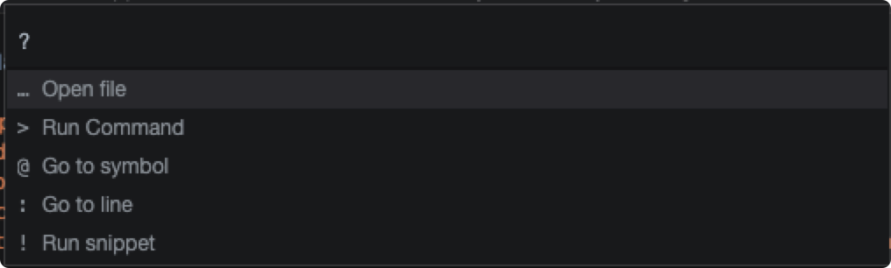

### 自带屏幕截图：`> screen`
* 包含 区域截图，整屏截图，节点截图，屏幕捕获功能

### 性能监视器：`> performance monitor`

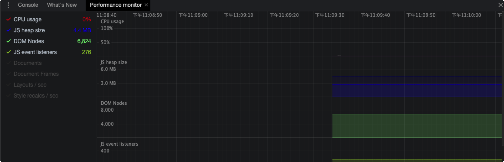

### 检查无用的css/js
* 这个功能帮助你检查页面上 CSS/JS 没有用到的比例，没有用到的用红色表示，用到的用绿色表示。
* 打开方式: 工具栏  `more tools => Coverage` 标签，然后点击记录按钮，刷新页面，页面加载完成之后单击停止，就会显示页面的代码占比。

### 花式 console
* `congsole.log()、console.error()、console.warn()、console.info()` 常规打印数据信息

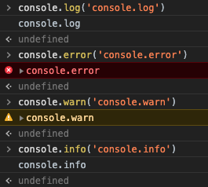

* `console.table()` 表格形式打印复杂的数据结构
* `console.group()、console.groupEnd()` 分组打印信息
* `console.assert()` 条件打印
* `console.dir()` 递归打印对象的所有属性
* `console.trace()` 追踪函数的调用轨迹
* 带样式打印

### 伪类伪元素调试

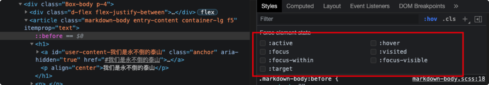

### 查看 DOM 节点绑定事件

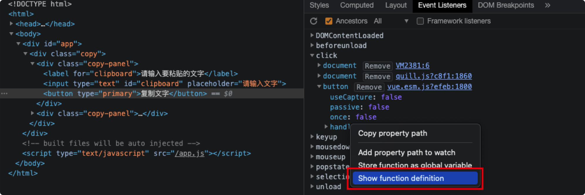

### 善用 network 过滤器

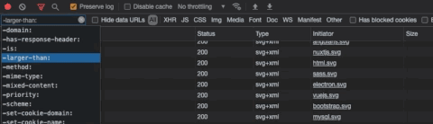

### 模拟断网进行错误处理
* 模拟不同网络速度下页面的展示情况

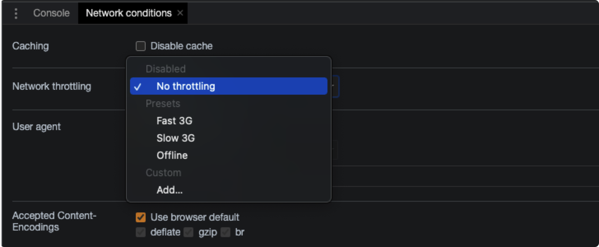

### 检查内存泄漏
* 只要存在一个引用就不会进行GC回收，有些DOM节点没有 append 到 DOM ，但是存在引用指向它，它就是一个分离的DOM的结点。这个时候就发生了 DOM 内存泄漏。这个时候拍一张内存堆的快照，Chrome 会帮我们把这些分离 DOM 结点用黄色标注出来。
* 打开方式: `Memory => profiles`

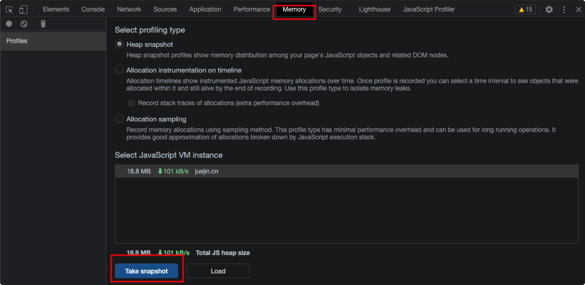

### 查看内存消耗
* 查看某个操作内存消耗情况，可以使用 Record Allocation 功能进行记录。
* 打开方式: `Memory => profiles => ALLOCATION TIMELINES`, 点击开始记录后，操作完成单击停止，就会出现使用情况分析。

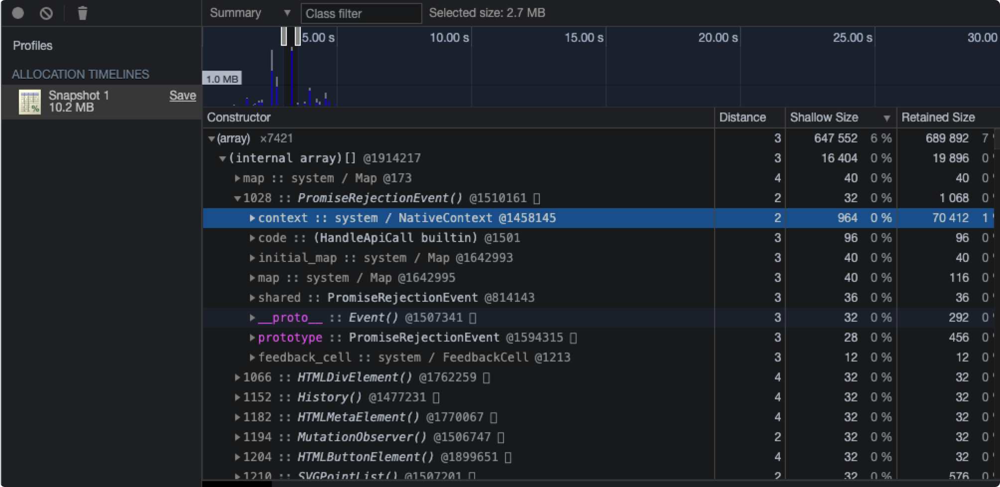

### Scroll Into View 滚动至 DOM 位置

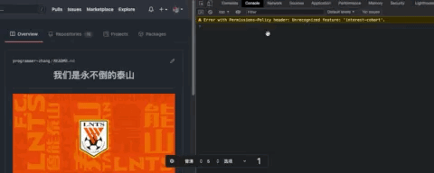

### DOM 断点测试

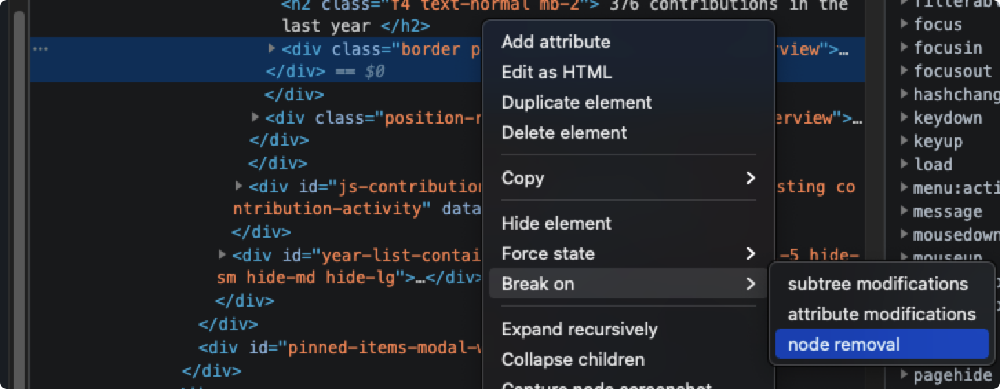

### 重新发送 XHR 请求

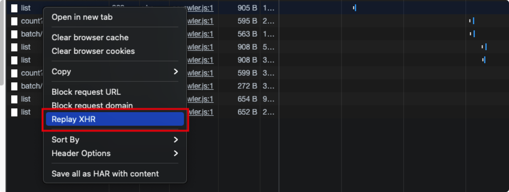

### 使用 Source Order Viewer 进行更好的可访问性检查

> 在源顺序查看器显示了元素的顺序在源文件中的定义。使用此功能可以帮助改善使用辅助技术的人的体验。这种顺序类似于 tabindex  对页面元素顺序的影响。

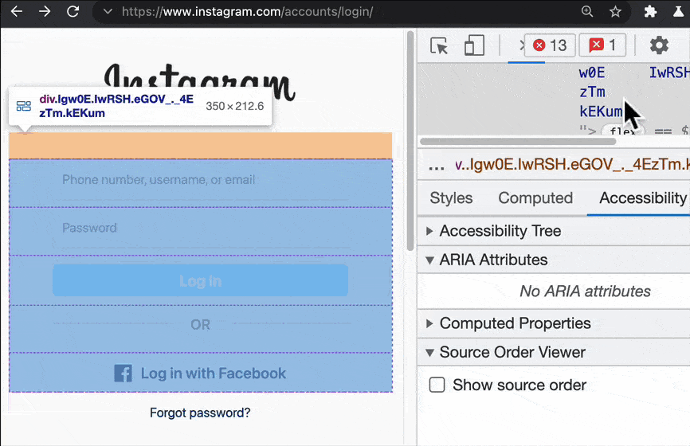

### 使用 CSS 字体编辑器轻松控制排版

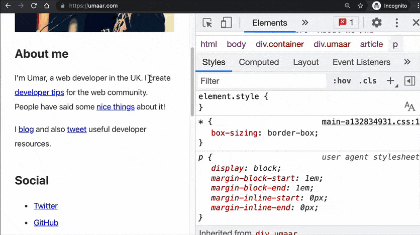

### 使用 CSS Grid 和 Flexbox 编辑器更好地调试

### 使用 CSS 概览面板重构和改进您的样式表

### 创建您自己的键盘快捷键并提高工作效率

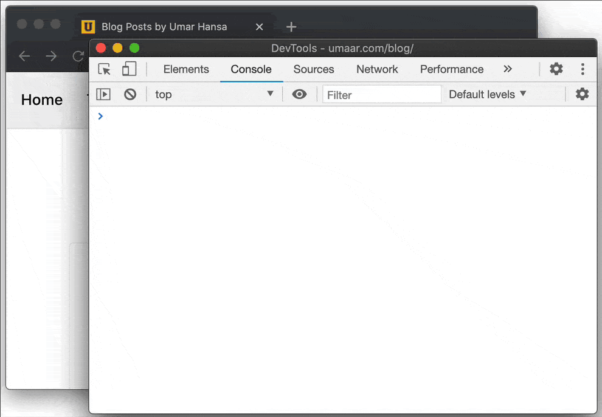

### 检查和调试 CSS 网格

### 快速更改 CSS 和 HTML 代码中的数值

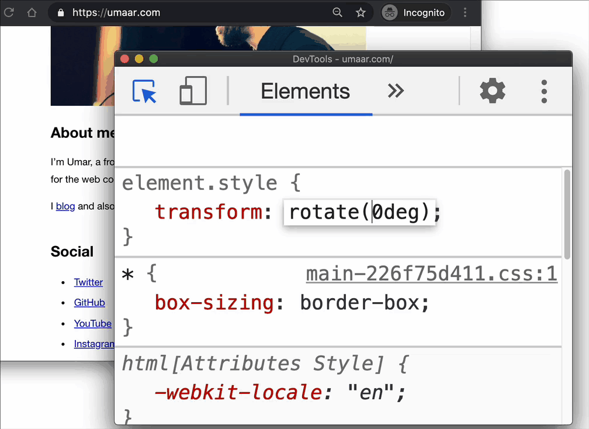

### 使用 CSS 概览面板查看 CSS 信息

### 复制并提取页面上元素的所有 CSS

### 生成 JavaScript 表达式以获取 DOM 节点

## 浏览器并发请求数量问题
* 基于端口数量和线程切换开销的考虑,浏览器不可能无限量的并发请求
* 浏览器并发请求数量问题并非越大越好，各大浏览器厂商基于良知和默契的考虑，为保护浏览器和服务器更好的性能，制定了自家的并发请求数量标准。
* 当然并发请求数量不是不可更改的，迅雷、暴风影音等可以修改电脑的最大连接数，从而达到下载或请求的最高效率。
* 部分浏览器还可以重写浏览器的默认值，比如 IE浏览器
* 目前浏览器的最大同域并发请求数量
	
Browser|Max
:--:|:--:
IE8,9| 6
Firefox|6
Chrome|6

* 针对最大并发请求数量的问题，现在[已有解决方案](https://www.zhihu.com/question/20474326/answer/15696641)，大致分为以下几类，这里不作特别讲解，有想了解的同学可以自行点击链接查看。
	* 解决方式分类: domain hash, cookie free, css sprites, js/css combine, max expires time, loading images on demand