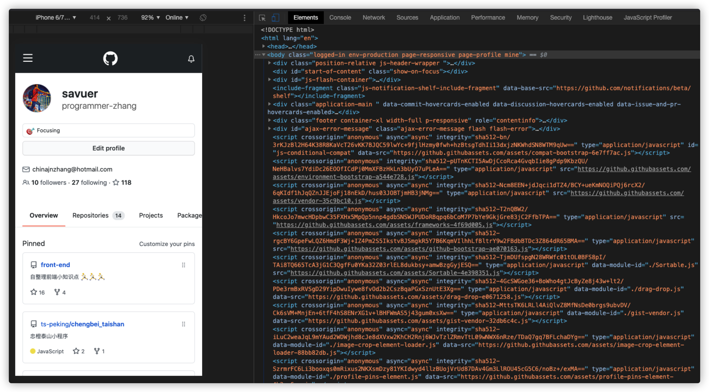
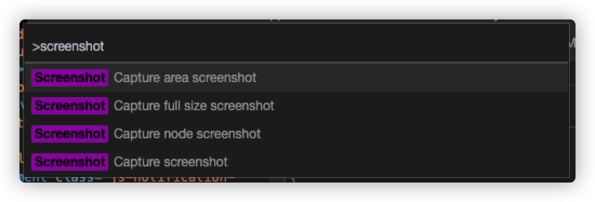

> 工欲善其事必先利其器，Chrome浏览器应该算是前端开发人员最常用的工具了，本期带来一些很实用的chrome浏览器调试方法

## 如何打开Chrome Devtool
* 在Chrome菜单中选择 更多工具 > 开发者工具
* 在页面元素上右键点击，选择 “检查”
* 使用 快捷键 Ctrl+Shift+I (Windows) 或 Cmd+Opt+I (Mac)

## 你真的认识Chrome devtool 吗

* 设备模式
	* 测试响应式和设备特定的视口
	* 模拟移动设备
	* 仿真传感器：地理定位和加速度计
* `Elements` - 页面dom元素面板
	* 检查和调整页面
	* 编辑样式
	* 编辑DOM
* `Console` - 控制台面板
* `Sources` - 源代码面板
	* 断点调试
	* 调试混淆代码
* `Network` - 网络面板
	* 资源时间轴
	* 网络带宽
* `Performance` - 设备加载性能分析面板
* `Memory` - 内存面板
* `Application` - 应用信息面板，PWA/Storage/Cache/Frames
* `Security` - 安全分析面板
* `Audits` - 自动化测试工具

## 用好Chrome Devtools
### 呼出快捷面板: `cmd + shift + p`
* 在 `Devtools` 打开的情况下，键入 `cmd + shift + p` 将其激活，然后开始在栏中键入要查找的命令或输入 `?` 号以查看所有可用命令
	* `...`: 打开文件
	* `:`: 前往文件
	* `@`：前往标识符(函数，类名等)
	* `!`: 运行脚本文件
	* `>`: 打开某菜单功能

### 花式 console
* `congsole.log()、console.error()、console.warn()、console.info()` 常规打印数据信息
* `console.table()` 表格形式打印复杂的数据结构
* `console.group()、console.groupEnd()` 分组打印信息
* `console.assert()` 条件打印
* `console.dir()` 递归打印对象的所有属性
* `console.trace()` 追踪函数的调用轨迹
* 带样式打印

### 截图：`> screen`

### 性能监视器：`> performance monitor`

### 检查无用的css/js
* `more tools => Coverage`

### debugger

### 断点检查
* hover、active

### 模拟断网进行错误处理
* offline、fast 3G

### 用timeline/performance查看执行时间
* 格子代表帧率
* 黄色js CPU占有率
* 红色 失帧比较厉害
* 紫色css CPU占有率

### 检查内存泄漏
* `Memory => profiles`

### 查看内存消耗
* `Memory => profiles => ALLOCATION TIMELINES`

### 远程调试
* `chrome://inspect/`

### Scroll Into View 滚动至DOM位置

### DOM断点测试

### 研究重绘

### 垃圾回收

## 浏览器并发请求数量问题
* 基于端口数量和线程切换开销的考虑,浏览器不可能无限量的并发请求
* 浏览器并发请求数量问题并非越大越好，各大浏览器厂商基于良知和默契的考虑，为保护浏览器和服务器更好的性能，制定了自家的并发请求数量标准。
* 当然并发请求数量不是不可更改的，迅雷、暴风影音等可以修改电脑的最大连接数，从而达到下载或请求的最高效率。
* 部分浏览器还可以重写浏览器的默认值，比如 IE浏览器
* 目前浏览器的最大同域并发请求数量
	
Browser|Max
:--:|:--:
IE8,9| 6
Firefox|6
Chrome|6

* 针对最大并发请求数量的问题，现在[已有解决方案](https://www.zhihu.com/question/20474326/answer/15696641)，大致分为以下几类，这里不作特别讲解，有想了解的同学可以自行点击链接查看。
	* 解决方式分类: domain hash, cookie free, css sprites, js/css combine, max expires time, loading images on demand