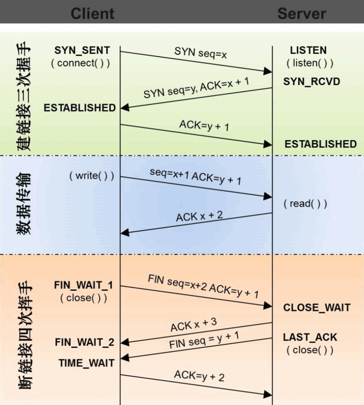
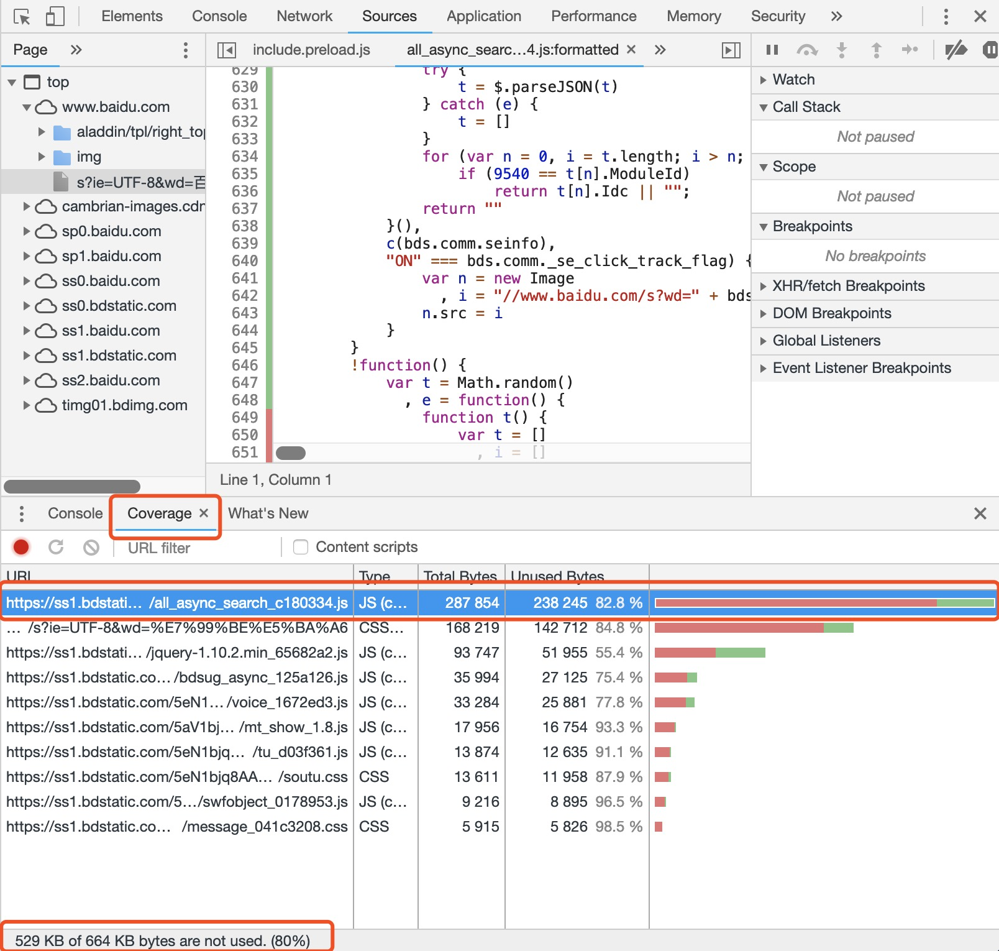

> 前两期讲过了如何在代码层级进行性能优化，本期给大家带来网络传输层的优化

## 强调HTTP请求的完整过程
* DNS解析
	* 首先会搜索浏览器自身的DNS缓存（缓存时间比较短，大概只有1分钟，且只能容纳1000条缓存）
	* 如果浏览器自身的缓存里面没有找到，那么浏览器会搜索系统自身的DNS缓存
	* 如果还没有找到，那么尝试从 hosts文件里面去找
	* 在前面三个过程都没获取到的情况下，就递归地去域名服务器去查找
* 建立TCP链接
	* 拿到域名对应的IP地址之后，浏览器会以一个随机端口（1024<端口<65535）向服务器的WEB程序（常用的有httpd，nginx）等的80端口发送链接请求。
	* 连接请求（原始的http请求经过TCP/IP4层模型的层层封包）到达服务器端（这中间有各种路由设备，局域网内除外）
	* 进入到网卡，然后进入到内核的TCP/IP协议栈（用于识别连接请求，解封包，一层一层的剥开），还有可能要经过Netfilter防火墙（属于内核的模块）的过滤，最终达到WEB程序
	* 建立了TCP/IP的连接
* TCP连接的三次握手/四次握手
	*  SYN > SYN-ACK > ACK(HTTPS协议还有一个ssl握手过程)

	* HTTP重定向的话，从头开始握手过程
* Web浏览器发送HTTP请求报文
	* HTTP请求报文由三部分组成：请求行，请求头和请求正文
* Web服务器发送HTTP响应报文
	* HTTP响应也由三部分组成：状态码，响应头和实体内容
* Web服务器关闭TCP连接

## 假设一个典型的宽带环境
* 没有本地缓存
* 相对较快的DNS解析(50ms)，TCP握手，ssl协商
* 较快的服务器响应时间(100ms)
* 一次延迟(80ms)

## 网络传输层时间分析
* 总时间(470ms)
	* 50ms for DNS
	* 80ms for TCP handshake (one RTT)
	* 160ms for SSL handshake (two RTT's)
	* 40ms （发送请求到服务器）
	* 100ms (服务器处理)
	* 40ms (服务器回传响应数据)
* 一个请求耗费470ms，事实上，470ms已经很乐观了
* (较早的数据，现在的DNS预解析和优化已经将这个时间减少部分)

## 优化方案

> 最快的请求就是没有请求

### 优化DNS解析
* 使用DNS缓存
	* 加快DNS解析速度
* 使用DNS负载均衡
	* 为同一个主机名配置多个IP地址，在应答DNS查询时，DNS服务器对每个查询将以DNS文件中主机记录的IP地址按顺序返回不同的解析结果，将客户端的访问引导到不同的机器上去，使得不同的客户端访问不同的服务器，从而达到负载均衡的目的。

### 优化缓存性能
* 强缓存和协商缓存的概念
	* 1）浏览器在加载资源时，先根据这个资源的一些http header判断它是否命中强缓存，强缓存如果命中，浏览器直接从自己的缓存中读取资源，不会发请求到服务器。比如某个css文件，如果浏览器在加载它所在的网页时，这个css文件的缓存配置命中了强缓存，浏览器就直接从缓存中加载这个css，连请求都不会发送到网页所在服务器；
	* 2）当强缓存没有命中的时候，浏览器一定会发送一个请求到服务器，通过服务器端依据资源的另外一些http header验证这个资源是否命中协商缓存，如果协商缓存命中，服务器会将这个请求返回，但是不会返回这个资源的数据，而是告诉客户端可以直接从缓存中加载这个资源，于是浏览器就又会从自己的缓存中去加载这个资源；
	* 3）共同点是：如果命中，都是从客户端缓存中加载资源，而不是从服务器加载资源数据；
	* 4）区别是：强缓存不发请求到服务器，协商缓存会发请求到服务器。
	* 5）当协商缓存也没有命中的时候，浏览器直接从服务器加载资源数据。
* 缓存的实现：本地磁盘和内存
	* 内存模式主要应用于无痕浏览，在窗口关闭时清除掉
	* 磁盘缓存实现了它自己的一组数据结构, 它们被存储在一个单独的缓存目录里。其中有索引文件(在浏览器启动时加载到内存中)，数据文件(存储着实际数据，以及HTTP头以及其它信息)
* 实现方式：Expires, ETag, Last-Modified, keepalive，Cache-Control

### 使用Service Worker
* 概念：谷歌开发的，在后台启动的一条服务Worker线程，作用是不管开多少个页面始终只有一个Worker在负责管理，把资源缓存起来，拦截页面请求，查看缓存。
* Service Worker结合Web APP Manifest能实现离线使用，断网时返回200，提示用户把网站添加图标到桌面(也是PWA的检测标准)
* 兼容性问题：现在所有的浏览器均支持Service Worker

### 利用Chrome Devtools进行优化传输资源检查与优化体积
* console
	* console.log: 不解释
	* console.table: 表格形式打印复杂的数据结构
	* console.dir: 递归打印对象的所有属性
	* console.trace(): 追踪函数的调用轨迹
	* console.group()、console.groupEnd(): 分组打印信息
	* 带样式打印
	
* 检查没用的CSS/JS
	* more tools=>Coverage
	
	
## Chrome浏览器提供的相关数据
* [查看缓存存储的数据和响应处理](chrome://net-internals/#httpCache)
* [DNS度量数据](chrome://histograms/DNS)
* [DNS缓存](chrome://net-internals/#dns)
* [Chrome浏览器的url表](chrome://chrome-urls/)
