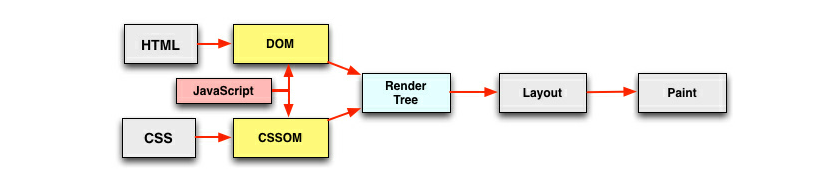

> 上期给大家带来了HTML、CSS、JS优化，这期给大家带来页面加载速度优化

> 本期内容请记住一个核心：JavaScript很快，DOM很慢

### 用户看到页面之前都经历了什么
* 检查缓存
* DNS服务器通过域名查找对应的web服务器的ip地址
* 三次握手机制、四次挥手机制
* HTTP请求
* 返回资源

### 页面渲染过程
* 说正事之前先说几点：
	* 以现有的通用显示器为例，帧率大多为60fps，即一秒钟60帧，这是一个什么概念呢，就是一秒钟的动画是由60幅静态图片连在一起形成的。60fps是动画播放比较理想，比较基础的要求。
	* 我们所说的页面卡了，就是页面失真了，或者掉帧了，一秒钟没有60个画面了，看起来不流畅了
	* 产生这种情况的原因就是页面在渲染某些帧时所花的时间较长，导致停留在这些帧的时间较长，所以画面卡顿了。



* JavaScript=>Style=>Layout=>Paint=>Composite=>Reflow?=>Repaint?
	* 渲染DOM树和CSSOM树
	* JavaScript规则合并DOM树和CSSOM树行程Render Tree	* 遍历渲染树开始布局，计算每个节点的位置大小信息，将Render Tree的每个节点绘制(composite)在屏幕上
	* reflow: 元素的几何尺寸发生了改变，需要重新验证并计算渲染树，是渲染树的一部分或者全部发生了变化
	* repaint: 屏幕的一部分重画，不影响整体布局，比如某个CSS的背景色变了，但元素的几何尺寸和位置不变

### 页面渲染过程优化

* 针对dom节点的显示隐藏进行优化

```
(1)display:none 的节点不会被加入Render Tree，
	而visibility: hidden 则会，所以，如果某个节点最开始是不显示的，
	设为display:none是更优的。
(2)display:none 会触发 reflow，而 visibility:hidden 只会触发 repaint，
	因为没有发现位置变化。
(3)有些情况下，比如修改了元素的样式，浏览器并不会立刻reflow 或 repaint 一次，
	而是会把这样的操作积攒一批，然后做一次 reflow，这又叫异步 reflow 或增量异步 reflow。
	但是在有些情况下，比如resize 窗口，改变了页面默认的字体等。
	对于这些操作，浏览器会马上进行 reflow。
```

* dom深度尽量浅
* 减少行内css和js的使用
* 合适的选择器，避免后代选择器，通配符选择器
	* css选择器匹配：从右往左，最后一个选择器被称为关键选择器，最后一个选择器越特殊，需要匹配的次数越少
* 减少layout
	* layout是比较耗时的操作，要减少页面重绘。能用transform就不用position/width/height做动画，还要减少layout的影响范围
* 避免强制性同步布局
	
	```
	//如果有一组 DOM 元素，我们需要读取它们的宽度，并设置其高度与宽度一致
	for(let i = 0,len = divs.length; i<len; i++){
	    let width = divs[i].clientWidth;
	    divs[i].style.height = width + 'px';
	}
	//执行这段代码就引起了强制性同步布局（forced synchonous layout），
	在每次迭代开始的时候都会进行重新计算布局，这是很昂贵的操作，千万要避免
	--------------------------------------------------------------
	//分离读与写
	let widthArray = [];
	for(let i = 0,len = divs.length; i<len; i++){
	    let width = divs[i].clientWidth;
	    widthArray.push(width);
	}
	for(let i = 0,len = divs.length; i<len; i++){
	    divs[i].style.height = widthArray[i] + 'px';
	}
	```
	
* 异步加载js文件并合并js文件
	* 涉及到一个浏览器并发请求数量的问题：
		* 例如chorme浏览器针对每一个域最多只能有6个TCP连接
		* 基于端口数量和线程切换开销的考虑,浏览器不可能无限量的并发请求
		* 并非越大越好，基于良知和默契的考虑，保护浏览器和服务器更好的性能
		* 迅雷、暴风影音等可以修改电脑的最大连接数
	* 异步加载js文件方式
		* `async` 方式
		* `defer` 方式
		* 动态创建 `script` 标签方式

### 加快页面的打开速度

> 页面开启速度主要指标：白屏时间，首屏时间，页面加载完成时间，所有资源加载完成

* 减少渲染堵塞(js、css)
	* 将script标签放在body后面
	* 给script标签添加defer属性，异步加载，延后执行script资源
	
	> 两种处理方式有什么区别呢？
	
	> head标签中的外链脚本会影响DOM构建和页面图片加载，特别是脚本很多时，所以需要加上defer避免阻塞。但是加上defer属性的资源加载的优先级会降为最低，甚至比图片还低，高优先级的资源加载顺序会优于低优先级的加载。如果页面的展示比交互重要，需要马上加载出来，可以加上defer，否则还是把JS文件放在body后面就行了
* 优化图片：
	* 使用响应式图片
	* 延时加载图片
	* 按需加载图片
	* 使用雪碧图，图标字体
	* 结合使用SVG图
* 压缩和缓存
	* gzip压缩、Cache-control、Etag
	
### 增强用户体验
* 加载loading框
* 增加过度动画效果
* 合理及时的错误处理
* 人性化的等待交互