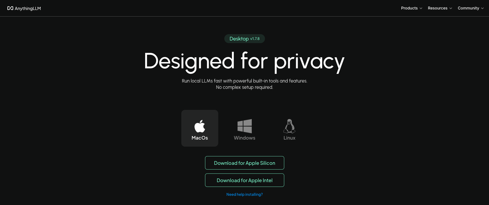
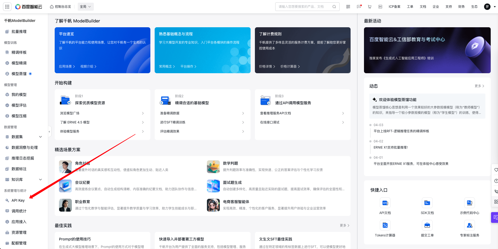
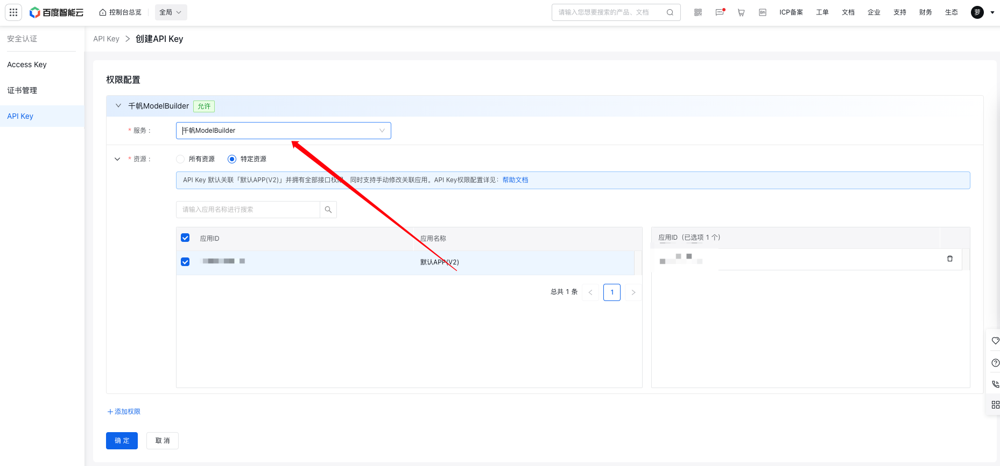
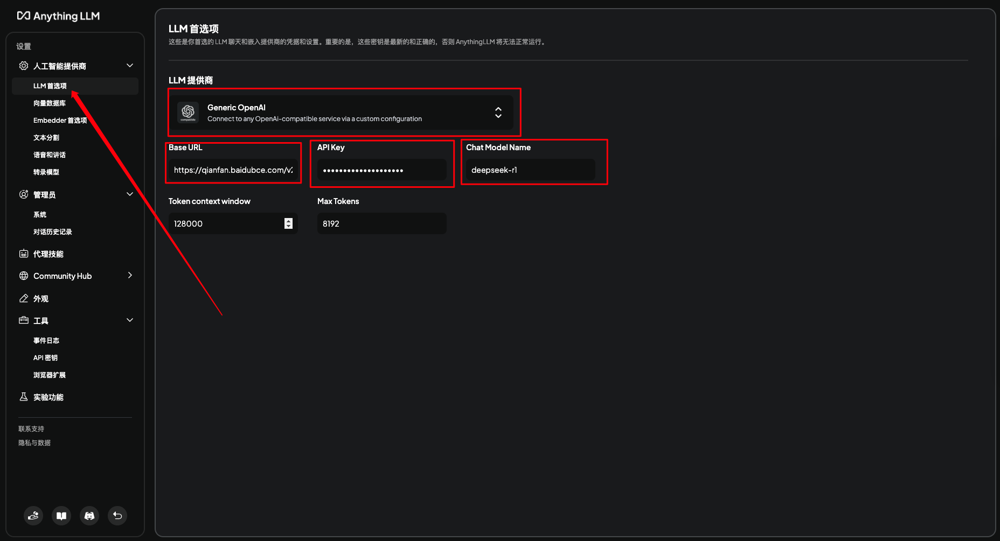
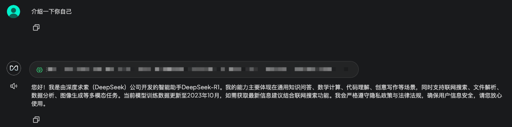

# 本地部署 DeepSeek

> 本文使用 `DeepSeek` 辅助编写

## 准备工作
### 百度云账号申请
### Chat Tool 准备
> 以 `Angthing LLM` 为例

* 根据设备版本下载 [Anything LLM](https://anythingllm.com/desktop)

* 安装成功即可

## API KEY 申请
* 登录百度云
* 打开百度智能云管理台
* 创建 API Key

* 使用 千帆 ModelBuilder 授权服务创建

* 拿到 API Key

**注：** 使用 API Key 部署后仍然可能出现服务繁忙的情况，建议开启付费模式.

* 开启方式：
	* 百度云控制台 -> 千帆ModelBuilder -> 模型服务 -> 在线推理 -> 找到 DeepSeek-R1 -> 购买配额
	* 价格很便宜

## Chat Tool 设置

* 配置百度云 API Key
	* 填写完整 Base URL (https://qianfan.baidubce.com/v2)、API Key、Chat Model Name

* 创建工作区测试 DeepSeek-R1

如上图回复为 DeepSeek-R1 版本即为创建成功，且为最新大模型。

## 参考资料
* 网上搜集的DeepSeek使用技巧大全: https://pan.quark.cn/s/69f76c763f93#/list/share