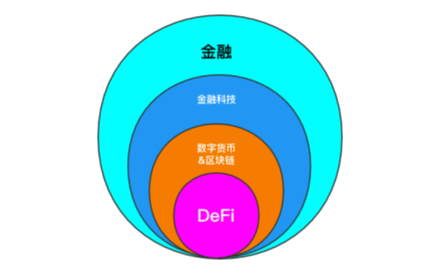

# 区块链基础(三): DeFi 是什么
## DeFi概述
* DeFi(Decentralized Finance) 去中心化金融
* 在分布式系统(区块链)中，用分布式应用(Dapp)，提供去中心化金融生态
* 是区块链和数字货币中非常小的分支
* 也是金融科技中的一部分
* 是一种生态，不是单独的一种数字货币或者一个项目
* 用一张图可以更好的解释

## DeFi 生态
* DeFi 底层的公链以以太坊为主，还有EOS、比特币的
* 支付采用稳定币，比如DAI
* 借贷
* 交易，交易分为正常交易和衍生品交易
* 钱包和券商，也就是交易所
* 预言机和博彩，预言机是提供数据接口，可以让现实世界发生的数据链接到DeFi的金融产品中
* 资产管理和理财

## DeFi 优势
> DeFi 去中心化金融 的优势是在与 CeFi 中心化金融对比来看出的，但是不代表着DeFi 可以替代传统金融，是一种对传统金融方式的补充和尝试。

* 不需要央行这种中心化提供货币的职能部门
	* DeFi依赖于区块链，自然数字货币可以作为底层的支付手段
* 不需要法务或法官或监管部门监管
	* DeFi有智能合约，在区块链中，代码即法律
* 不存在合同纠纷
	* DeFi的智能合约只要写好，到期自动执行，或者触发条件自动执行就好，不存在合同纠纷
* 不会被篡改，不需要公证
	* DeFi的智能合约存在于区块链上，不存在篡改的可能性，不需要公证，可追溯，透明公平

## DeFi 的意义
> 很多人认为 DeFi 对于 普惠金融 的意义较大

### 传统金融现状
* 全球还有大量人口是没有银行账户的，这就意味着有很多人是在传统金融之外的
* 可以连接互联网的手机占比较大，通过互联网让这些人享受到金融服务
* 传统金融开户需要部分文件、资料、资产证明等
* 传统金融要手续费或者服务费，大额资产的服务费高昂
* 传统金融机构并不是在所有地方都有分户

### DeFi 可以解决的问题
* 准入门槛低，只要有手机就可以通过互联网享受金融服务，人人可参与
* 相对可靠，相关内容都写在代码中，自动执行
* 金融服务公开透明开放，每个参与者都是平等地位，没有信息差，费率平等
* 跑路风险低，通过智能合约进行操作，违约立即执行，不需要机制管控
* 可组合性强，衍生品更加丰富，可以对赌，做合约，可组合，可编程

## DeFi 的风险
### 代码风险
* 智能合约透明，所有的代码都在上面，如果没有相应健全的代码审计，有些漏洞会产生技术风险

### 流动性风险
* 币圈形势不好时，锁仓容易被强平，越强平价格越低，产生恶性循环，踩踏价格，会产生较大的流动性风险

### 操作风险
* 操作失误造成损失，私钥忘记，钱包玩完