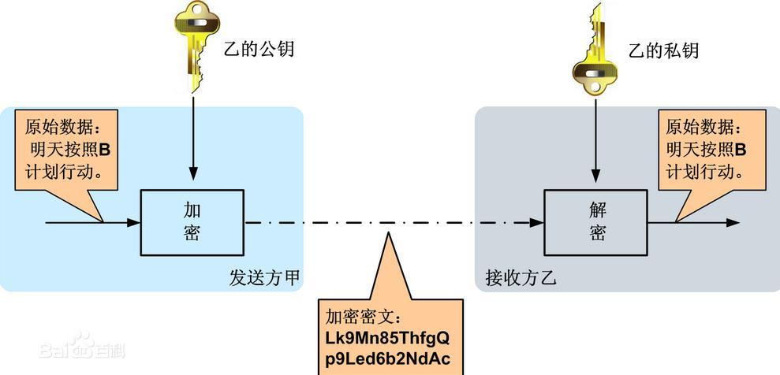
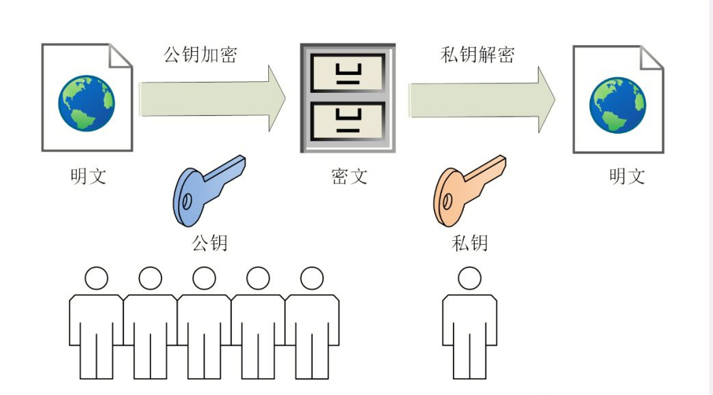

# 什么是非对称加密？

## 大纲
* 非对称加密的基本概念
* 在数字货币中的应用
* 优点与挑战

---

在数字货币领域，非对称加密是一个至关重要的概念，它保证了交易的安全性和数据的隐私性。对于刚接触这个行业的新手来说，理解这个技术并不需要深奥的数学知识，我们可以用简单的例子来说明它的原理和作用。

---

## 非对称加密的基本概念

非对称加密是一种加密技术，它使用一对密钥：**公钥**和**私钥**。这两个密钥相互关联，但各自具有不同的功能：

1. **公钥（Public Key）**：可以公开给任何人，主要用于加密信息。
2. **私钥（Private Key）**：需要严格保密，主要用于解密信息或签名。

### 类比解释
可以将非对称加密想象成一个锁和钥匙的组合：
* 公钥就像一个只有锁功能的箱子，任何人都可以用它来锁住信息（加密）。
* 私钥则是唯一可以打开这个锁的钥匙（解密）。

这种方式的关键在于，只有持有正确私钥的人才能解密信息或完成交易，而公钥可以自由传播。

## 在数字货币中的应用

在数字货币中，非对称加密是确保资产和交易安全的核心技术，主要体现在以下两个方面：

### 1. **交易签名**

* 每当你发起一笔交易时，系统会用你的私钥对交易数据进行签名。这个签名的作用类似于在重要文件上签署你的名字，用以证明这笔交易是由你授权的

* 签名验证流程如下：
	1. 交易发起人使用私钥生成签名
	2. 接收方或网络节点用发起人的公钥验证签名是否匹配
	3. 如果签名有效，则证明交易合法且未被篡改

* 这使得即便公钥公开，其他人也无法伪造你的签名，从而保证了交易的安全性

### 2. **钱包地址生成**

* 你的数字货币钱包地址是通过公钥生成的，而公钥又是从私钥派生出来的。这意味着：
	- 只要你掌握私钥，就能控制与该钱包地址相关的资产。
	- 即使公钥或钱包地址被公开，资产仍然是安全的。

* 但是，一旦私钥丢失或被泄露，你将无法找回资产。这也是为什么妥善保管私钥是使用数字货币的核心要求。

## 优点与挑战

* 非对称加密技术的应用带来了许多优势，但同时也伴随着一定的挑战。

### 优点
- **安全性高**：由于私钥从不被传输或公开，数据窃取的可能性大大降低。
- **去中心化**：非对称加密不依赖第三方机构，可以直接进行点对点的加密通信。
- **不可篡改性**：通过数字签名，保证了数据的完整性和真实性。

### 挑战
- **私钥管理**：私钥一旦丢失或泄露，用户将永久失去对资产的控制。
  - **应对方法**：使用硬件钱包或多重签名机制来增加安全性。
- **计算复杂**：非对称加密需要较高的计算能力，在处理大量数据时可能效率较低。
  - **应对方法**：结合对称加密，通过混合加密方式提高性能。

---

## 总结

非对称加密是数字货币世界的基础技术之一，它通过公钥和私钥的配合，确保了交易的安全性和数据的隐私性。理解这一技术是进入数字货币领域的重要一步，能帮助你更好地保护你的数字资产。