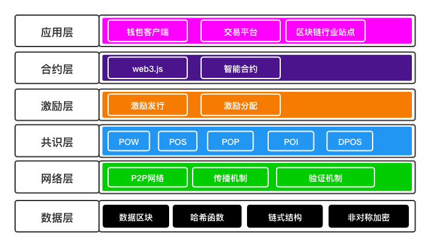

# 区块链基础(二): 区块链技术架构
## 区块链的六层结构

### 数据层
* 主要实现数据的存储，账户和交易的实现与安全
* 数据的存储依赖于区块中存储的信息和链式结构
* 账户和交易的实现基于数字签名，哈希算法，非对称加密等多种密码学算法和技术，为了保证交易能够安全的进行。
* 涉及内容:
	* 数据区块
	* 哈希函数
	* 链式结构
	* 非对称加密

### 网络层
* 网络节点间的连接和通讯，又称点对点技术(没有中心服务器，依赖用户群组交换信息)。
* 涉及内容:
	* P2P网络
	* 传播机制
	* 验证机制

### 共识层
* 实现全网所有节点交易和数据的统一，防范共识攻击(例如拜占庭攻击、女巫攻击、51%攻击)，其算法称为共识机制。
* 共识机制算法是区块链技术的核心技术
* 涉及内容:
	* POW(Proof of Work) 工作量证明机制: 类似根据算力按劳分配
	* POS(Proof of Stake) 股权证明机制: 持有初始货币的人，就有对应的权利，持有越多权力越大
	* DPOS(Delegated Proof of Stake) 授权股权证明机制: 选举产生的董事会成员行驶权利
	* PBFT(Practical Byzantine Fault Tolerance) 实用拜占庭容错算法: 基于消息传递的一致性算法，经过预准备 -> 准备 -> 确认 打成一致，并且可能因为失败而重复进行
	* POI(Proof of Importance) 重要度证明共识算法: POS的变种
	* POP(Proof of Participation) POI和DPOS的思想结合

### 激励层
* 将经济因素引入区块链技术体系，主要包括经济激励的发行机制和分配机制
* 也是一种博弈机制，激励遵守规则参与记账的节点，惩罚不遵守规则的节点

### 合约层
* 封装各类脚本、算法、智能合约，赋予账本可编程的特性
* 区块链2.0通过虚拟机的方式运行代码从而实现虚拟机的功能，比如以太坊区块链，通过在合约层在智能合约上添加能够进行交互的前台界面，实现去中心化的应用(DAPP)
* 以太坊区块链内置编程语言协议，从而在理论上可以实现任何应用功能
* 设计内容:
	* Solidity 语言
	* Truffle 语言
	* web3.js
	* 各种智能合约

### 应用层
* 封装区块链的各种应用场景和案例
* 各类区块链应用都部署在应用层
* 设计内容:
	* 钱包客户端
	* 交易平台
	* 行业站点