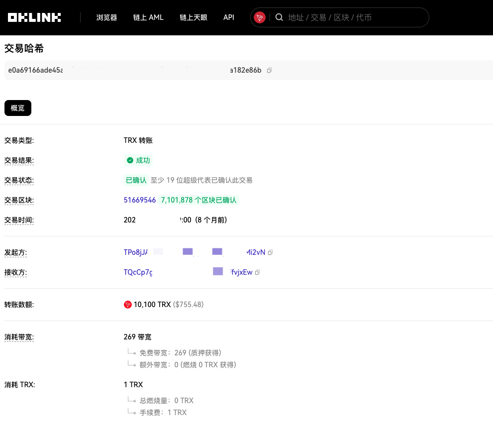
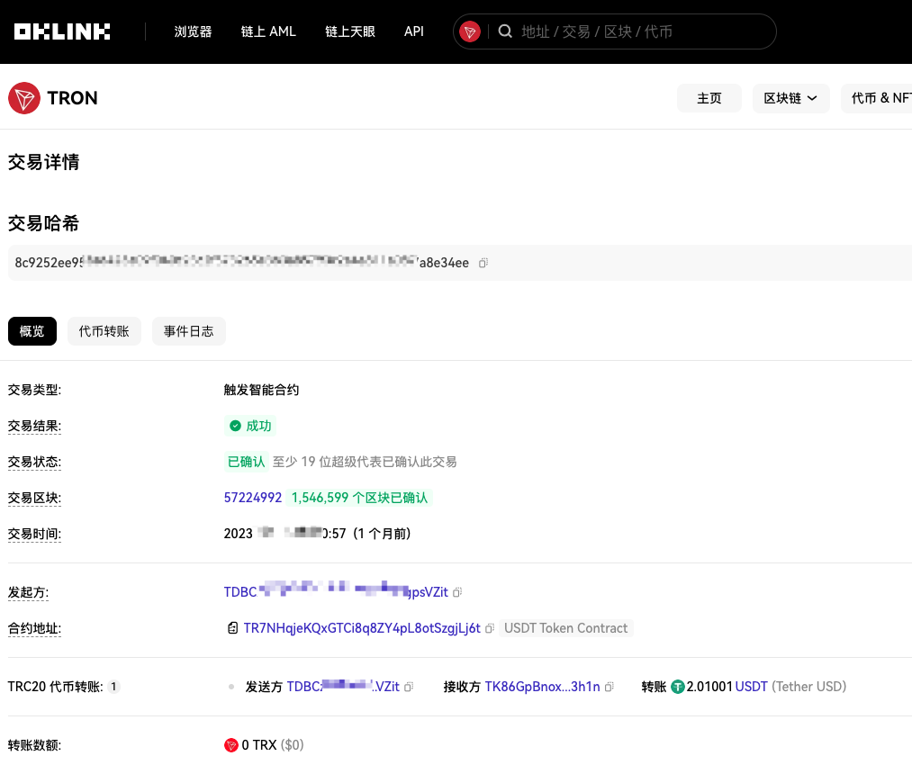
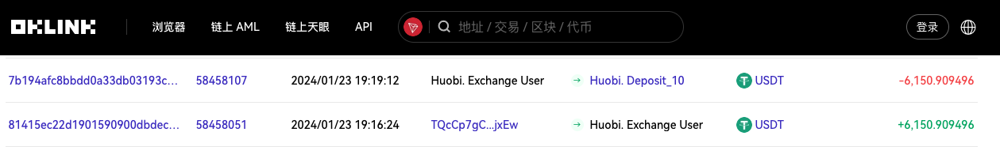
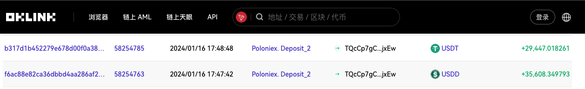

# 区块链基础(六): 如何进行链上交易追踪

> 去中心化、开放性、自治性、信息不可篡改、匿名性是区块链的关键属性，其中系统开放是区块链中对于数据和资产安全利弊共存的特点。

> 除了交易各方的加密私有信息外，数据对所有人公开，任何人都可以通过公开的接口进行数据查询和应用开发。

> 系统开放也为链上交易追踪提供了基础。

## 资金流
* 数字资产的资金流通主要通过区块链网络完成。每一笔交易都被记录在区块链上的区块中，形成一个不可篡改的交易记录。
* 区块链的特性决定了无法掩盖资金的流向情况，当前随着链上基建的发展和智能合约的兴起只能混淆链上资金的流向情况。
* 现实世界中资金的转移涉及多种方式，除去电子支付外很难追查其资金的真实流向，链上资金的转移只需要通过区块链浏览器对资金的交易进行查询，便可知道链上资金流的流动情况。
* 资金流的转移中如果涉及中心化交易所(`CEX`)，我们可以通过司法机构对其发起调证，便可拿到真实世界中的相关信息，从而避免因为数字资产的匿名性导致资金追踪无法完成。
* 资金流的基本原理是通过链上的交易记录，追溯数字资产从一个地址转移到另一个地址的路径。这种过程通常包括输入和输出，其中输入是来自一个或多个地址的资产，而输出则是新的地址，这样一层一层地形成链式的资金流动。

## 资金监控及告警
> 使用现有工具及网站可以帮助我们进行资金监控及告警。

> 这类系统通过分析链上交易数据，实时监测数字资产的流动，以便发现任何可疑活动。

* **大额交易监控：** 设置阈值，一旦有大额数字资产交易发生，系统立即发出警报。这有助于防范资金洗钱等不法行为。
* **交易频率监测：** 分析地址的交易频率，如果某个地址短时间内发生多次交易，可能是异常活动的迹象，需要进行进一步调查。
* **地址关联分析：** 通过分析交易中涉及的地址，建立地址之间的关联关系，发现潜在的关联地址，以揭示资金流的真实路径。
* **黑名单地址监控：** 维护黑名单地址列表，一旦有资金涉及这些地址，系统发出警报，帮助防范涉及欺诈或非法活动的交易，目前很多的链上数据工具也有维护大量的黑地址标签库。

> 目前相关的资产监控及告警工具有很多很成熟的方案。大多也集成了上述的所有需求点，但目前无法做到所有币种的监控及告警。

## 链上追踪
> 链上追踪是数字资产追踪中最基础的一种方式，这里以[ `OKLink` 区块链浏览器](https://www.oklink.com/)为工具展示链上资产的转移。

> 想要看懂链上资产的转移，有一些链上资产转移的特点需要注意

### 普通地址间的资金转移

##### 基础代币转移
> 以TRX的转移为例:

* 基础代币的转移为链上地址间的直接转移，表现为两个地址间的基础代币进行资金转入与转出。

* 如上图为波场链中两个地址之间的基础代币( `TRX` )的转移，两个地址直接相互交易，完成 `TRX` 的转移。

##### 协议下代币转移
> 以 USDT 为例

* 如上图为波场链中两个地址之间的 `TRC20-USDT` 的转移，并不是资金转出地址和资金转入地址的直接交易，而是转出资金和智能合约的直接交易，本例中智能合约为 `TRC20-USDT` 合约。通过智能合约将需要转移的代币 `TRC20-USDT` 转移至目标地址中。

### 涉及CEX的资金转移
* 链上资产变现大多需要经过中心化交易所，当交易涉及中心化交易所时，交易特征表现为资金进入交易所个人账户充币地址，交易所个人账户充币地址会自动将资金归集至交易所大地址，由此完成交易所个人账户充值过程。具体表现为：

* 当交易所个人账户进行提现时，资金会直接从交易所大地址转移至目标地址中。具体表现为：

* 涉及 `CEX` 的资金转移，绝大多数情况下都需要正规的手续向 `CEX` 交易所进行调证，返回的结果中会包含该账户的涉及交易所的交易情况，以便我们可以精确的向下继续追踪。
* 可调证信息也是根据交易的情况有不同，`CEX` 用户接收相关地址的充值时，可调证信息为该用户的接收地址，即用户充币地址。`CEX` 用户提现资金进入其他地址时，可调证信息为该笔交易的交易哈希，即用户提币哈希。

* `CEX` 的结果中还会包含账户人的相关信息以及交易所内变现和交易情况，这部分就是下文中提到的链下追踪的重要数据基础。

### 涉及链上合约的资金转移
> 涉及链上合约的资金转移也需要区分几种情况，一种是上文提到的协议下代币的转移，比如USDT、USDC的转移，还有跨链协议的转移、币币兑换合约的转移、使用混币器等等。

> 涉及链上合约的转移在区块链浏览器中需要查看详情，详情中会包含整个与合约交互过程中的所有交易详情。

## 链下追踪
> 链下追踪是根据链上数据及链上资金追踪得到的相关信息，结合互联网及其他手段，进行相关地址实际控制人进行追踪和排查。

> 这部分主要是指与区块链无关的信息，例如邮箱、手机号、IP地址、设备指纹等等一切与相关地址实际控制人能够关联上的信息。
