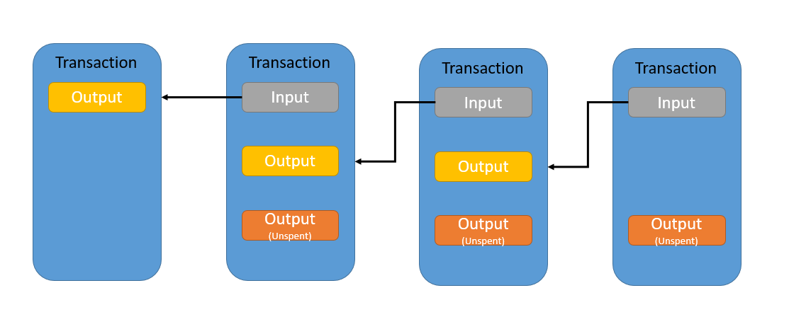

# 区块链基础(八): BTC 的 UTXO 模型如何进行链上交易追踪

> 前面针对链上交易追踪及链上交易数据的查验进行了讲述，但是有一条公链上的交易较为特殊，就是比特币链，其特有的 `UTXO` 模型使得在交易的追溯上更为复杂一些。

> 以太坊链等EVM系链的转账为账户模型的转账，即减去转出地址中的相应币种，增加转入地址中的相应币种，且在地址上也会记录该地址的余额情况。但这种账户模型的转账在比特币链上是行不通的。

## 什么是 UTXO (Unspent Transaction Output)
* 比特币的每一笔交易都是有输入和输出的，铸币交易除外，铸币交易没有输入只有输出
* 比特币交易的基本单位是一个未经使用的交易输出，即未花费的交易输出(UTXO)
* B 转给 C 一个比特币，B 的这个比特币是由 A 转来的，更确切的讲是 A 发起的交易，只不过交易的输出方是 B 而已。但是 B 转给 C 之后，B 这边就变成了已经消费的交易输出了，C多了一笔未消费的交易输出(UTXO)
* 由于每一笔交易都会指向前一笔交易（一笔交易的输入来源于上一笔交易的输出），和区块链中的区块很相似（每一个区块都指向前一个区块）。对每个比特币的来源追溯的话，都来源于某个铸币交易；类比到区块链中，每个区块追溯的话，起点就是创世区块

 图片来自网络 

## 比特币交易

* [https://www.oklink.com/zh-hans/btc/tx/6216b12925f9bf817679e4cbaae35e1f5b8da997dc8b12603c6de7dd965af5c1](https://www.oklink.com/zh-hans/btc/tx/6216b12925f9bf817679e4cbaae35e1f5b8da997dc8b12603c6de7dd965af5c1)
* 上图为一个典型的比特币交易详情，图片中会告知我们涉及交易的很多信息
* 交易哈希为本次交易的唯一标识
* 本笔交易涉及的全部比特币数额
* 本笔交易所用来支付矿工费用的手续费
* 在交易的双方中，左侧为交易输入，同时可以向前通过链式交易追溯交易；右侧为交易输出，可以看到向后是未花费的交易输出，所以不能向后追查

## 比特币交易结构

* 点开交易明细后可以看到本笔比特币交易的交易结构
* 在区块链浏览器中看到的交易详情并不是比特币交易的原始结构，详情中的比特币交易结构也是经过美化和序列化后的结果，原始的比特币交易结构为 `JSON` 结构数据