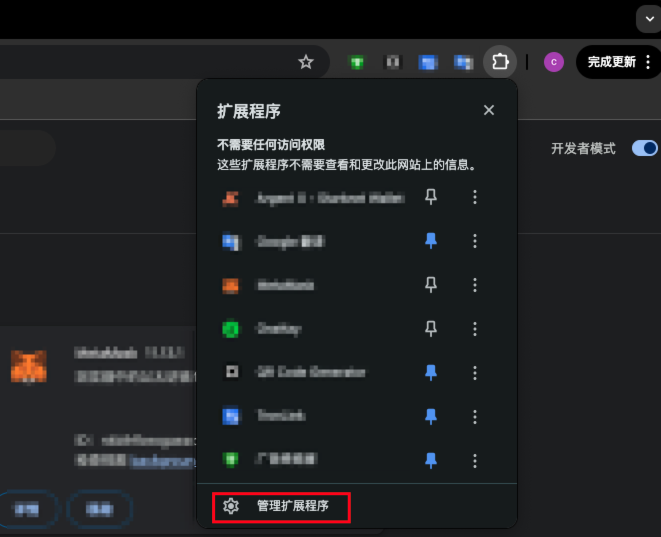
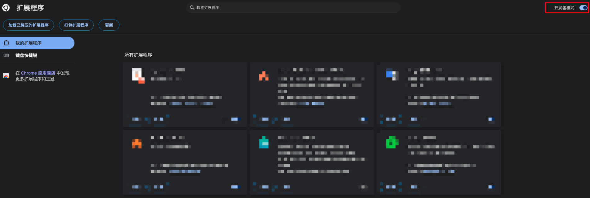
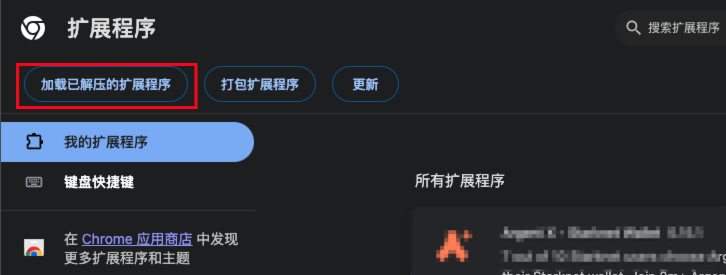
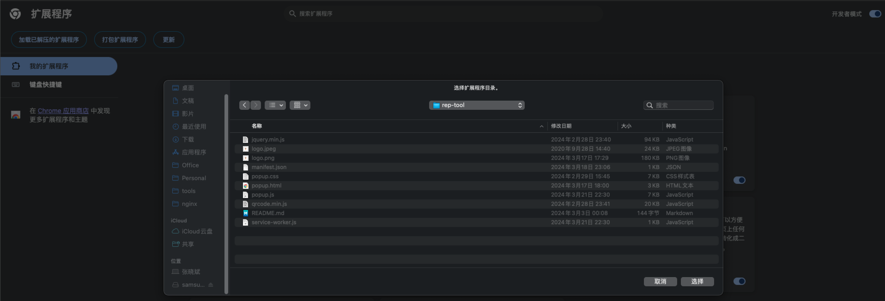
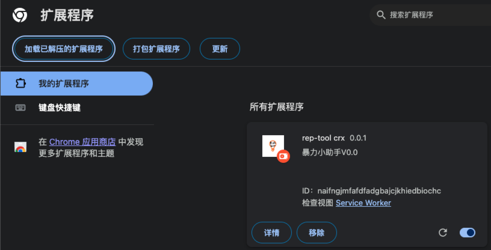

# 谷歌浏览器扩展程序 V3 制作指南

> 出于对隐私保护、安全性、性能的加强，谷歌随着 `Chrome 88` 的升级，将推行 `Manifest V3` 扩展程序规范。

> 本文也将基于 `Manifest V3` 规范进行扩展程序制作。

## 写在前面
* 本次大版本提升从 `Manifest V2` 升级到 `Manifest V3`，带来了很多新特性和功能变化。以下是按照我认为的重要性变化点:
	* 使用 `service-worker.js` 替代 `background.js`
	* 不再允许远程托管代码，所有 `JavaScript` 必须包含在包中
	* `Promise` 支持，但仍然支持回调函数

## 目录结构
* 以下为 `Chrome` 官方文档给出的参考目录结构
* 可以通过多种方式构建项目目录，唯一的前提条件是必须将 `manifest.json` 文件放在根目录中。

```
|-README.md
|-manifest.json // 配置文件，必不可少
|-popup.html // 入口文件
|-popup.css // 样式文件
|-popup.js // 用户界面用到的JS文件，运行时加载
|-service-worker.js // 后台运行JS文件，也就是V2版本的 background.js 文件
|-logo.png // 扩展程序LOGO文件
```

## Manifest 配置
* `manifest.json` 文件的配置详情如下:

```
{
	"name": "rep-tool",
	"version": "0.0.1",
	"manifest_version": 3,
	// 简单描述
	"description": "a chrome browser extension tool",
	// 插件图标
	"icons": {
		"16": "./logo.jpeg",
		"48": "./logo.jpeg",
		"128": "./logo.jpeg"
	},
	// 选择默认语言
	"default_locale": "en",
	
	// 浏览器图标部分
	"action": {
	    "default_title": "小助手",
	    "default_icon": "./logo.jpeg",
	    "default_popup": "./popup.html"
	},
	
	// 后台常驻文件
	"background": {
		"service_worker": "service-worker.js"
	},

	// 引入一个脚本
	"content_scripts": [
		{
			"matches": ["<all_urls>"],
			"js": ["qrcode.min.js", "jquery.min.js"]
		}
	],
	// 跨域请求
	"host_permissions": [
        	"*://api.xxxxxx.com/*"
	],
	// 插件中用到的静态资源需要在这里配置
	"web_accessible_resources": [
		{
			"matches": ["<all_urls>"],
			"resources": ["qrcode.min.js", "jquery.min.js"]
		}
	],
	// 应用权限配置: cookie 权限、tabs 权限、系统通知权限等
	"permissions": [
		"contextMenus",
		"tabs",
		"storage",
		"cookies",
		"notifications",
		"alarms"
	  ]
}
```

### 权限类型

> 在 V3 版本当中可以声明以下类别的权限

* `permissions`: 包含写明的权限列表中的项
* `optional_permissions`: 用户运行时授予的权限
* `content_scripts.matches`: 包含一个或多个匹配模式，可允许内容脚本注入一个或多个主机中
* `host_permissions`: 包含一个或多个匹配模式，可提供对一个或多个主机的访问权限，多用于 `fetch()` 跨域请求
* `optional_host_permissions`: 由用户在运行时授予

## 主体页面
* 编写 `popup.html`

```
<!DOCTYPE html>
<html lang="en">
    <head>
        <meta charset="UTF-8">
        <title>暴力小助手</title>
    </head>
    <body>
        <div class="container">
            <div class="tab-content">
                <ul id="tab">
                    <li class="tab-item active" data-area="develop">页面二维码</li>
                    <li class="tab-item" data-area="ipip">IP解析</li>
                </ul>
            </div>
        </div>
    </body>
</html>
```

## 样式调整
* 使用样式调整页面主体

```
<head>
	    <meta charset="UTF-8">
	    <title>暴力小助手</title>
	    <link href="./popup.css" rel="stylesheet"> // 引入样式文件
</head>
```

## 逻辑处理
* 加入 `JavaScript`

```
<!DOCTYPE html>
<html lang="en">
    <head>
        <meta charset="UTF-8">
        <title>暴力小助手</title>
        <link href="./popup.css" rel="stylesheet"> // 引入样式文件
    </head>
    <body>
        <div class="container">
            ...
        </div>
    </body>
    <script src="popup.js"></script> // 引入样式文件
    // 当然也可以引入其他JS文件
	<script src="jquery.min.js"></script>
	<script src="qrcode.min.js"></script>
</html>

```

## 使用网络请求
* 使用 `fetch` 在 `service-worker` 中发送请求

```
fetch(request.url + request.body).then(response => {
        return response.json();
}).then(jsonData => {
        console.log('service-worker.js-fetch', jsonData);
        sendResponse({success: true, jsonData});
}).catch(err => {
        console.error('service-worker.js-fetch', err);
        sendResponse({success: false, error: 'Failed to send the request'});
});
```

## 运行插件
* 管理扩展程序



* 打开开发者模式



* 添加已解压的扩展程序



* 导入文件夹

> 导入的是代码文件夹，不是压缩包



* 添加成功



## 错误排查
### 错误信息：`Unchecked runtime.lastError: The message port closed before a response was received.`
>  造成此错误的原因归根到底是 `onMessage` 监听器消息端口自动关闭

* **可能错误原因一:** `chrome.runtime.onMessage` 监听器在异步操作完成之前关闭了消息端口，导致无法发送响应。

* **解决方案一:** 保持消息端口打开，使用 `return true` 提前返回响应 或 二次监听 的方法来保持消息端口开放。

```
chrome.runtime.onMessage.addListener((request, sender, sendResponse) => {
    if (request.action === 'sendRequest') {
        sendChromeRequest(request, sendResponse);
    }
    return true; // 防止消息端口关闭
});

async function sendChromeRequest(request, sendResponse) {
    fetch(request.url + request.body).then(response => {
        return response.json();
    }).then(jsonData => {
        sendResponse({ success: true, jsonData });
    }).catch(err => {
        sendResponse({ success: false, error: 'Failed to send the request' });
    })
}
```

* 早期已经有国外的开发者发现此问题并提出了解决方案，传送门 [https://github.com/mozilla/webextension-polyfill/issues/130](https://github.com/mozilla/webextension-polyfill/issues/130)

* **解决方案二:** 双监听器策略。

```
// 第一个监听器，返回 true 以保持消息端口开启
chrome.runtime.onMessage.addListener((request, sender, sendResponse) => {
    return true; 
});

// 第二个监听器，处理实际的接口响应和其他异步操作
chrome.runtime.onMessage.addListener(async (request, sender, sendResponse) => {
    if (request.action === 'sendRequest') {
        sendChromeRequest(request, sendResponse);
    }
});
```

* 上述解决方案参考[这里](https://gitcode.csdn.net/65e95d911a836825ed790a29.html)

* **可能错误原因二:** `chrome.runtime.sendMessage` 未正确使用回调函数 `sendResponse`

* **解决方案:**增加  `sendResponse` 回调

```
chrome.runtime.onMessage.addListener((request, sender, sendResponse) => {
     sendResponse({ success: true }); // 必须处理 sendResponse 回调函数
});
```

* **可能错误原因三:** 跨域权限

* **解决方案:** `host_permissions` 权限配置

* 在 `manifest.json` 文件中对需要跨域请求的域名进行配置

```
"host_permissions": [
	"*://api.xxxxxx.com/*"
],
```

### 使用 `fetch` 发送数据后接收不到 `response`

* **原因一:** `response` 数据需要`JSON` 格式化数据后 `return`

```
fetch(request.url + request.body).then(response => {
        return response.json(); // 必不可少
}).then(json => {
        sendResponse({ success: true, json }); // 真实处理数据
}).catch(err => {
        sendResponse({ success: false, error: 'Failed to send the request' });
})
```