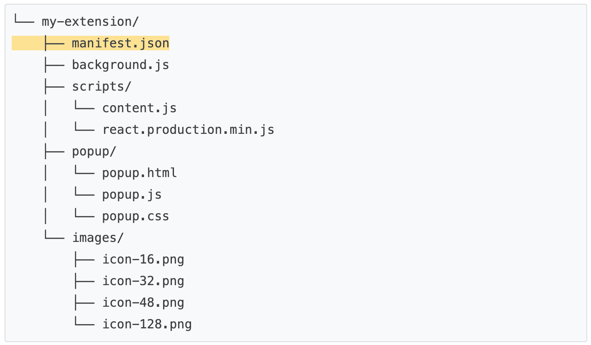

# 谷歌浏览器扩展程序制作指南

> 出于对隐私保护、安全性、性能的加强，谷歌随着 `Chrome 88` 的升级，将推行 `Manifest V3` 扩展程序规范。

> 本文也将基于 `Manifest V3` 规范进行扩展程序制作。

> 本文使用 `ChatGPT` 辅助编写

## 目录结构
* 以下为 chrome 官方文档给出的参考目录结构
* 可以通过多种方式构建项目目录，唯一的前提条件是将 `manifest.json` 文件放在根目录中



## Manifest 配置
* `manifest.json` 文件的配置详情如下:

```
{
	"name": "rep-tool",
	"version": "0.0.1",
	"manifest_version": 3,
	
	// 简单描述
	"description": "a chrome browser extension tool",
	"icons": {
		"16": "./logo.jpeg",
		"48": "./logo.jpeg",
		"128": "./logo.jpeg"
	},
	// 选择默认语言
	"default_locale": "en",
	
	// 浏览器图标部分
	// browser_action表示程序图标会出现在扩展程序槽，若要出现在地址栏内，则写成page_action
	"browser_action": {
	    "default_title": "小助手",
	    "default_icon": "logo.jpeg",
	    "default_popup": "popup.html"
	},

	// 引入一个脚本
	"content_scripts": [
		{
			"js": [
				"script/test.js"
			],
			// 脚本执行状态
			"matches": [
				"http://*/*",
				"https://*/*"
			],
			// 开始运行状态【文档加载开始】
			"run_at": "document_start"
		}
	],
	// 应用权限配置:cookie 权限，系统通知权限等
	"permissions": [
		"http://*/*",
		"https://*/*"
	  ]
}

```

## 主体页面


## 运行插件