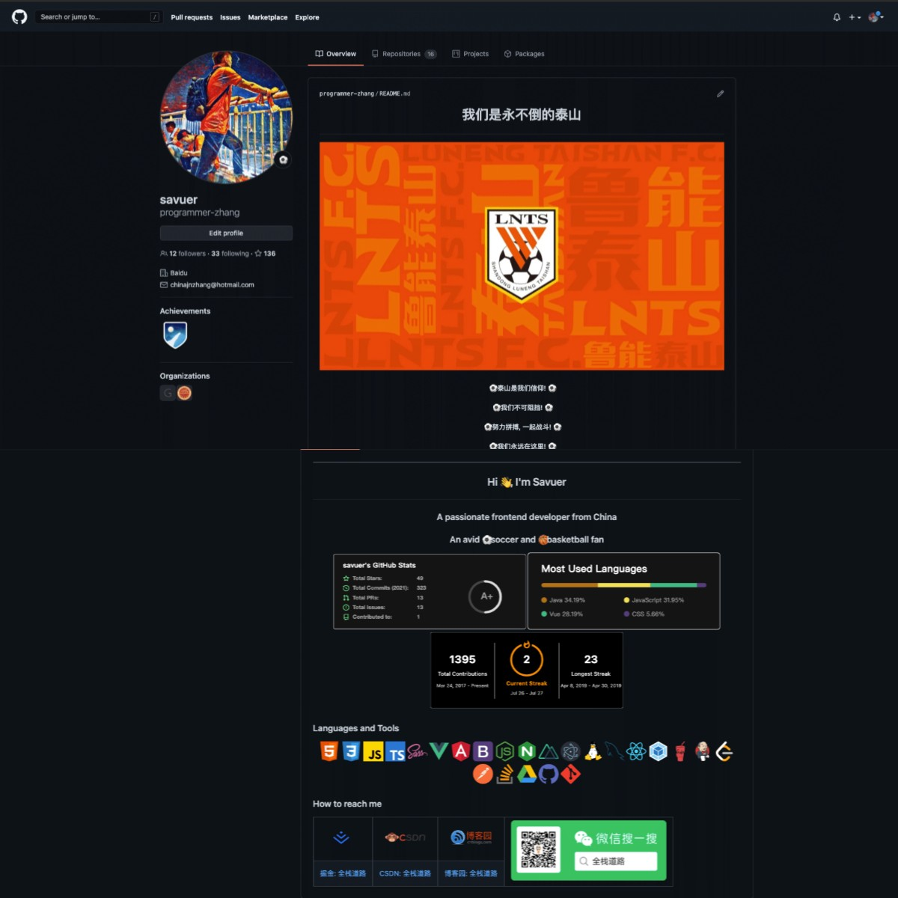
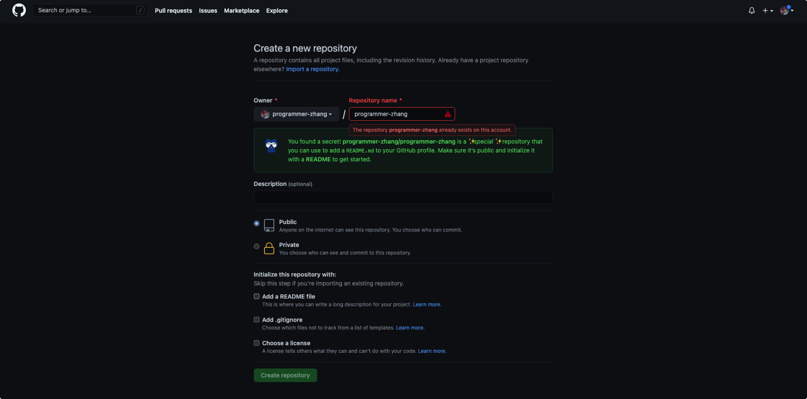
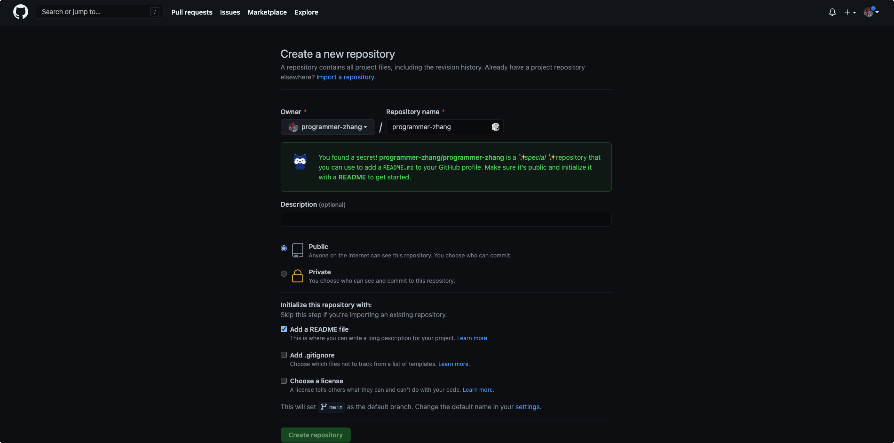

> 不知在什么时候起，Github 支持创建同名仓库来达到美化 Github 主页的功能, 关注的很多大神也自己设计开发了自己的主页，很有特点，今天就为大家带来 Github 个性主页如何开发~

> 下方先放上个人 Github 主页 ，笔者是球迷，所以主页也是按照个人兴趣喜好来设计的，如果和您审美有差距，请直接关闭。若有帮助，请记得三联哦~

## 开发
### 创建 Github 仓库
* 在 Github 中创建与个人 ID 同名的仓库

* 记得勾选下方「Add a README file」，仓库会自动创建readme文件，我们需要设计的个人主页，就需要在这个文件中进行开发。
	* readme文件为MarkDown格式，开发时可以使用HTML+CSS或MarkDown语法相结合，可以实现更多的个性化样式。

* 创建仓库后你就可以得到一个默认的 `Hi there` 主页信息

### 编辑 readme 文件
> 默认的 readme 文件仅仅有一些基础介绍，我相信大多数开发者都是不满足于此

* readme 文件使用 MarkDown 语法进行编写，当然你可以使用 MarkDown 结合 HTML 语言进行编写，这样生成的 readme 文件风格多样

### 个性化设计
##### Github 徽章
##### Github 统计
##### Github Icon