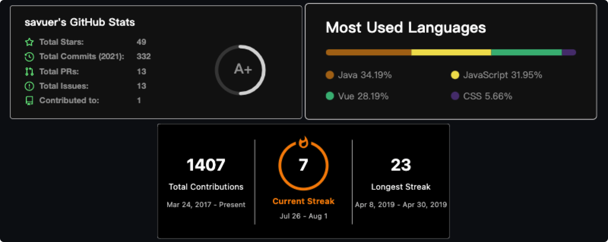

# 打造属于自己的 Github 主页
> 不知在什么时候起，Github 支持创建同名仓库来达到美化 Github 主页的功能, 关注的很多大神也自己设计开发了自己的主页，很有特点，今天就为大家带来 Github 个性主页如何开发~

## 阅读本文您将收获
* 如何进行个性化Github个人主页创建
* 如何美化Github个人主页

> 下方先放上个人 Github 主页 ，笔者是球迷，所以主页也是按照个人兴趣喜好来设计的，如果和您审美有差距，请直接关闭。若有帮助，请记得三联哦~


## 开发
### 创建 Github 仓库
* 在 Github 中创建与个人 ID 同名的仓库


* 记得勾选下方「Add a README file」，仓库会自动创建 `readme` 文件，我们需要设计的个人主页，就需要在这个文件中进行开发。
	* `readme` 文件为 `MarkDown` 格式，开发时可以使用 `HTML+CSS` 或 `MarkDown` 语法相结合，可以实现更多的个性化样式。


* 创建仓库后你就可以得到一个默认的 `Hi there` 主页信息，现在我们只需要修改 `readme` 文件就可以进行个人主页美化啦~

### 编辑 readme 文件
> 默认的 readme 文件仅仅有一些基础介绍，我相信大多数开发者都是不满足于此

* `readme` 文件使用 `MarkDown` 语法进行编写，当然你可以使用 `MarkDown` 结合 `HTML` 语言进行编写，这样生成的 `readme` 文件风格多样。

### 个性化设计
> 我们在很多大佬的 github 个人主页中经常能看到各种个性化的主页徽章或统计，那这些个性化的图表、统计、徽章都是怎么生成的，接下来我就为大家提供一些自己在开发主页过程中用(bai)到(piao)的小组件。

##### Github 徽章
 

* 大佬文章中经常使用到的这种 `badge` (徽章) ，其实都是一个个的SVG图片进行处理的，只需要通过[shields.io](https://shields.io/) 就可以自定义生成自己需要的 `badge`。
* 在网站下方的 `YOUR BBADGE` 中就能自定义 `badge`，填写相关信息之后，点击 `Make Badge` 就能获得 `badge` 的图片地址。


* 网站还支持自定义复杂 `badge` ,可以实现添加icon等功能，感兴趣就去试一下吧~

##### Github 统计
> Github 有很多动态生成的官方统计信息，利用这些统计信息我们可以更清晰地展现个人 Github 中的提交、分类、热门等信息。

* [GitHub Readme Stats](https://github.com/anuraghazra/github-readme-stats/blob/master/docs/readme_cn.md) 官方中文文档可以让你更快速地设置自己的主页，只需要将图片链接地址写入readme文件中，你就可以设置这些多彩且丰富的信息卡片
* 我在我的个人主页中用到的三个统计图片分别是

```
// github - stats
https://github-readme-stats.vercel.app/api?username=programmer-zhang&theme=dark&show_icons=true
// most - used-language
https://github-readme-stats.vercel.app/api/top-langs/?username=programmer-zhang&layout=compact&hide=html&theme=dark
// total - contribution
https://github-readme-streak-stats.herokuapp.com/?user=programmer-zhang&theme=highcontrast
```



##### Github Icon
> 善于利用 `Icon` 可以让我们的 `Github` 主页更加简洁，同时图标是个国际公用的语言，很多工具和框架相比文字描述，使用图标更加一目了然，这里我将提供一些我自己使用的图标，这些图标同样都是 svg 图标，如有需要请自取，点个赞就行~


* 图中我使用的图标地址都在我的 `Github` 中，请点击这里自取，[programmer-zhang](https://github.com/programmer-zhang/programmer-zhang/tree/main/images)

##### Github Emoji-cheat-sheet
> 很多情况下，文字并不能完美表达我们的意思，所以加上些 `Emoji` 表情能够更传神地表达意思，这部分为大家带来能够轻松在 `Github` 中使用的 `Emoji` 表情。


* 全部的 `Emoji-chat-sheet` 图标都在后面这个网址中，[emoji-cheat-sheet](https://www.webfx.com/tools/emoji-cheat-sheet/) 提供了很多 `Emoji` 表情，使用方式也特别的简单粗暴，直接将 `Emoji` 后面的标识复制在 `MarkDown` 文件中即可，提交到远程后，在网页中预览就能看到表情了。
