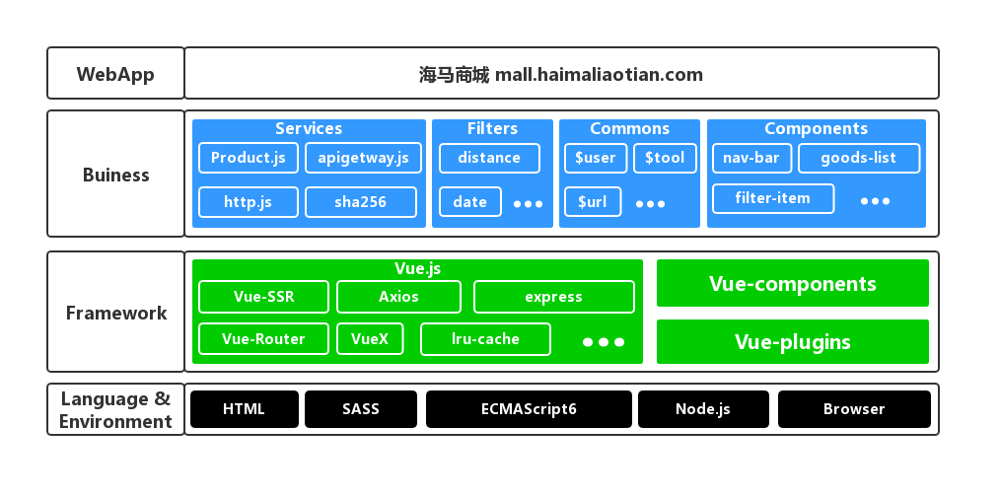

## 记一次惨痛的Vue-cli + VueX + SSR经历
> 前言介绍

> 总部提出新项目，大致需求就是APP内置一个H5商城，于是开始出差去总部极限开发

### 技术选型
* 项目语言：HTML、CSS、JavaScript
* 项目框架：Vue.js
* 项目搭建脚手架：vue-cli
* 工程化工具：webpack、Sass、Npm
* 源码管理：gitlab
* 运行环境：Browser & Node(PM2)
* 第三方服务：GrowingIO、高德地图

### 技术方案
* 非单页面应用，多页面站点，极限开发，直接使用Vue-cli
* 产品考虑SEO，上VueX和SSR
* 便于开发，使用sass等工程化工具
* 根据项目需要，封装user.js(针对用户信息存储), base.js(基础公共JS文件), url.js(针对url的操作), http.js(二次封装axios)
* 根据项目需求，抽象组件(compoments)和插件(widgets)注册到Vue实例
* 根据项目需要，合理设置Router和page
* 根据接口及环境需要，设置必要的环境变量和接口地址
* 根据开发和生产需要，添加必要的依赖

### Node服务器版本项目架构
* 整个网站的架构采用横向分层，从上往下越来越抽象，引用关系由上至下，拒绝由下至上的引用。
	* 语言&环境
	* 框架层
	* 业务公共层
	* 应用层

#### 语言&环境
* 语言：
	* 采用 Html 控制各个模块的结构；
	* 采用 Sass 做样式的预处理；
	* 采用 ECMAScript 6 来开发逻辑和交互，然后通过 Webpack 和 Babel 将高级版本的 JS 编译成当下流行浏览器能够解析的 ECMAScript 5。
* 环境：
	* Web 前端的代码主要运行在浏览器端，但是也能在 Node 环境运行，通过 Vue-ssr Node 端插件，同样的前端代码也可以通过服务器端将 Html 渲染出来。
	* 正式的部署中，Node 的进程管理是通过 PM2（process manager 2），它可以帮你检查进程的健康情况，并提供强大的接口，让你很容易的了解 Node 在服务器中的运行情况。

#### 框架层
* 框架层主要解决：算法、存储、通讯和 UI 4 大问题。
	* Vue
* 核心框架采用 Vue 及其 Vue 系列插件：
	* Vue-ssr 服务器端渲染模块
	* Vue-Router 路由模块
	* Vuex 数据流模块
* 选择Vue作为核心框架的原因：
	* Vue 更加轻量级
	* Vue 入门成本更低
	* Vue 中文社区比较多，中文文档也翻译的很好
	* Vue 在 GitHub 中对问题的回复也很及时
	* Vue 语法更加忠于前端语言
	* Vue 的解决方案更加齐全

#### 公共业务层
* 主要解决站点的业务问题，例如：系统配置、获取用户信息、与后端接口的交互等。
* Config: 公共环境变量相关
* Buiness:
	* user.js 用户信息相关
	* filter 业务相关filter
* Plugins:
	* bsae.js 基础公共方法库
	* cookie.js 针对cookie操作公共方法
	* gotoapps.js hyBrid公共方法
	* h5toapp.js  hyBrid公共方法
	* url.js  针对url操作公共方法
	* weixinShare.js  分享公共方法
* Components:  公共组件
* Widgets: 公共插件

#### 应用层
* 业务页面代码

### Node服务器版本存在的问题
#### 内存溢出问题
* 分析原因
	* 高并发是node服务器的瓶颈，增加服务器端渲染后这个问题更加突出
	* 服务器端渲染将数据大量存储在内存中，导致页面不销毁内存无法释放，内存猛增
	* 代码书写不规范，导致部分代码出现内存泄漏的情况
* 尝试解决方案
	* code review 将部分内存泄漏释放掉	[参考资料](http://www.ayqy.net/blog/js%E5%86%85%E5%AD%98%E6%B3%84%E6%BC%8F%E6%8E%92%E6%9F%A5%E6%96%B9%E6%B3%95/)
	* 开启node多进程	[参考资料](https://blog.csdn.net/u012251421/article/details/76262949)
	* 开启组件缓存和页面缓存	[参考资料](http://www.ayqy.net/blog/js%E5%86%85%E5%AD%98%E6%B3%84%E6%BC%8F%E6%8E%92%E6%9F%A5%E6%96%B9%E6%B3%95/)

#### PM2监控问题
* 分析原因
	* 公司服务器上探针检测代码健康，内存溢出导致pm2重启时，健康检测不通过导致项目重启

#### 多线程问题
* 分析原因
	* 为应对内存溢出问题，增加了多线程和组件缓存以及页面缓存，

#### 服务器端渲染接口请求报错
* 分析原因
	* 服务器端获取不到url上的参数，导致部分接口请求报错，页面阻塞
