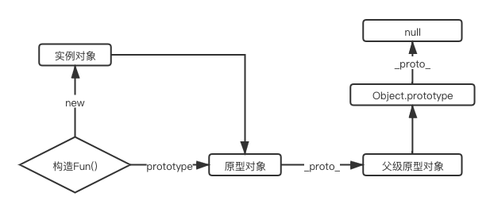

# 百度和好未来的面试官把我榨干了
> 我，普通本科计算机专业，18年6月毕业，抛去实习，工作经验只有一年半，没有什么大厂背景，没想到自己临时的决定让我敲开了百度的大门，非常荣幸地成为百度的RD。

> 2019年最后一个月，由于当时的东家当时业务成绩不是很出色，涨薪变得困难，所以当时决定抽出时间学习然后出去探探风，遂整理简历并高效学习，同时在求职APP上有针对性的投递简历，没想到第一周就有面试电话打了过来，于是请了一周年假，准备开始面试。

> 一周时间一共面试了三家公司，没想到三家公司全都拿到了offer，除了一家上海的企业涨幅没有达到预期外，百度和好未来均给了让我很心动的价格。

> 本文只介绍技术相关的题目，至于前期学习和准备以及非技术问题后续我会继续为大家带来，敬请关注更新。

## 百度面试题目

> 百度的面试加上电话面试共进行了六轮(一轮技术电话面试+三轮当场技术面试+两轮招聘行政面试)

> 百度的面试题目都是基础型题目，没有太偏的，但是面试官会抓住一个点往深层次问

### 电话面试
### 1.之前接触过动画交互与过渡属性吗？用到什么程度？讲一讲实际使用场景
> 作为一个前端er，切图和交互自然是基础中的基础，信手拈来。

* 经常使用，交互实现在我的开发习惯里是能用原生css实现就用原生。
* 比如一些hover操作需要淡进淡出，就需要用 `transation` 和 `opacity ` 相结合去实现。
* 还有一些窗口的抖动可以通过 `animation` 去实现，设定 `keyframes` 关键帧。
* 加入购物车的动画可能需要结合 JS 去判断飞入和飞出的相对位置，利用 `transform: translate(x,y)` 进行位置的变化，然后通过 `transition : transform 0.8s linear ` 去控制动态飞入的时间和速度曲线，当然这些属性的出发都需要动态去添加。
* 说到这里面试官打断了我，可能觉得说的差不多了，无情~

### H5的具体场景部分动画实现
> 这部分面试官问了一些具体场景下动态交互的实现，应该都是百度部分业务用到的。其实核心还是第一个问题中的部分属性，这里不再赘述。

### 制作横向滑动收起的动画时有没有碰到一些问题？
* 横向滑动收起如果使用 `display: none;` 去控制显示隐藏的时候会出现动画的不连贯和抖动，解决方式就是就是通过位置去视觉上的隐藏，利用定位将动画的 DOM 藏在屏幕之外。

### `animation`属性缩写状态下值分别代表什么？第四个呢？
> 这里面试官一开始没问前几个，我就把经常用的前三个说了，然后追问的第四个属性值，好在我还记得。

* `animation: 动画名称 持续时间 速度函数 延迟时间` 

### 如何画 1PX 的线
* 因为屏幕的分辨率和浏览器的的分辨率存在换算关系，所以1像素的线在屏幕上会占用2个或者2个以上视觉像素，这点在移动端尤其明显。
* 解决方案：

```
// 解决方案有很多种，这里仅给出我经常使用的使用伪类解决
.outer {
	position: relative;
}
.outer:before {
	display: block;
	content: '';
	position: absolute;
	left: 0;
	top: 0;
	width: 200%;
	height: 1px;
	tansform: scale(0.5);
	tansform-origin: 0 0;
	background: #f5f5f5;
}
```

### 说一下深拷贝和浅拷贝及常用实现方式
* 浅拷贝: 以赋值的形式拷贝引用对象，仍指向同一个地址，修改时原对象也会受到影响
	* 赋值表达式 `=`
	* `Object.assign`
	* 展开运算符(...)
* 深拷贝: 完全拷贝一个新对象，修改时原对象不再受到任何影响
	* `JSON.parse(JSON.stringify(obj))`
	* 递归进行逐一赋值

### 追问：使用JSON自带函数进行深拷贝有什么问题
* 具有循环引用的对象时，报错
* 当值为函数或 `undefined` 时，无法拷贝

### 用户从浏览器输入地址到看到页面发生了什么
> 由于是电话面试，当时心想说多了面试官也没心情听，只要把关键的节点都说出来就好。后来去百度面对面面试的时候面试官又问了一遍这个问题，然后追问了很多。

* 检查缓存
	* DNS 缓存
	* 页面缓存
* 网络请求
	* DNS域名解析
	* 建立TCP连接(三次握手机制、四次握手机制(HTTPS安全协议下))
	* 发送HTTP请求
	* 接收响应
* 解析页面
	* 构建DOM树
	* 样式计算
	* 生成布局树
* 渲染过程
	* 建立图层树
	* 生成绘制列表
	* 生成图块、位图
	* 显示内容

### 部分特定情况下的性能优化
> 性能优化是前端面试中必问的题目，这部分前期写过三篇专门的文章，分成三个方面讲述性能优化问题，可以点击链接查看，这次面试中问到的题目在文章中都有解决方案

* [[前端性能优化]HTML、CSS、JS部分]()
* [[前端性能优化]页面加载速度优化]()
* [[前端性能优化]网络传输层优化]()

> 以上电话面试的内容就结束了，约定了三天后去百度面试。虽然问题不多，但是经历了近一个小时，想到问了很多关于动态交互和性能优化的题目，猜测部门应该面向用户，而且量级不小，所以后续在复习中专门巩固了相关的内容。

> 事实证明自己没有猜错，入职之后发现业务全是面向用户，而且日活上亿。

> 这里给大家一点建议，除了针对招聘信息上的招聘要求针对性复习之外，如果能够在面试前和面试官有交流，可以问一下具体是什么业务部门，这样可以提前猜测一下面试会针对哪些方面。

> 电话面试之后我就傻啦吧唧忘了问了，幸好还能猜测出部分针对性问题。

## 百度一面
### 自我介绍以及之前工作流程和模式
> 这里面试官估计想了解以前的工作状态，是否是一个公认的合理的开发和工作模式，从实习到百度，经历告诉我，不同量级不同类型的公司在这方面差别很大，同时也能反映出之前的公司技术水平和能力，从而面试官判断对面的人是否能够和自己愉快的进行合作开发。

> 也可能是我想多了，就是简单问问，减轻点被面试者的压力

### 一个基本的语义化布局的页面你想怎么规划
> 这个问题说实话没明白想问啥，难不成只是想问语义化？这么简单？

* 主体框架(简单的瀑布流布局)

```
<nav></nav>
	<header></header>
	<main>
		<section></section>
		<section></section>
	</main>
<footer></footer>
```

### CSS上有没有什么书写注意点或者可优化的角度
> 说了这个问题我明白了，这是让我说一说在基础层面的页面优化方向，只不过把大问题分化成细节了

> 这里不说很细了，之前专门写过这方面优化的文章，详细内容可以点击下方链接去阅读

> [[前端性能优化]HTML、CSS、JS部分]()

*  能用html/css解决的问题就不要用js
	*  比如hover显示隐藏
	*  比如导航高亮
	*  自定义原始样式
	*  巧用伪类解决问题
	*  使用预编译器
*  不滥用高消耗的样式
*  选择器合并
*  0值去单位，小于1的值去掉0

### 使用Float进行布局容易产生什么问题？解决方式呢？
* 子元素在设置 float 后会脱离文档流，造成父元素高度塌陷
* 解决方式：
	* 父元素设置高度
	* 清除浮动

```
// test.html
<div class="outter">
	<div class="inner"></div>
	<div style="clear: both;"></div>
</div>

// test.css
.outter { width:200px; background:#3FF; border:1px solid #000;}
.inner { float:left; width:120px; height:80px; background:#FF3; }
```

### 简单说几种垂直水平居中的方式
* 固定宽高

```
// test.html
 <div class="outer">
	<div class="inner">
		inner-box
	</div>
</div>

// test.css
.outer {
	width: 500px;
	height: 300px;
}
.inner {
    width: 100px;
    height: 100px;
    background-color: red;
    color: #fff;
}

// 1. position absolute + 负margin
.outer {
	position: relative;
}
.inner {
	position: absolute;
	top: 50%;
	left: 50%;
	margin-top: -50px; // 子元素高度一半
	margin-left: -50px; // 子元素宽度一半
}

// 2. position absolute + calc
.outer {
	position: relative;
}
.inner {
	position: absolute;
	top: calc(50% - 50px);
	left: calc(50% - 50px);
}

// 3. position absolute + margin auto
.outer {
	position: relative;
}
.inner {
	position: absolute;
	top: 0;
	left: 0;
	right: 0;
	bottom: 0;
	margin: auto;
}
```

* 不固定宽高

```
// test.html
 <div class="outer">
	<div class="inner">
		inner-box
	</div>
</div>

// test.css
// 1. flex布局
.outer {
  display: flex;
  justify-content: center;
  align-items: center;
}

// 2. position absolute + transform
.container {
	position: relative;
}
.box-center {
	position: absolute;
	top: 50%;
	left: 50%;
	transform: translate(-50%, -50%);
}
// 3. css-table
.outer {
	display: table-cell;
	text-align: center;
	vertical-align: middle;
}
.inner {
	display: inline-block;
}

// 4. grid布局
.outer {
	display: grid;
	justify-items: center;
	align-items: center;
}
.inner {
	text-align: center;
}
```

### 盒子模型
* `box-sizing: content-box`（W3C盒子模型）：元素的宽高大小表现为内容的大小。
* `box-sizing: border-box`（IE盒子模型）：元素的宽高表现为内容 + 内边距 + 边框的大小。背景会延伸到边框的外沿。

### 什么情况下回发生回流和重绘
* 回流
	* 页面一开始渲染
	* 显示隐藏元素
	* 浏览器窗口变化
	* 元素位置变化
	* 元素尺寸变化
* 重绘
	* 样式改变不影响元素的位置时，比如 `color`、`background`，当然还有`visiability`

### 追问：回流和重绘的关系是什么样的
* 重绘不一定会发生回流
* 回流一定触发重绘

### 追问：怎么避免回流产生
* 避免多级嵌套
* 避免使用内联样式
* 避免使用计算样式
* 尽量少的使用JS去操作DOM结构
* 使用CSS3属性以被动启动GPU加速

### 平常开发遇到涉及数组遍历或对象遍历问题都是用什么方式
> 这里说的可能不是很全，记得之前阅读过一篇全面分析各种循环方式的文章，找到后再为大家总结一遍，敬请关注。

* 对象循环
	* `for...in` 遍历
	* `Object.keys(Object)`,创建包含对象属性的数组
	* `Object.values(Object)`,创建包含对象值的数组
	* `Object.getOwnPropertyNames(Object)`,返回一个数组，包含对象自身的所有属性（包含不可枚举属性）
	* `Object.entries(Object)`,创建了一个二维数组，每个内部数组都有两个元素，第一个元素是属性名，第二个属性值
* 数组循环
	* 基本的 `for` 
	* `forEach` 
	* `map` 
	* `for...of`
	* 使用ES6 `filter()`，`some()`, `every()`进行业务查找和筛选

### 追问：map和forEach的共同点和区别
* 共同点
	* 都是遍历数组
	* 都支持三个参数，item（当前每一项），index（索引值），arr（原数组）
* 区别
	* map 不会改变原数组，forEach 会改变原数组的值

### 追问：普通for循环和forEach的区别
> 这里一开始没明白面试官想要问啥，答了forEach更加简洁一些，普通for循环针对大量级数据性能更好，然后面试官直接说在跳出循环上说一下，才明白要问的，这里提醒大家，如果没弄明白想问啥，一定要问清楚

* for 循环可以通过 break，continue， return 跳出循环
* forEach 不能使用上述跳出方式，可以采用 `try...catch` 的写法，扔出一个 `Error` 跳出循环

### 追问：刚才说到 for...in 循环对象，有没有碰到什么疑惑或者问题，怎么解决的
* 遍历的是原型链中的数据，需要使用 `hasOwnProperty` 看是否属于该对象。

### 追问：既然说到原型了，讲讲你理解的原型和原型链吧
> 从循环的问题追问到原型，我可太南了

#### 简单讲
* 每一个函数都有一个prototype对象属性，指向另一个对象(原型链上面的)
* prototype就是调用构造函数所创建的那个实例对象的原型(proto)
* 实例对象与原型之间的连接，叫做原型链

#### 展开讲
> 在展开讲的时候，我边画图边给面试官讲的，作为技术人员嘛，充分利用各种形式展现自己的技术理解，大概就是下边这张图



* 定义了一个函数后，天生自带 prototype 指向函数的原型对象
* 函数经过new调用后，返回一个全新的实例对象，实例对象的 `_proto_` 指向构造函数的原型对象
* 对象的 `hasownproperty()` 来检查自身中是否含有该属性

### 事件机制
* 浏览器的JS引擎管理着事件代码的调用和执行，主线程在运行时会产生执行栈，栈中的代码调用某些异步API时会在任务队列中添加事件，栈中的代码执行完毕后，就会读取任务队列中的事件，去执行事件对应的回调函数，如此循环往复，形成事件循环机制。
* 整体的执行顺序：宏任务 -> 微任务 -> 必要的渲染UI -> 下一轮Eventloop
* 通俗点的流程
	* 执行一个宏任务（首次执行的主代码块或者任务队列中的回调函数）
	* 执行过程中如果遇到微任务，就将它添加到微任务的任务队列中
	* 宏任务执行完毕后，立即执行当前微任务队列中的所有任务（依次执行）
	* JS引擎线程挂起，GUI线程执行渲染
	* GUI线程渲染完毕后挂起，JS引擎线程执行任务队列中的下一个宏任务
* 宏任务： `script主代码`、`setTimout`、`setInterval`、`事件I/O`等
* 微任务：`promise`等

### 追问笔试题：那道经典的setTimeout题，并问什么会这样输出
* 主线程执行同步任务，也就是主循环，`setTimeout` 为宏任务，同时是异步任务，会被挂起到循环结束
* 循环结束执行 `setTimeout` 的回调,执行时发现 `i` 的当前作用域不存在，向上查找，在全局作用域中发现了 `i` ，此时循环已经结束，所以全都输出同一个数

### 追问笔试题，一道结合了各种 setTimout 和 promise 的事件机制输出题目,共有十一个输出代码块
> 题目具体已经不记得了，反正记住执行顺序一点一点的输出，面试时最好带个笔记本或者电脑，可以随时记录下，方便回答

### HTTP请求的三次握手机制
> 三次握手机制这里不再大篇幅展开讲了，之前写的关于性能优化的文章中有详细的回答，请[点击这里查看]()

### 追问：HTTP请求为什么是三次握手，不是两次或者四次
* 三次握手是确定客户端和服务端接收和发送能力都正常的最优次数
	* 第一次：客户端发送能力正常
	* 第二次：服务端接收能力正常，服务端发送能力正常
	* 第三次：客户端接收能力正常

### 追问：HTTP、HTTPS的区别
* HTTPS更安全：http 是超文本传输协议，信息是明文传输，https 则是具有安全性的 ssl 加密传输协议
* HTTP更简单：http 的连接是无状态的；HTTPS 协议是由 SSL+HTTP 协议构建的可进行加密传输、身份认证的网络协议。

### 追问：关于缓存方面讲一讲
> 这个问题之前写过关于缓存策略的文章，不在展开讲，详细内容请点击[缓存问题看这篇，让面试官爱上你]()

* 强缓存(不走服务器)：
	* `Expires`
	* `Cache-Control`
* 协商缓存(走服务器):
	* `Last-Modified/If-Modified-Since`
	* `ETag/If-None-Match`

### 追问：几种缓存策略的对比简单说一下
> 这个问题也在关于缓存策略的文章里，详细内容请点击[缓存问题看这篇，让面试官爱上你]()

### 前端跨域问题如何产生，有什么方法解决
> 这里之前写过详细的文章，不展开细讲了，可以点击这里查看[前端跨域看这篇就够了]()

* 产生原因：同源策略
* 解决方式：
	* jsonp实现跨域请求
	* 使用 iframe + form 进行跨域请求
	* CORS(跨域资源共享 Cross-origin resource sharing)进行跨域请求
	* 利用服务器中转

### 追问：JSONP跨域有什么特点
* 只支持 GET 请求

### 追问：CORS进行跨域有什么特点
> 这个追问题我回答完之后面试官说是临时想出来的，加分题，但是他没想到我之前看过相关的文章还整理出来了，这不是巧了么这不是~
> 这个问题的答案也在上面给出的前端跨域文章里

* CORS请求分为简单请求和非简单请求，区分方式是看请求头和请求方法 (只有 GET、POST、HEAD)
* 简单请求：服务端配置好的前提下，简单请求直接请求就可以
* 非简单请求：在请求时会发送两次请求，第一次是预检测请求，返回的状态码为204，第二次请求为预检测请求通过后才会发送真实请求

> 问到这里其实一面已经结束了，不过面试官看来需求不多，告诉我一面已经过了，看我是Vue技术栈，遂通过Vue又续上了，没有问很深入的问题，都是小细节，当做聊家常了，然后我猜测二面应该会问关于Vue深层次的问题，不过我还是有点信心的，毕竟是看过源码的人。

> 就在我写这篇文章的收尾阶段，网上发布了关于尤雨溪和Vue的纪录片，链接附上[纪录Vue.js尤雨溪 - 中英CC字幕 - Honeypot呈现](https://www.bilibili.com/video/av91714806)，朋友们可以当做茶余饭后的小片看，这里建议大家，少看那些场景简单，人物两三个人，说着奇奇怪怪语言的视频！

### 有没有遇到深层次对象双向绑定后子组件未监听到更新的情况，怎么解决的
* 有
* 解决方式：
	* 一：深层监听 `deep: true`,但是这样会带来性能问题
	* 二：使用 `this.$set()` 进行赋值

### Vue的data以Function方式返回的原因
* 避免产生变量共享，不以返回值的情况下，所有组件将共享同一个对象，指向相同的内存地址

### Vue的响应式怎么做的，简单说
* init时利用 `Object.defineproperty` 监听数据变化
* 利用 `setter` 和 `getter` 进行触发

> 这里一面算是正式结束了，面试官走的时候说回答的不错，我去给你找个精通 Vue 的二面来，你们再聊聊。

> 一面面试官说完我瞬间感觉要爆炸，我可太南了！但是事实是二面面试官并没有很深入的问，而是让我自己说，他从中问一些细节。后来才知道，百度有个业务组的领导是Vue的核心开发者，大家都很熟悉Vue。

## 百度二面
### 结合页面加载流程流程详细说下过程中的性能优化

### ES6 extends 的原理

### new 的原理

### ES6 和 ES5

### 继承和原型

### 闭包的原理和优劣

### 特定状态下浏览器的兼容性

### 事件委托

### 前端安全

## 百度三面
### 关于前东家

### 关于读书期间的规划和未来的规划

### 工作后的心态变化及感受

### nginx相关

### 小程序相关

### weex相关

## 上海某外包公司
### 浮动的产生原因及解决方式

### 盒子模型

### BFC

### 类型判断

### Vue的生命周期

### 垂直水平居中

### 闭包

### var 和 let

### 性能优化

### CSS预处理器

## 好未来一、二、三面
### 性能优化

### H5

### less & sass

### marginTop的基准点

### 数组的并集

### 深拷贝和浅拷贝

### Vue父子组件传值

### Vue列表的循环定义key的原理

### Vue Router的原理及过程

### 地图可视化

### 手写一个promise的ajax请求