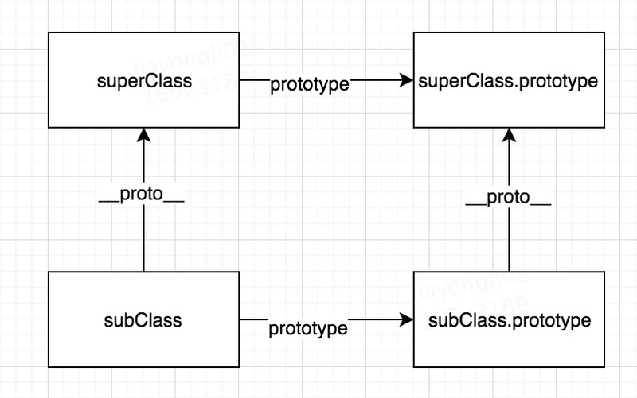
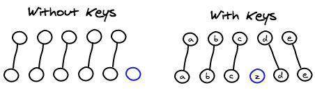
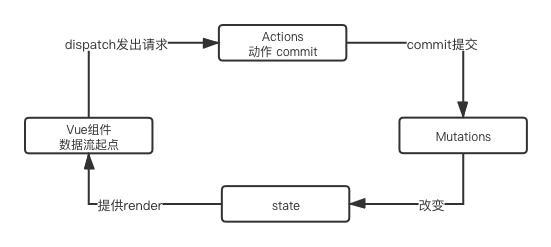

# 百度和好未来的面试官把我榨干了
> 我，普通本科计算机专业，18年6月毕业，抛去实习，工作经验只有一年半，没想到自己临时的决定让我敲开了百度的大门，非常荣幸地成为百度的RD。

> 2019年最后一个月，由于当时的东家当时业务成绩不是很出色，涨薪变得困难，所以当时决定抽出时间学习然后出去探探风，遂整理简历并高效学习，同时在求职APP上有针对性的投递简历，没想到第一周就有面试电话打了过来，于是请了一周年假，准备开始面试。

> 一周时间一共面试了三家公司，没想到三家公司全都拿到了offer，除了一家上海的企业涨幅没有达到预期外，百度和好未来均给了让我很心动的价格。

> 本文只介绍技术相关的题目，至于前期学习和准备以及非技术问题后续我会后续为大家带来，敬请关注更新。

> 由于刚开始写作掘金没多久，大部分文章都在github上，大家可以按需自取，[github文章地址](https://github.com/programmer-zhang/front-end)

## 百度面试题目

> 百度的面试加上电话面试共进行了六轮(一轮技术电话面试+三轮当场技术面试+两轮招聘行政面试)

> 百度的面试题目都是基础型题目，没有太偏的，但是面试官会抓住一个点往深层次问

### 电话面试
### 1.之前接触过动画交互与过渡属性吗？用到什么程度？讲一讲实际使用场景
> 作为一个前端er，切图和交互自然是基础中的基础，信手拈来。

* 经常使用，交互实现在我的开发习惯里是能用原生css实现就用原生。
* 比如一些hover操作需要淡进淡出，就需要用 `transation` 和 `opacity ` 相结合去实现。
* 还有一些窗口的抖动可以通过 `animation` 去实现，设定 `keyframes` 关键帧。
* 加入购物车的动画可能需要结合 JS 去判断飞入和飞出的相对位置，利用 `transform: translate(x,y)` 进行位置的变化，然后通过 `transition : transform 0.8s linear ` 去控制动态飞入的时间和速度曲线，当然这些属性的出发都需要动态去添加。
* 说到这里面试官打断了我，可能觉得说的差不多了，无情~

### H5的具体场景部分动画实现
> 这部分面试官问了一些具体场景下动态交互的实现，应该都是百度部分业务用到的。其实核心还是第一个问题中的部分属性，这里不再赘述。

### 制作横向滑动收起的动画时有没有碰到一些问题？
* 横向滑动收起如果使用 `display: none;` 去控制显示隐藏的时候会出现动画的不连贯和抖动，解决方式就是就是通过位置去视觉上的隐藏，利用定位将动画的 DOM 藏在屏幕之外。

### `animation`属性缩写状态下值分别代表什么？第四个呢？
> 这里面试官一开始没问前几个，我就把经常用的前三个说了，然后追问的第四个属性值，好在我还记得。

* `animation: 动画名称 持续时间 速度函数 延迟时间` 

### 如何画 1PX 的线
* 因为屏幕的分辨率和浏览器的的分辨率存在换算关系，所以1像素的线在屏幕上会占用2个或者2个以上视觉像素，这点在移动端尤其明显。
* 解决方案：

```
// 解决方案有很多种，这里仅给出我经常使用的使用伪类解决
.outer {
	position: relative;
}
.outer:before {
	display: block;
	content: '';
	position: absolute;
	left: 0;
	top: 0;
	width: 200%;
	height: 1px;
	tansform: scale(0.5);
	tansform-origin: 0 0;
	background: #f5f5f5;
}
```

### 说一下深拷贝和浅拷贝及常用实现方式
* 浅拷贝: 以赋值的形式拷贝引用对象，仍指向同一个地址，修改时原对象也会受到影响
	* 赋值表达式 `=`
	* `Object.assign`
	* 展开运算符(...)
* 深拷贝: 完全拷贝一个新对象，修改时原对象不再受到任何影响
	* `JSON.parse(JSON.stringify(obj))`
	* 递归进行逐一赋值

### 追问：使用JSON自带函数进行深拷贝有什么问题
* 具有循环引用的对象时，报错
* 当值为函数或 `undefined` 时，无法拷贝

### 用户从浏览器输入地址到看到页面发生了什么
> 由于是电话面试，当时心想说多了面试官也没心情听，只要把关键的节点都说出来就好。后来去百度面对面面试的时候面试官又问了一遍这个问题，然后追问了很多。

* 检查缓存
	* DNS 缓存
	* 页面缓存
* 网络请求
	* DNS域名解析
	* 建立TCP连接(三次握手机制、四次握手机制(HTTPS安全协议下))
	* 发送HTTP请求
	* 接收响应
* 解析页面
	* 构建DOM树
	* 样式计算
	* 生成布局树
* 渲染过程
	* 建立图层树
	* 生成绘制列表
	* 生成图块、位图
	* 显示内容

### 部分特定情况下的性能优化
> 性能优化是前端面试中必问的题目，这部分前期写过三篇专门的文章，分成三个方面讲述性能优化问题，可以点击链接查看，这次面试中问到的题目在文章中都有解决方案

* [[前端性能优化]HTML、CSS、JS部分](https://github.com/programmer-zhang/front-end/blob/master/profiles/%5B%E5%89%8D%E7%AB%AF%E6%80%A7%E8%83%BD%E4%BC%98%E5%8C%96%5DHTML%E3%80%81CSS%E3%80%81JS%E7%AF%87.md)
* [[前端性能优化]页面加载速度优化](https://github.com/programmer-zhang/front-end/blob/master/profiles/%5B%E5%89%8D%E7%AB%AF%E6%80%A7%E8%83%BD%E4%BC%98%E5%8C%96%5D%E9%A1%B5%E9%9D%A2%E5%8A%A0%E8%BD%BD%E9%80%9F%E5%BA%A6%E4%BC%98%E5%8C%96.md)
* [[前端性能优化]网络传输层优化](https://github.com/programmer-zhang/front-end/blob/master/profiles/%5B%E5%89%8D%E7%AB%AF%E6%80%A7%E8%83%BD%E4%BC%98%E5%8C%96%5D%E7%BD%91%E7%BB%9C%E4%BC%A0%E8%BE%93%E5%B1%82%E4%BC%98%E5%8C%96.md)

> 以上电话面试的内容就结束了，约定了三天后去百度面试。虽然问题不多，但是经历了近一个小时，想到问了很多关于动态交互和性能优化的题目，猜测部门应该面向用户，而且量级不小，所以后续在复习中专门巩固了相关的内容。

> 事实证明自己没有猜错，入职之后发现业务全是面向用户，而且日活上亿。

> 这里给大家一点建议，除了针对招聘信息上的招聘要求针对性复习之外，如果能够在面试前和面试官有交流，可以问一下具体是什么业务部门，这样可以提前猜测一下面试会针对哪些方面。

> 电话面试之后我就傻啦吧唧忘了问了，幸好还能猜测出部分针对性问题。

## 百度一面
### 自我介绍以及之前工作流程和模式
> 这里面试官估计想了解以前的工作状态，是否是一个公认的合理的开发和工作模式，从实习到百度，经历告诉我，不同量级不同类型的公司在这方面差别很大，同时也能反映出之前的公司技术水平和能力，从而面试官判断对面的人是否能够和自己愉快的进行合作开发。

> 也可能是我想多了，就是简单问问，减轻点被面试者的压力

### 一个基本的语义化布局的页面你想怎么规划
> 这个问题说实话没明白想问啥，难不成只是想问语义化？这么简单？

* 主体框架(简单的瀑布流布局)

```
<nav></nav>
	<header></header>
	<main>
		<section></section>
		<section></section>
	</main>
<footer></footer>
```

### CSS上有没有什么书写注意点或者可优化的角度
> 说了这个问题我明白了，这是让我说一说在基础层面的页面优化方向，只不过把大问题分化成细节了

> 这里不说很细了，之前专门写过这方面优化的文章，详细内容可以点击下方链接去阅读

> [[前端性能优化]HTML、CSS、JS部分](https://github.com/programmer-zhang/front-end/blob/master/profiles/%5B%E5%89%8D%E7%AB%AF%E6%80%A7%E8%83%BD%E4%BC%98%E5%8C%96%5DHTML%E3%80%81CSS%E3%80%81JS%E7%AF%87.md)

*  能用html/css解决的问题就不要用js
	*  比如hover显示隐藏
	*  比如导航高亮
	*  自定义原始样式
	*  巧用伪类解决问题
	*  使用预编译器
*  不滥用高消耗的样式
*  选择器合并
*  0值去单位，小于1的值去掉0

### 使用Float进行布局容易产生什么问题？解决方式呢？
* 子元素在设置 float 后会脱离文档流，造成父元素高度塌陷
* 解决方式：
	* 父元素设置高度
	* 清除浮动

```
// test.html
<div class="outter">
	<div class="inner"></div>
	<div style="clear: both;"></div>
</div>

// test.css
.outter { width:200px; background:#3FF; border:1px solid #000;}
.inner { float:left; width:120px; height:80px; background:#FF3; }
```

### 简单说几种垂直水平居中的方式
* 固定宽高

```
// test.html
 <div class="outer">
	<div class="inner">
		inner-box
	</div>
</div>

// test.css
.outer {
	width: 500px;
	height: 300px;
}
.inner {
    width: 100px;
    height: 100px;
    background-color: red;
    color: #fff;
}

// 1. position absolute + 负margin
.outer {
	position: relative;
}
.inner {
	position: absolute;
	top: 50%;
	left: 50%;
	margin-top: -50px; // 子元素高度一半
	margin-left: -50px; // 子元素宽度一半
}

// 2. position absolute + calc
.outer {
	position: relative;
}
.inner {
	position: absolute;
	top: calc(50% - 50px);
	left: calc(50% - 50px);
}

// 3. position absolute + margin auto
.outer {
	position: relative;
}
.inner {
	position: absolute;
	top: 0;
	left: 0;
	right: 0;
	bottom: 0;
	margin: auto;
}
```

* 不固定宽高

```
// test.html
 <div class="outer">
	<div class="inner">
		inner-box
	</div>
</div>

// test.css
// 1. flex布局
.outer {
  display: flex;
  justify-content: center;
  align-items: center;
}

// 2. position absolute + transform
.container {
	position: relative;
}
.box-center {
	position: absolute;
	top: 50%;
	left: 50%;
	transform: translate(-50%, -50%);
}
// 3. css-table
.outer {
	display: table-cell;
	text-align: center;
	vertical-align: middle;
}
.inner {
	display: inline-block;
}

// 4. grid布局
.outer {
	display: grid;
	justify-items: center;
	align-items: center;
}
.inner {
	text-align: center;
}
```

### 盒子模型
* `box-sizing: content-box`（W3C盒子模型）：元素的宽高大小表现为内容的大小。
* `box-sizing: border-box`（IE盒子模型）：元素的宽高表现为内容 + 内边距 + 边框的大小。背景会延伸到边框的外沿。

### 什么情况下回发生回流和重绘
* 回流
	* 页面一开始渲染
	* 显示隐藏元素
	* 浏览器窗口变化
	* 元素位置变化
	* 元素尺寸变化
* 重绘
	* 样式改变不影响元素的位置时，比如 `color`、`background`，当然还有`visiability`

### 追问：回流和重绘的关系是什么样的
* 重绘不一定会发生回流
* 回流一定触发重绘

### 追问：怎么避免回流产生
* 避免多级嵌套
* 避免使用内联样式
* 避免使用计算样式
* 尽量少的使用JS去操作DOM结构
* 使用CSS3属性以被动启动GPU加速

### 事件委托
* 详细的原理要从DOM的事件机制说起：捕获事件阶段、冒泡事件阶段、目标时间阶段
* 事件委托是利用冒泡机制来实现的，可以减少内存消耗，减少注册事件。

### 平常开发遇到涉及数组遍历或对象遍历问题都是用什么方式
> 这里说的可能不是很全，记得之前阅读过一篇全面分析各种循环方式的文章，找到后再为大家总结一遍，敬请关注。

* 对象循环
	* `for...in` 遍历
	* `Object.keys(Object)`,创建包含对象属性的数组
	* `Object.values(Object)`,创建包含对象值的数组
	* `Object.getOwnPropertyNames(Object)`,返回一个数组，包含对象自身的所有属性（包含不可枚举属性）
	* `Object.entries(Object)`,创建了一个二维数组，每个内部数组都有两个元素，第一个元素是属性名，第二个属性值
* 数组循环
	* 基本的 `for` 
	* `forEach` 
	* `map` 
	* `for...of`
	* 使用ES6 `filter()`，`some()`, `every()`进行业务查找和筛选

### 追问：map和forEach的共同点和区别
* 共同点
	* 都是遍历数组
	* 都支持三个参数，item（当前每一项），index（索引值），arr（原数组）
* 区别
	* map 不会改变原数组，forEach 会改变原数组的值

### 追问：普通for循环和forEach的区别
> 这里一开始没明白面试官想要问啥，答了forEach更加简洁一些，普通for循环针对大量级数据性能更好，然后面试官直接说在跳出循环上说一下，才明白要问的，这里提醒大家，如果没弄明白想问啥，一定要问清楚

* for 循环可以通过 break，continue， return 跳出循环
* forEach 不能使用上述跳出方式，可以采用 `try...catch` 的写法，扔出一个 `Error` 跳出循环

### 追问：刚才说到 for...in 循环对象，有没有碰到什么疑惑或者问题，怎么解决的
* 遍历的是原型链中的数据，需要使用 `hasOwnProperty` 看是否属于该对象。

### 追问：既然说到原型了，讲讲你理解的原型和原型链吧
> 从循环的问题追问到原型，我可太南了

#### 简单讲
* 每一个函数都有一个prototype对象属性，指向另一个对象(原型链上面的)
* prototype就是调用构造函数所创建的那个实例对象的原型(proto)
* 实例对象与原型之间的连接，叫做原型链

#### 展开讲
> 在展开讲的时候，我边画图边给面试官讲的，作为技术人员嘛，充分利用各种形式展现自己的技术理解，大概就是下边这张图


* 定义了一个函数后，天生自带 prototype 指向函数的原型对象
* 函数经过new调用后，返回一个全新的实例对象，实例对象的 `_proto_` 指向构造函数的原型对象
* 对象的 `hasownproperty()` 来检查自身中是否含有该属性

### 事件机制
* 浏览器的JS引擎管理着事件代码的调用和执行，主线程在运行时会产生执行栈，栈中的代码调用某些异步API时会在任务队列中添加事件，栈中的代码执行完毕后，就会读取任务队列中的事件，去执行事件对应的回调函数，如此循环往复，形成事件循环机制。
* 整体的执行顺序：宏任务 -> 微任务 -> 必要的渲染UI -> 下一轮Eventloop
* 通俗点的流程
	* 执行一个宏任务（首次执行的主代码块或者任务队列中的回调函数）
	* 执行过程中如果遇到微任务，就将它添加到微任务的任务队列中
	* 宏任务执行完毕后，立即执行当前微任务队列中的所有任务（依次执行）
	* JS引擎线程挂起，GUI线程执行渲染
	* GUI线程渲染完毕后挂起，JS引擎线程执行任务队列中的下一个宏任务
* 宏任务： `script主代码`、`setTimout`、`setInterval`、`事件I/O`等
* 微任务：`promise`等

### 追问笔试题：那道经典的setTimeout题，并问什么会这样输出
* 主线程执行同步任务，也就是主循环，`setTimeout` 为宏任务，同时是异步任务，会被挂起到循环结束
* 循环结束执行 `setTimeout` 的回调,执行时发现 `i` 的当前作用域不存在，向上查找，在全局作用域中发现了 `i` ，此时循环已经结束，所以全都输出同一个数

### 追问笔试题：一道结合了各种 setTimout 和 promise 的事件机制输出题目,共有十一个输出代码块
> 题目具体已经不记得了，反正记住执行顺序一点一点的输出，面试时最好带个笔记本或者电脑，可以随时记录下，方便回答

### HTTP请求的三次握手机制
> 三次握手机制这里不再大篇幅展开讲了，之前写的关于性能优化的文章中有详细的回答，请[点击这里查看](https://github.com/programmer-zhang/front-end/blob/master/profiles/%5B%E5%89%8D%E7%AB%AF%E6%80%A7%E8%83%BD%E4%BC%98%E5%8C%96%5D%E7%BD%91%E7%BB%9C%E4%BC%A0%E8%BE%93%E5%B1%82%E4%BC%98%E5%8C%96.md)

### 追问：HTTP请求为什么是三次握手，不是两次或者四次
* 三次握手是确定客户端和服务端接收和发送能力都正常的最优次数
	* 第一次：客户端发送能力正常
	* 第二次：服务端接收能力正常，服务端发送能力正常
	* 第三次：客户端接收能力正常

### 追问：HTTP、HTTPS的区别
* HTTPS更安全：http 是超文本传输协议，信息是明文传输，https 则是具有安全性的 ssl 加密传输协议
* HTTP更简单：http 的连接是无状态的；HTTPS 协议是由 SSL+HTTP 协议构建的可进行加密传输、身份认证的网络协议。

### 追问：关于缓存方面讲一讲
> 这个问题之前写过关于缓存策略的文章，不在展开讲，详细内容请点击[缓存问题看这篇，让面试官爱上你](https://github.com/programmer-zhang/front-end/blob/master/profiles/HTTP_header.md)

* 强缓存(不走服务器)：
	* `Expires`
	* `Cache-Control`
* 协商缓存(走服务器):
	* `Last-Modified/If-Modified-Since`
	* `ETag/If-None-Match`

### 追问：几种缓存策略的对比简单说一下
> 这个问题也在关于缓存策略的文章里，详细内容请点击[缓存问题看这篇，让面试官爱上你](https://github.com/programmer-zhang/front-end/blob/master/profiles/HTTP_header.md)

### 前端跨域问题如何产生，有什么方法解决
> 这里之前写过详细的文章，不展开细讲了，可以点击这里查看[前端跨域看这篇就够了](https://github.com/programmer-zhang/front-end/blob/master/profiles/cross-origin.md)

* 产生原因：同源策略
* 解决方式：
	* jsonp实现跨域请求
	* 使用 iframe + form 进行跨域请求
	* CORS(跨域资源共享 Cross-origin resource sharing)进行跨域请求
	* 利用服务器中转

### 追问：JSONP跨域有什么特点
* 只支持 GET 请求

### 追问：CORS进行跨域有什么特点
> 这个追问题我回答完之后面试官说是临时想出来的，但是他没想到我之前看过相关的文章还整理出来了，这不是巧了么这不是~
> 这个问题的答案也在上面给出的前端跨域文章里

* CORS请求分为简单请求和非简单请求，区分方式是看请求头和请求方法 (只有 GET、POST、HEAD)
* 简单请求：服务端配置好的前提下，简单请求直接请求就可以
* 非简单请求：在请求时会发送两次请求，第一次是预检测请求，返回的状态码为204，第二次请求为预检测请求通过后才会发送真实请求

> 问到这里其实一面已经结束了，不过面试官看来需求不多，告诉我一面已经过了，看我是Vue技术栈，遂通过Vue又续上了，没有问很深入的问题，都是小细节，当做聊家常了，然后我猜测二面应该会问关于Vue深层次的问题，不过我还是有点信心的，毕竟是看过源码的人。

> 就在我写这篇文章的收尾阶段，网上发布了关于尤雨溪和Vue的纪录片，链接附上[纪录Vue.js尤雨溪 - 中英CC字幕 - Honeypot呈现](https://www.bilibili.com/video/av91714806)，朋友们可以当做茶余饭后的小片看，这里建议大家，少看那些场景简单，人物两三个人，说着奇奇怪怪语言的视频！

### 有没有遇到深层次对象双向绑定后子组件未监听到更新的情况，怎么解决的
* 有
* 解决方式：
	* 一：深层监听 `deep: true`,但是这样会带来性能问题
	* 二：使用 `this.$set()` 进行赋值

### Vue的data以Function方式返回的原因
* 避免产生变量共享，不以返回值的情况下，所有组件将共享同一个对象，指向相同的内存地址

### Vue的响应式怎么做的，简单说
* `init` 时利用 `Object.defineproperty` 监听数据变化
* 利用 `setter` 和 `getter` 进行触发

> 这里一面算是正式结束了，面试官走的时候说回答的不错，我去给你找个精通 Vue 的二面来，你们再聊聊。

> 一面面试官说完我瞬间感觉要爆炸，我可太南了！但是事实是二面面试官并没有很深入的问，而是让我自己说，他从中问一些细节。后来才知道，百度有个业务组的领导是Vue的核心开发者，大家都很熟悉Vue。

## 百度二面
### 结合页面加载流程流程详细说下过程中的性能优化
> 这个问题就比较细节化，可以参考我之前写过的关于性能优化的文章，基本的优化方案里边都有，[前端性能优化](https://github.com/programmer-zhang/front-end/blob/master/profiles/%5B%E5%89%8D%E7%AB%AF%E6%80%A7%E8%83%BD%E4%BC%98%E5%8C%96%5D%E9%A1%B5%E9%9D%A2%E5%8A%A0%E8%BD%BD%E9%80%9F%E5%BA%A6%E4%BC%98%E5%8C%96.md)

> 这个问题回答期间面试官追问了一些具体的小细节问题，这里就不再给出了，文章中基本都包含了，这里就不展开篇幅讲了

> 这种笼统的大方向问题建议条理化回答，可以按照自己习惯的或者固定的方面去展开讲，否则这种大问题东一句西一句的容易让面试不耐烦，越条理越好，我自己当时是按照HTML、CSS、JS、网络通信，页面加载的顺序去说的，过程中面试官一直在记录，估计是看有没有说到他想要的那些点。

### 追问：开发过程中碰到过什么棘手的性能方面的问题么
> 这个问题当时都是回答的之前在开发过程中确实碰到的，感恩自己当时有心做了总结，总结请点击[记一次惨痛的Vue-cli + VueX + SSR经历](https://github.com/programmer-zhang/front-end/blob/master/profiles/hmall.md)

> 这期间穿插着问了一点node，webpack的小知识点

### 继承的方式有哪些
提供个父类进行继承

```
function SuperType(name) {
    this.name = name;
    this.sexy = ["man", "woman", "unknow"];
    this.showName = function() {
        console.log(name);
    };
};
SuperType.prototype.age = 18;
```

##### 原型继承
* 利用原型让一个引用类型继承另外一个引用类型的属性和方法
* 重点：新实例的原型等于父类的实例
* 特点：
	* 1.实例可继承的属性有：实例的构造函数的属性，父类构造函数属性，父类原型的属性。（新实例不会继承父类实例的属性！）
	* 2.基于原型链，既是父类的实例，也是子类的实例
* 缺点：
	* 1.无法实现多继承
	* 2.所有新实例都会共享父类实例的属性

```
function SubType() {
    this.name = 'coder';
}
SubType.prototype = new SuperType();
var subFun = new SubType();
console.log(subFun.age) // 18
console.log('outer', subFun instanceof SuperType) // true 
```
##### 构造函数继承
* 重点：用call()和apply()将父类构造函数引入子类函数（在子类函数中做了父类函数的自执行（复制））
* 特点：
	* 1、只继承了父类构造函数的属性，没有继承父类原型的属性。
	* 2、解决了原型链继承缺点1、2、3。
	* 3、可以继承多个构造函数属性（call多个）。
	* 4、在子实例中可向父实例传参。
* 缺点：
	* 1、只能继承父类构造函数的属性。
	* 2、无法实现构造函数的复用。（每次用每次都要重新调用）
	* 3、每个新实例都有父类构造函数的副本，臃肿。

```
function SubType() {
    SuperType.call(this);
}
let instance1 = new SubType();
instance1.sexy.push("all");
console.log(instance1.sexy); // ["man", "woman", "unknow", "all"]
let instance2 = new SubType();
console.log(instance2.sexy); // ["man", "woman", "unknow"]
```
##### 组合继承
* 特点：利用原型链继承父类的原型属性和方法，利用构造函数继承实例属性和方法
* 缺点：调用了两次父类构造函数，生成了俩实例

```
function SubType(name) {
    SuperType.call(this, name);
}
SubType.prototype = new SuperType();
var instance3 = new SubType("newCoder");
console.log(instance3.name) // newcoder
```
##### 使用 ES6 extends 进行继承

```
class A {
    constructor(name, age) {
        this.name = name;
        this.age = age;
    }
    getName() {
        return this.name;
    }
}

class B extends A {
    constructor(name, age) {
        super(name, age);
        this.job = "IT";
    }
    getJob() {
        return this.job;
    }
    getNameAndJob() {
        return super.getName() + this.job;
    }
}

var b = new B("Tom", 20);
console.log(b.name); // Tom
console.log(b.age); // 20
console.log(b.getName()); // Tom
console.log(b.getJob()); // IT
console.log(b.getNameAndJob()); // TomIT
```

### 追问：new 的原理
* 在调用 new 的过程中会发生以下四件事：
	* 新生成一个对象
	* 将构造函数的作用域赋值给新对象（即绑定新对象的 this）
	* 执行构造函数中的代码（即为这个新对象添加属性）
	* 返回新对象
* 一个简版的new

```
function _new() {
	// 创建一个新对象
    let newObj = {};  
    // 获取构造函数
    let Constructor = Array.prototype.shift.call(arguments);
    // 连接新对象原型，新对象可以访问原型中的属性
    newObj.__proto__ = Constructor.prototype;
    // 执行构造函数，即绑定 this，并且为这个新对象添加属性
    Constructor.apply(newObj, arguments);
    // 返回该对象
    return newObj;
}
```

### 追问：ES6 extends 的原理
> 这个问题当时回答的不好，很多关键点没有说出来，面试官也是很友好地帮我答疑解惑

* ES6 中是通过 class 关键字去定义类，经过 bable 编码之后其实还是通过构造函数去实现的，但是为了规范类的使用，ES6中是不允许直接调用 class 创建的类，因为编码之后会产生一个 `_classCallCheck ` 阻止你直接调用，会抛出错误
* 继承过程其实归根结底也是类似原型继承，过程请看下图



首先 `subClass.prototype.__proto__ = superClass.prototype` 保证了 `Child` 的实例可以访问到父类的属性，包括内部属性，以及原型属性。其次，`subClass.__proto__ = superClass`，保证了`Child.height` 也能访问到，也就是静态方法。

### ES6 和 ES5
> 基础的问题我就不展开说了，面试过程中涉及到的我列出来，很多基本的大家开发中肯定都已经很熟悉了

* let 和 const
* 解构赋值
* 箭头函数
* 模板字符串
* for...of 循环
* 展开运算符...
* Class 类
* extends继承
* Modules

### 闭包的原理和优劣以及使用
##### 闭包产生的原因
* JS中存在全局作用域和函数作用域，当访问一个变量时，解释器会首先在当前作用域查找，如果没有找到，就去父作用域找，直到找到该变量或者不在父作用域中(也是作用域链的概念)
* 作用域中的每个子函数都会拷贝上级的作用域，形成一个完整的作用域链条
* 当前作用域中的变量存在着指向父级作用域的引用，便产生了闭包，下面用一段代码说明

```
// JS的变量逐级查找
var a = 1;
function f1() {
	// f1() 的作用域指向全局作用域(window)和它本身
	var a = 2
	function f2() {
		// f2的作用域指向全局作用域(window)、f1的作用域和它本身
		var a = 3;
		console.log(a);//3
	}
}

// fun会拿到父级作用域中的变量，输出2。
// 因为在当前环境中，含有对f2的引用 ,f2恰恰引用了window、f1和f2的作用域, 因此f2可以访问到f1的作用域的变量
function f1() {
	var a = 2
	function f2() {
		console.log(a); // 2
	}
	return f2;
}
var fun = f1();
fun();
```
##### 闭包的表现形式
* 返回一个函数
* 作为函数参数传递
* 在定时器、事件监听、Ajax请求、跨窗口通信、Web Workers或者任何异步中，只要使用了回调函数，实际上就是在使用闭包
* 立即执行函数表达式
	* 保存了全局作用域和当前作用域，实际也是闭包

##### 闭包的优劣
* 优点
	* 可以读取函数内部的变量
	* 可以让这些局部变量保存在内存中，实现变量数据共享。
* 缺点
	* 由于闭包会使得函数中的变量都被保存在内存中，内存消耗很大，所以不能滥用闭包，否则会造成网页的性能问题
	* 闭包会在父函数外部，改变父函数内部变量的值。

##### 闭包的使用
* 匿名自执行函数，因为外部无法引用其内部的变量，使用完会立即释放
* 进行结果缓存
* 进行封装工厂函数
* 实现类的继承
* 函数柯里化

### this 的指向问题
* 记住一点：this最终指向调用它的对象
	* 通俗解释：JS中存在上下文环境window或者函数，当执行的属于window时，则取的window的上下文环境，如果执行的属于函数，则取函数的上下文，this是堆栈的指针，堆栈里有什么就返回什么
* 具体分析
	* 如果是一般函数,this指向全局对象window
	* 在严格模式下"use strict",为undefined
	* 对象的方法里调用,this指向调用该方法的对象
	* 构造函数里的this,指向创建出来的实例
	* () => console.log(this) 里面 this 跟外面的 this 的值一模一样
	* 事件监听的时候，this是监听元素，setTimeout的函数内this是window(非严格模式下)

```
var app = {
  fn1: function () {
    console.log(this)
  },
  fn2: function(){
    return function() {
      console.log(this)
    }
  },
  fn3: function() {
    function fn() {
      console.log(this)
    }
    return fn()
  },
  fn4: function() {
    return {
      fn: function () {
        console.log(this)
      }
    }
  },
  fn5: function() {
    setTimeout(function () {
      console.log(this)
    },10) 
  },
  fn6: function() {
    setTimeout( () => {
      console.log(this)
    },20) 
  },
  fn7: function() {
    setTimeout(function () {
      console.log(this)
    }.bind(this),30) 
  },
  fn8: () => {
    setTimeout( () => {
      console.log(this)
    },40) 
  }
}
app.fn1() // app
app.fn2()() // window
app.fn3() // window
app.fn4().fn() // fn
app.fn5() // window
app.fn6() // app
app.fn7() // app
app.fn8() // window
```

### VUE 的生命周期
* vue 生命周期流程图(图片来自网络，侵联删)

1. 创建实例，`new Vue()` 的过程中，首先执行 `init()`
2. `init()` 过程首先是执行 `beforeCreate` ，初始化`data、 props、 watch、computed`,这些执行都是在 `beforeCreate` 阶段和 `create` 阶段，也是创建响应式数据的阶段，这个阶段不要去修改数据
3. `create` 阶段结束，会去判断实例中有无 `el option` 选项，如果没有会执行 `$mount()`, 如果有，直接执行下一步
4. 判断 `template`, 若有，会把 `template` 打成一个个 `render function` ,其中的传参h就是`vue.createElement`， 参数为 标签，对象(可以是props或事件)，内容
5. `render`函数发生在 `beforemounted` 和 `mounted` 之间，所以当 `beforeMount` 时，`$el` 还只是HTML上的节点，`mounted` 时才把渲染的内容挂载到 `DOM` 上，实际就是执行了 `renderfunction`
6. `beforeMount` 有了 `renderfunction` 才执行，执行完执行 `mount` , `mounted` 执行完，整个生命周期中主动执行的函数就已经完毕，剩下的比如 `beforeUpdata、updata、beforDestory、destory` 需要外部触发

### VUE computed原理
* 设置 `computed` 的 `getter` ，若执行了 `computed` 的函数，会去读取 `data` 值，就会触发 `data` 的 `getter` ，从而建立`data`的依赖关系
* 首次`mounted`的值，会执行`vm.computed`对应的`getter`，没有`getter`的是赋值函数
* 若`computed`的属性值依赖其他属性值，会将`target`暂存在栈中，先进行其他的依赖收集

### VUE watch流程
1. 创建实例时会去处理`watch`，这点在前面生命周期中已经提到
2. 遍历数据keys去创建监听
3. 给监听注册回调(多种处理方式)
	* `name:{ handle(){} }` 传入为对象去handler字段
	* `name(){}` 传入为函数直接监听回调
	* `name: 'getName'` 传入为字符串就去实例上获取回调
4. 调用`vm.$watch`
	* 判断是否立即执行回调
	* 每个`watch`配发`watcher(监听的key，callback，options)`
5. 监听的数据变化时，通知`watch-watcher`更新，然后使用`updata()`更新数据

### VUE 响应式数据处理流程
1. `init()`时，利用`object.defineproperty`监听vue实例的响应式数据变化从而实现数据的劫持，其实是利用了数据的`setter`和`getter`
2. 当`render function`被渲染时，读取实例中与视图相关的响应式数据，从而触发`getter`进行依赖收集
3. 正常的渲染和更新
4. 数据变化时，触发`setter`，通知依赖收集中和视图相关的`watcher`，告知重新渲染视图，`watcher`再次通过`updata`渲染视图

### 特定状态下浏览器的兼容性
> 这个问题想必前端开发中大家都碰到过很多奇奇怪怪的兼容性问题，我也没有回答地特别细致，说了几个日常开发中碰到过的，面试官结合实际情况问了几个，具体问的已经记不清了，JS的也有，CSS的也有，IE的那些低版本的兼容性问题个人觉得不说也罢，毕竟用户量少的又少。

## 百度三面
> 三面就基本上就是聊些思想上的东西多一些，有的人可能起来觉得没营养，但是每个技术leader都想找个能和大家愉快工作的人，所以一定要认真回答。

### 关于前东家以及离职原因

### 关于读书期间的规划和未来的规划

### 工作后的心态变化及感受

> 还有一些技术无关的问题记不住了

### nginx相关问题
> 没有问很深入的问题，当做技术点稍微聊了聊，设计到的问题就这些，如果想要了解，请查看我之前整理的这部分文章[Nginx 相关](https://github.com/programmer-zhang/front-end#%E6%9E%B6%E6%9E%84%E6%A1%86%E6%9E%B6%E7%9B%B8%E5%85%B3-construction)

* nginx 的作用
* nginx 进程的执行过程
* nginx location进行路由转发的原理
* nginx 重定向参数问题

### 小程序相关问题
> 这部分问题因为自己曾经开发过很多小程序，简历中也有写，所以面试官问了一些基本的问题，未开发过小程序的同学可以参考这篇文章[近两万字小程序攻略](https://juejin.im/post/5b8fd1416fb9a05cf3710690?utm_source=gold_browser_extension)

> 笔者也曾经把业务方面大家常用的实践整理到了github上，按需自取，[微信相关文章](https://github.com/programmer-zhang/front-end#%E5%BE%AE%E4%BF%A1%E7%9B%B8%E5%85%B3-envelope)

* 小程序生命周期
* 小程序设计组件(包含组件传参问题)
* 小程序兼容性问题
* 小程序的尺寸单位
* 小程序工程化

### weex相关
> 笔者之前公司曾经技术发展曾经试水过一段时间weex，还写了一遍简单到不能再简单的基本使用说明，有兴趣的可以了解一下[weex 基础使用指南](https://github.com/programmer-zhang/front-end/blob/master/profiles/weex-base.md)

> weex相关的问题面试官是让我自己看着说的，我基本也是把自己知道的都放在了上面的文章里。

以上就是百度的面试过程，还有部分问题已经记得不是很清楚了，但是整体面试下来百度的面试官没有出很偏的问题，还是以基础为主，然后深入问，所以想进入大厂基础还是很重要的。

## 好未来一、二、三面
> 好未来部分我就不再每个问题都写了，百度问到的我就不写了，只写些新的问题。

> 好未来一面的女士很漂亮哦，只可惜没能成为同事

### less & sass
* CSS的预处理器，扩展了css语言，增加了变量、Mixin、函数等特性，使css更容易维护和扩展

### marginTop的基准点
* 如果父元素中有内容的时候，子元素的外边距是相对父元素内容，如果没有内容则一直向上追溯寻找如果都没有找到(案例四中可以看到)，最终以浏览器视口为参考点

### 绝对定位的基准点
* `position: absolute;` 相对于relative容器的content
* `position: absolute; top: 0; left: 0;` 相对于border以内，padding的外侧

### 手写题：数组的并集和交集
* 实现方案

```
let a = new Set([1, 2, 3]);
let b = new Set([3, 5, 2]); 

// 并集
let unionSet = new Set([...a, ...b]);
//[1,2,3,5]

// 交集
let intersectionSet = new Set([...a].filter(x => b.has(x)));
```

### 深拷贝和浅拷贝
##### 浅拷贝
* 浅拷贝: 以赋值的形式拷贝引用对象，仍指向同一个地址，修改时原对象也会受到影响
	* 赋值表达式 `=`
	* `Object.assign`
	* 展开运算符(...)

##### 深拷贝
* 深拷贝: 完全拷贝一个新对象，修改时原对象不再受到任何影响
* 性能最快：`JSON.parse(JSON.stringify(obj))`
	* 具有循环引用的对象时，报错
	* 当值为函数或undefined时，无法拷贝
* 递归进行逐一赋值

```
deepClone(obj) {
    let result;
    if (typeof obj == 'object') {
        result = isArray(obj) ? [] : {}
        for (let i in obj) {
            result[i] = isObject(obj[i])||isArray(obj[i])?deepClone(obj[i]):obj[i]
        }
    } else {
        result = obj
    }
    return result
}
function isObject(obj) {
    return Object.prototype.toString.call(obj) == "[object Object]"
}
function isArray(obj) {
    return Object.prototype.toString.call(obj) == "[object Array]"
}
```

### Vue父子组件传值
* 组件间的父子之间的传值: `v-bind` 传入，`props` 接收
* 组件间的子父之间的传值：`$emit` 触发，`v-bind` 监听
* 非组件间的组件间的传值：`vuex`、`EventBus`、路由参数、`storage`

### Vue列表的循环定义key的作用
* 为了更高效的渲染虚拟DOM树
* 在没有定义key的情况下，当我们插入一个元素时，vue的处理方式是这样的：
	* 逐个按照顺序进行更新，插入点之后的元素都会被重新更新一遍
* 定义key的情况下，插入元素时，vue的处理方式是：
	* 按照key当做唯一标识符，仅插入该元素，其他元素不做变动



### VueX
* 核心概念
	* `state` ：存放数据，`mutation`修改数据会动态修改所有的调用此变量的值
	* `getter`：获取数据
	* `mutation`：直接修改状态
	* `action`：`action`类似`mutation`，是个装饰器，包裹`mutation`，使之可以异步，`action`提交的是`mutation`而不是直接修改状态
	* `moudle(mapAction)`：模块化`VueX`
* 流程：
	* 页面 -> `mapAction` -> 提交事件到`action` -> `action`通过`commit`将对应参数同步到`mutation` -> `mutation`会修改`state`中的值 -> 最后欧通过`getter`将数据传递出去 -> `computed`中通过`mapgetter`获取`state`
* 数据传递


* 好处
	* 传统传参方法对于多层级的组件非常繁琐，兄弟组件无能为力，把组件的共享状态通过单例模式抽离出来，行成‘树’


### 模块化
> JS模块化引入是当前比较流行的处理方式，大部分工程师可能会用，但是很多人未必了解他的区别，有兴趣的可以查看我之前写过的相关文章[JS模块化编程资源引入方式](https://github.com/programmer-zhang/front-end/blob/master/profiles/js%E6%A8%A1%E5%9D%97%E5%8C%96%E7%BC%96%E7%A8%8B%E8%B5%84%E6%BA%90%E5%BC%95%E5%85%A5%E6%96%B9%E5%BC%8F.md)

### 数据可视化
> 笔者之前用过ECharts，问的问题也大多是实操相关的，建议大家面试前有时间自己稍微实操研究一下，起码面试时不会太尴尬

### 手写一个promise的ajax请求

```
const getJson = function (url) {
  return new Promise((resolve, reject) => {
    const xhr = new XMLHttpRequest();
    xhr.open('GET', url, true);
    xhr.onreadystatechange = function () {
      if (this.readyState === 4) {
        if (this.status === 200) {
          resolve(this.responseText, this)
        } else {
          const resJson = { code: this.status, response: this.response};
          reject(resJson);
        }
      } 
    };
    xhr.send();
  })
};
// 使用
getJSON('URL').then((res) => {
	console.log(res);
}).catch((err)=>{
	console.log(err);
})   
```

## 写在最后
* 连续的面试让我总结的话就是：基础很重要。 
* 很多面试题其实并不难，都是基础问题，如何追根溯源才是工程师技术能力的象征，能把基础理解透彻再去拓展技术广度，会更加从容。
* 祝愿大家都能收获健康的身体，喜欢的工作，愉悦的心情，完美的爱情