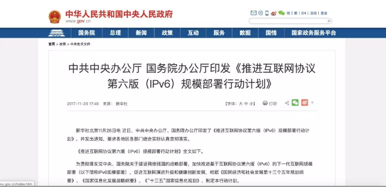

# 国家为何要大力推广IPv6？
> 文章摘要： IPv6地址是128位的，可以提供的地址总数约为43亿的4次方，号称可以为全世界的每一粒沙子编上一个地址，这将彻底解决IPv4地址资源有限的问题。

* IPv6是互联网协议第6版的缩写，是互联网工程任务组设计的用于替代IPv4的下一代IP协议。如今，我国正在加快IPV6技术的普及，而双栈改造也是实现IPv4到IPv6的无缝衔接的关键。

* 2017年11月，中共中央办公厅、国务院办公厅印发了《推进互联网协议第六版（IPv6）规模部署行动计划》，要求到2020年末IPv6活跃用户数超过5亿，新增网络地址不再使用私有IPv4地址；到2025年末，我国IPv6网络规模、用户规模、流量规模位居世界第一位。

* 为此，我国三大运营商都公布了IPv6的时间表；中国人民银行、中国银行保险监督管理委员会、中国证券监督管理委员会也于2018年12月26日联合发布了《关于金融行业贯彻&lt;推进互联网协议第六版（IPv6）规模部署行动计划&gt;的实施意见》（以下简称《意见》），加快推进基于IPv6的下一代互联网在金融行业规模部署。