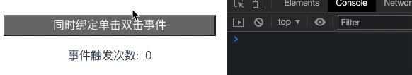

# JS 同DOM节点同时绑定【双击】【单击】事件
> 节点绑定【单击】或者【双击】事件方法很简单，可以使用 onclick 单击事件及 ondbclick 双击事件即可，但是一个节点同时绑定【双击】和【单击】事件，你知道怎么监听么?

## 阅读本文您将收获
* 节点同时绑定【单击】事件和【双击】事件
* 【双击】事件会误触发两次单击事件如何解决


## 基本结构
* 首先确定基本DOM结构，后续的 JS 代码都是依赖于这个结构进行处理的。

```
<div>
	<button id="eventTarget" class="btn">同时绑定单击双击事件</button>
	<div class="num">事件触发次数: {{num}}</div>
</div>
```

## 绑定【单击】事件
* 使用原生 JS 方式进行监听 `click`

```
document.getElementById('eventTarget').addEventListener('click', singleClick);
function singleClick() {}
```

## 绑定【双击】事件
* 使用原生 JS 方法进行监听 `dblclick`

```
document.getElementById('eventTarget').addEventListener('click', doubleClick);
function doubleClick() {}
```

## 同时绑定【单击】【双击】事件
* 按照正常的思维可能很多人都会直接在 DOM 节点绑定两个事件，但是在实践中我们就会发现，直接绑定两个事件时，【单击】事件是正常的，而【双击】时会连续触发两次【单击】事件，然后触发一次【双击】事件，通过代码计数我们也能看到。


* 那么怎么解决这种问题呢，常见的解决方式有几种

### 定时器方式
> 通过设置两次点击事件的间隔时间，来实现单击双击并存。

* 首先我们设置定时器，用于控制时间间隔

```
let clickTimer = null;
```

* 绑定事件还是正常进行绑定，这里不再赘述，首先处理【单击】事件

```
function singleClick() {
	// 先清除上次执行的Timer
	clearTimeout(clickTimer);
	// 利用Timer的时间间隔进行单击延时
	clickTimer = setTimeout(function() {
		...do something
		console.log("鼠标单击");
	}, 300);
}
```

* 然后处理【双击】事件

```
function doubleClick() {
	// 因为会先执行【单击】事件，所以先将执行的 Timer 清除掉
	clearTimeout(clickTimer);
	...do something
}
```



* 这样处理的好处是利用定时器，将【单击】事件和【双击】事件区分开，【单击】事件正常执行，延时的处理对交互的影响较小，【双击】事件虽然还是会触发【单击】事件的执行，但是不会触发内部执行逻辑，两个函数虽都执行但是逻辑不会影响。
