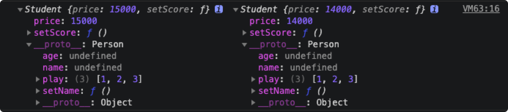
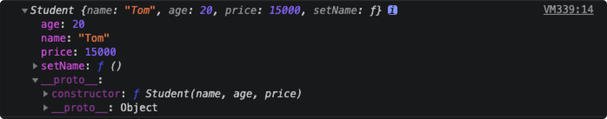

# JS的继承方式

> 面向对象语言的三大特征为 继承、封装、多态，如何让 JavaScript 语言实现继承也是面试中的高频面试题。

> 大部分面向对象的编程语言，都是通过“类”（class）实现对象的继承。传统上，JavaScript 语言的继承不通过 class(ES6 引入了class 语法)，而是通过“原型对象”（prototype）实现。

## 阅读本文您将收获
* 实现继承的几种方式
* 实现继承多种方式的优劣

## 继承方式一：原型链继承
* 利用原型链让一个引用类型继承另外一个引用类型的属性和方法，本质上子类型的原型为父类型的一个实例对象。

```
//父类型
function Person(name, age) {
	this.name = name;
	this.age = age;
	this.play = [1, 2, 3];
	this.setName = function () {};
}
Person.prototype.setAge = function () {};
//子类型
function Student(price) {
   this.price = price;
   this.setScore = function () {};
}
Student.prototype = new Person(); // 子类型的原型为父类型的一个实例对象
var s1 = new Student(15000);
var s2 = new Student(14000);
console.log(s1,s2);
```



* 特点
	* 父类新增原型方法/原型属性，子类都能访问到
	* 简单，易于实现
* 缺点
	* 引用类型的属性被所有实例共享
	* 创建子类实例时，无法向父类构造函数传参

## 继承方式二：构造函数继承
* 这种继承方式的关键是: 在子类构造函数中使用 call() 调用构造函数。

```
function Person(name, age) {
	this.name = name;
	this.age = age;
	this.setName = function () {};
}
Person.prototype.setAge = function () {};
function Student(name, age, price) {
	Person.call(this, name, age);  // 相当于: this.Person(name, age)
	this.price = price;
}
var s1 = new Student('Tom', 20, 15000);
console.log(s1);
```



* 特点
	* 不像原型链继承中子类实例共享父类引用，每个子类都有自己父类函数的副本
	* 创建子类实例时，可以向父类传递参数
	* 可以实现多继承(call多个父类对象)
* 缺点
	* 实例是子类的实例而不是父类的实例
	* 只能继承父类的实例属性和方法，不能继承原型的属性和方法，也就是例子中的 `setAge()` 方法
	* 无法实现函数复用，每个子类都有父类实例函数的副本，影响性能

## 继承方式三：组合继承(寄生组合继承)
* 通过调用父类构造，继承父类的属性并保留传参的优点，然后通过将父类实例作为子类原型，实现函数复用。

```
function superType() {}
function subType() {
	superType.call(this); // 继承父类属性
}
subType.prototype = new superType();
subType.prototype.constructor = subType; // 需要修复构造函数指向
```

* 优点
	* 可以继承实例属性/方法，也可以继承原型属性/方法
	* 不存在引用属性共享问题
	* 可传参
	* 函数可复用
* 缺点
	* 调用了两次父类构造函数，生成了两份实例

## 继承方式四：extends 实现继承(ES6 方法)
* 原理: 本质上也是原型链继承，实现了两步原型链继承
* 大多数浏览器的 ES5 实现之中，每一个对象都有 `_proto_` 属性，指向对应的构造函数的 `prototype`属性。
* Class 作为构造函数的语法糖，同时有 `prototype` 属性和 `_proto_` 属性，因此同时存在两条继承链。
	* 子类 `_proto_`属性，表示构造函数的继承，总是指向父类。(把子类构造函数(Child)的原型(`_proto_`)指向了父类构造函数(Parent))。
	* 子类 `prototype` 属性的 `_proto_` 属性，表示方法的继承，总是指向父类的 `prototype` 属性。
* Bable对extends语法糖的部分编译结果

```
function _inherits(subClass, superClass) {
	// 对 superClass 进行类型判断
	if (typeof superClass !== "function" && superClass !== null) {
		throw new TypeError("Super expression must either be null or a function");
	}
	// 子类的 prototype 继承父类的 prototype
	// 也就是说执行后 subClass.prototype._proto_ === superClass.prototype; 这条语句为true
	subClass.prototype = Object.create(superClass && superClass.prototype, {
		constructor: { 
			value: subClass, 
			writable: true, 
			configurable: true 
		}
	});
	// 子类是父类构建出的函数对象，需要指定对象的 _proto_
	if (superClass) _setPrototypeOf(subClass, superClass);
} 
```

* 继承实例

```
class Zoo {
      constructor(x, y) {
			this.x = x;
			this.y = y;
      }
}
class Dog extends Zoo {
      constructor(x,y,z) {
			// 子类实例的创建基于父类实例,只有super方法才能得到父类实例
			super(x,y)
			this.z = z;
      }
}
const dog = new Dog(1,2,3)
console.log(dog)
console.log(dog instanceof Dog)  // true
console.log(dog instanceof Zoo)  // true
```