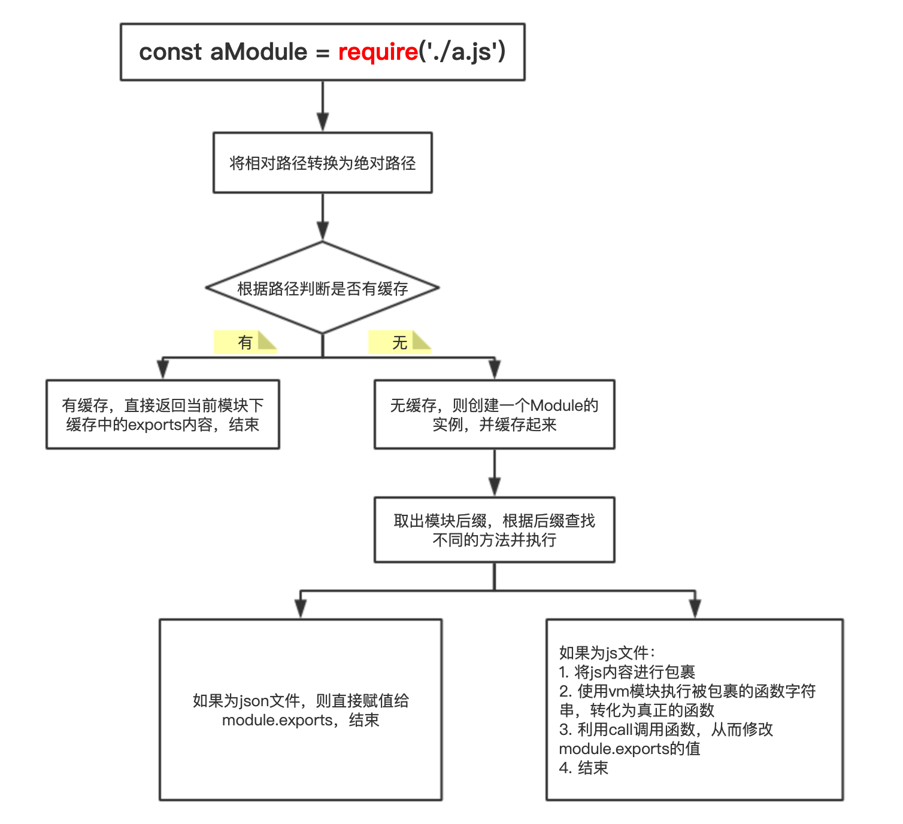
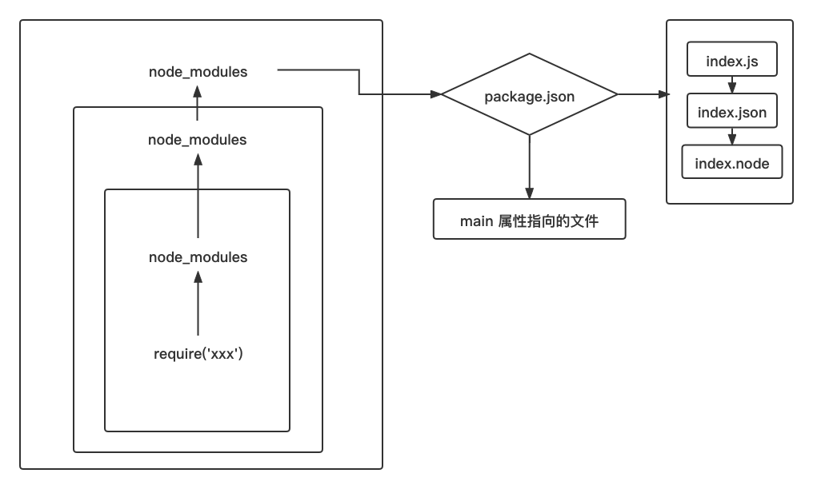

# JS 模块化编程

> 随着前端技术的逐渐发展，模块化的概念越来越成熟。

> 随着ES6的出现，模块的设计思想变得尽量的静态化，使得编译时就能确定模块的依赖关系，以及输入和输出的变量。

## 阅读本文您将收获
* 模块化的需求
* 模块化的概念
* 模块化的理论基础
* 模块化的演变过程
* 多种模块化资源引入方案
* 模块的加载执行过程与循环引用

## 模块化需要满足我们哪些需要
> 结合我们使用模块化的目的来说，在于最大化的设计重用，以最少的模块、零部件，更快速的满足更多的个性化需求。

* 职责单一
	* 应用复杂需要职责单一的代码组合
* 可替换/可维护性
	* 需要长期更新维护的应用支持可替换
* 可复用性
	* 节省开发时间
	* 代码质量提高
* 按需加载/性能要求
	* 空间上: 只加载当前页面的模块
	* 时间上: 只有当用户表现出需要某一功能意图时才去加载相关模块
* 多人协作的需要
	* 大型应用多人协作，只有功能单一，接口明确，高内聚低耦合的代码才敢放心大胆的修改和使用

## 模块化的概念
### 模块化
* 解决一个复杂问题自上向下逐层把整体划分成若干部分的过程，是一种管理方式、生产方式、解决问题的方案，一种思想
* 放在开发场景中，模块化就是有组织的把一个大文件拆成独立且相互依赖的多个小文件，是一种代码代码管理方式

### 模块
* 模块就是将一个复杂的程序依据一定的规则（规范）封装成几个块（文件），并进行组合在一起，块的内部数据和实现是私有的，只是向外部暴露一些接口（方法）与外部其它模块通信。
* 一个模块的组成由两部分组成： 数据（内部的属性）、操作数据的行为（内部的函数）
* 开发场景中，一个模块就是实现特定功能的文件，也可以理解为两种情况，外部的模块(引入的外部package，可能由多个JS文件组成，会通过暴露入口供我们调用)、内部的模块(工程项目中编码的最小单元，即单个的JS文件)

## 模块化的好处
### 可维护性
* 模块独立，良好的模块依赖越少越好，这样可以独立进行更新或改进

### 命名空间
* 模块化封装变量，可以避免污染全局环境。

### 重用代码

## 模块化的理论基础
### 面向对象
* 继承
	* 把不应该暴露给其他代码的逻辑，方法或属性隐藏在模块内部，对外只提供必要接口，进而保证了代码内部的高内聚和低耦合
* 封装、多态

### 设计模式
> 设计模式要解决的是如何组织和协调不同对象去解决程序问题

* 单例模式
	* 单例模式是指在程序运行期间保证一个类只有一个实例。
	* 由于JavaScript没有类的概念，应用单例模式其实就是保证我们的程序在运行期间，某一功能对象一直只是同一个对象，而不是每次都重复创建。
* 订阅者模式
	* 通过 `addEventListener` 或 `attachEvent` 为dom节点添加事件监听，其实就是在应用订阅者模式。
	* 订阅者模式通过让一组对象去监听一个对象的事件，实现对象间一对多的通信，在最大程度上降低了对象间的耦合度。
* 外观模式
	* 外观模式通过将一个或一组对象的接口封装起来，对外只提供其他代码需要的接口，实现降低代码耦合度。

## 模块化的历程
### 最初没有模块化的概念
* `JavaScript` 当初被设计出来仅是作为一种网络脚本语言使用，没有模块化的概念

### 变量冲突和依赖管理问题需要解决，自执行函数的模式已不够用
* Ajax 出现后，前端拥有向后端异步请求数据的能力后，前端逻辑越来越复杂，代码越来越庞大
* 变量污染和变量冲突问题可以用JavaScript作用域的特性来解决，但是依赖关系问题没有很好的解决
* `JavaScript` 加载依靠浏览器加载能力，默认是阻塞式加载

### 社区涌现第三方模块化规范
* `node.js` 中使用 `Common.js` 规范，同时出现 `npm` 生态，以及一大批前端构建工具 `grunt、webpack、fis`
* 社区中出现 `AMD、CMD` 规范，以及 `require.js` 等前端模块加载器

### ES6 模块化规范
* ES6 的出现，`JavaScript` 语言终于有了原生模块体系

## 模块化的早期实现
### 全局 `Function` 模式
* 早期的这种全局 `Function` 模式比较接近于为了抽离组件化而组件化，各个模块间容易产生污染。同时需要手动管理依赖顺序，维护成本较高。

* ModuleFirst.js

```
// 内部数据
let data = '模块1'
// 操作数据的函数
function fun() {
	console.log(`fun() ${data}`);
}
function funNext() {
	console.log(`funNext() ${data}`);
}
```

* ModuleSecond.js

```
let data = '模块2'
function fun() {
	console.log(`fun() ${data2}`);
}
```

* index.html

```
<script type="text/javascript" src="ModuleFirst.js"></script>
<script type="text/javascript" src="ModuleSecond.js"></script>
<script type="text/javascript">
	let data = "修改后的数据";
	fun(); // 冲突
	funNext();
</script>
```

* 全局函数模式是早期的模块化思想之一，这种方式最大的问题在于同时引入的模块会造成数据污染和命名冲突。

### `namespace` 模式/对象写法

* ModuleFirst.js

```
let moduleFirst = new Object({
	data: 'ModuleFirst',
	fun() {
		console.log(`fun() ${this.data}`);
	},
  	funNext() {
		console.log(`funNext() ${this.data}`);
	}
})
```

* ModuleSecond.js

```
let moduleSecond = new Object({
	data: 'ModuleSecond',
	fun() {
		console.log(`fun() ${this.data}`);
	},
  	funNext() {
		console.log(`funNext() ${this.data}`);
	}
})
```

* index.html

```
<script type="text/javascript" src="ModuleFirst.js"></script>
<script type="text/javascript" src="ModuleSecond.js"></script>
<script type="text/javascript">
	// ModuleFirst.js模块
  	moduleFirst.fun()
  	moduleFirst.funNext()
	// ModuleSecond.js模块
 	moduleSecond.fun()
 	moduleSecond.funNext()
  
  	moduleFirst.data = 'other data' //能直接修改模块内部的数据
  	moduleFirst.foo()
</script>
```

* 这种模式是简单的对象封装，虽然解决了命名冲突和数据污染的问题，但是在引用页面还可以直接针对内部数据进行修改。

### 立即执行函数写法

* module.js

```
var module1 = (function(){
	var _count = 0;
	var m1 = function(){
		//...
	};
	var m2 = function(){
		//...
	};
	return {
		m1 : m1,
		m2 : m2
	};
})();
```

* index.html

```
console.info(module1._count); //undefined
```

* 这种方式不太常用，虽然可以达到不暴露私有成员的目的，但是外部代码无法读取模块内部变量

> 下面几种方式是对上面方式的加工，但是不常用，虽然能够解决一些问题，但是都存在着使用上的缺点，以下几种方式有兴趣可以自行了解下

### 放大模式
### 宽放大模式
### 输入全局变量方式

> 上述的方法不可避免的带来一些问题

> 随着项目的扩大，HTML 文件中包含大量的 script 标签，标签顺序不能很好的契合模块间的依赖关系，当出现树状或网状的模块依赖关系时，难以通过script便签的先后顺序进行组织

> 代码逻辑关系难以理解，不便于维护，容易出现某个脚本加载时依赖的变量尚未加载而导致错误

> 页面卡死问题

## 现代模块化规范的多种实践方式
### CommonJS module.exports/exports 导出 require() 引入
> CommonJS 是以在浏览器环境之外构建JS生态系统为目标而产生的项目，对node来说，模块存放在本地硬盘，同步加载等待时间就是硬盘的读取时间，这个时间非常短。

> 但是对于浏览器环境编程，存在一个问题，`require()` 的返回是同步的, 意味着有多个依赖的话需要一个一个依次下载，堵塞js脚本的执行。

#### 规范要求
* 一个模块就是一个文件
* 每个模块内有两个变量可以使用 `require` 和 `module`
* 通过 `require` 加载模块
* 通过 `module.exports` 或者 `exports` 导出模块

#### 使用方式
* `require()` 是 `CommonJS` 的语法，`CommonJS` 的模块是对象，输入时必须查找对象属性。

```
//定义模块 module.js
function moduleInnerFun(){}

//模块输出
module.exports = {
	moduleInner
}
//加载模块 math.js
var moduleOuter = require('module')
//调用模块提供的方法
moduleOuter.moduleInnerFun()
```
* 整体加载 `module` 模块，生成一个对象 `moduleOuter`，然后再从这个对象上读取方法，这叫“运行时加载”，因为只有运行时才能得到这个对象，不能在编译时做到静态化。

#### 核心实践逻辑
* 解析模块路径
* 同步从本地读取模块文件内容，得到文本字符串
* 将字符串包裹成自执行函数的前半部分
* 使用vm沙箱将字符串转换成函数(vm是node.js的虚拟沙箱模块，vm.runInThisContext方法可以接受一个字符串，并将它转换成一个函数返回)
* 执行函数，并将关键变量传入(exports、require、module、_filename)

### AMD 规范
> 异步方式加载模块，模块的加载不影响后续语句的执行

> 依赖这个模块的语句，都定义在一个回调函数中，等到加载完成之后，这个回调函数才会运行

#### 规范要求
* 两个API `define` 和 `require`
* 两个API都能够进行依赖模块声明和接受，区别在于 `define` 能够自定义模块(模块开发者关注)而 `require` 仅作为执行模块加载(模块使用者关注)

```
define(id?, dependencies?, factory);
```
* `id`
	* 字符串，定义模块的名字
* `dependencies`
	* 定义模块所依赖模块的数组，执行结果按照依赖数组中的位置顺序以参数形式传入
* `factory`
	* 模块初始化要执行的函数或对象，如果为函数，只被执行一次，并且该函数按照依赖声明顺序，接收依赖作为参数；如果为对象，此对象应为模块的输出值

#### 使用方式

```
// index.html
<script src="js/require.js"></script>
<script>
  require(['a'], function(f) {
    console.log(f);
  })
</script>
```

```
// a.js
define(function() {
  const func1 = function() {
    console.log('I am a.');
  }
  return func1;
})
```

#### 核心实现逻辑
* 动态创建 `script` 脚本插入HTML
* 利用浏览器的加载能力，异步加载模块
* 监听每个脚本的load事件
* 依赖的所有脚本加载完成之后，执行回调
* 回调中拿到的依赖模块靠 `define` 注入

### CMD 规范
> CMD 规范没有提供前置的依赖数组，而是接受 `factory` 函数，与 AMD 规范相比，AMD 推崇依赖前置和通过返回值对外输出，而 CMD 规范推崇依赖就近，并且通过 `module.exports` 赋值的方式对外输出。

#### 规范要求
* require: 一个方法标识符，调用它可以动态的获取一个依赖模块的输出
* exports: 一个对象，用于对其他模块提供输出接口，例如:exports.name = "xxx"
* module: 一个对象，存储了当前模块相关的一些属性和方法，其中module.exports属性等同于上面的exports

#### 使用方式

```
define(function (requie, exports, module) {
	//依赖就近书写
	var module1 = require('Module1');
	var result1 = module1.exec();
	module.exports = {
		result1: result1,
	}
});
```

### ES6 export/export default 导出 import 引入
#### export 导出
* 模块是独立的文件，该文件内部的所有的变量外部都无法获取。如果希望获取某个变量，必须通过export输出。

```
// profile.js
export var firstName = 'Michael';
export var lastName = 'Jackson';
export var year = 1958;
```

* 或者用更好的方式：用大括号指定要输出的一组变量。

```
// profile.js
var firstName = 'Michael';
var lastName = 'Jackson';
var year = 1958;

export {firstName, lastName, year};
```

* 除了输出变量，还可以输出函数或者类（class）。

```
export function multiply(x, y) {
  return x * y;
};
```

* 还可以批量输出，同样是要包含在大括号里，也可以用as重命名。

```
function v1() { ... }
function v2() { ... }

export {
  v1 as streamV1,
  v2 as streamV2,
  v2 as streamLatestVersion
};
```

* export 命令规定的是对外接口，必须与模块内部变量建立一一对应的关系。

```
// 写法一
export var m = 1;
// 写法二
var m = 1;
export {m};
// 写法三
var n = 1;
export {n as m};
// 报错
export 1;
// 报错
var m = 1;
export m;
```

* 报错的写法原因是：没有提供对外的接口，第一种直接输出1，第二种虽然有变量m，但还是直接输出1，导致无法解构。
* 同样的，function和class的输出，也必须遵守这样的写法。

```
// 报错
function f() {}
export f;
// 正确
export function f() {};
// 正确
function f() {}
export {f};
```

* export语句输出的接口，都是和其对应的值是动态绑定的关系，即通过该接口取到的都是模块内部实时的值。
* export模块可以位于模块中的任何位置，但是必须是在模块顶层，如果在其他作用域内，会报错。

```
function foo() {
  export default 'bar' // SyntaxError
}
foo()
```

### export default 导出
* 之前的例子中，在导入时，都需要知道模块中所要加载的变量名或函数名，用户可能不想阅读源码，只想直接使用接口，就可以用 `export default` 命令，为模块指定输出。

```
// export-default.js
export default function () {
	console.log('foo');
}
```

* 其他模块加载该模块时，import命令可以为该匿名函数指定任意名字。

```
// import-default.js
import customName from './export-default';
customName(); // 'foo'
export default也可以用于非匿名函数前。
```

* 下面比较一下默认输出和正常输出。

```
// 第一组
export default function crc32() { // 输出
  // ...
}
import crc32 from 'crc32'; // 输入
// 第二组
export function crc32() { // 输出
  // ...
};
import {crc32} from 'crc32'; // 输入
```

* 可以看出，使用 `export default` 时，`import` 语句不用使用大括号。
* `import` 和 `export` 命令只能在模块的顶层，不能在代码块之中。否则会语法报错。
* 这样的设计，可以提高编译器效率，但是没有办法实现运行时加载。

#### import 引入
* `export/export default` 定义了模块的对外接口后，其他JS文件就可以通过 `import` 来加载这个模块。

```
// main.js
import {firstName, lastName, year} from './profile';

function setName(element) {
  element.textContent = firstName + ' ' + lastName;
}
```

* import命令接受一对大括号，里面指定要从其他模块导入的变量名，必须与被导入模块对外接口的名称相同。
* 如果想重新给导入的变量一个名字，可以用as关键字

```
import { lastName as surname } from './profile';
```

* `import` 时 `from` 可以指定需要导入模块的路径名，可以是绝对路径，也可以是相对路径， `.js` 路径可以省略，如果只有模块名，不带有路径，需要有配置文件指定。
* 注意，`import` 命令具有提升效果，会提升到整个模块的头部，首先执行。（是在编译阶段执行的）
* 因为 `import` 是静态执行的，不能使用表达式和变量，即在运行时才能拿到结果的语法结构（eg. if...else...）

* 除了指定加载某个输出值，还可以用（*）指定一个对象，所有的变量都会加载在这个对象上。

```
// circle.js。输出两个函数
export function area(radius) {
  return Math.PI * radius * radius;
}
export function circumference(radius) {
  return 2 * Math.PI * radius;
}

// main.js 加载在个模块
import { area, circumference } from './circle';
console.log('圆面积：' + area(4));
console.log('圆周长：' + circumference(14));

//上面写法是逐一指定要加载的方法，整体加载的写法如下。
import * as circle from './circle';
console.log('圆面积：' + circle.area(4));
console.log('圆周长：' + circle.circumference(14));
```
* 模块整体加载所在的那个对象（上例是circle），不允许运行时改变。

```
import * as circle from './circle';

// 下面两行都是不允许的
circle.foo = 'hello';
circle.area = function () {};
```

#### import() 引入
* 因为 `require` 是运行时加载，所以 `import` 命令没有办法代替 `require` 的动态加载功能。所以引入了 `import()` 函数。完成动态加载。

```
import(specifier)
```
* `specifier` 用来指定所要加载的模块的位置。`import` 能接受什么参数，`import()` 可以接受同样的参数。
* `import()` 返回一个 `Promise` 对象。
* 按需加载
	* import模块在事件监听函数中，只有用户点击了按钮，才会加载这个模块。

```
button.addEventListener('click', event => {
  import('./dialogBox.js')
  .then(dialogBox => {
	    dialogBox.open();
  })
  .catch(error => {
	    /* Error handling */
  })
});
```
* 条件加载
	* import()可以放在if...else语句中，实现条件加载。

```
if (condition) {
  import('moduleA').then(...);
} else {
  import('moduleB').then(...);
}
```

## CommonJS 加载模块与原理
> `CommonJS` 的模块在第一次加载后被缓存，这意味着每次调用 `require()` 都会返回完全相同的对象(如果解析为相同的文件)

> 如果 `require.cache` 没有被修改，则多次调用 `require()` 不会导致模块代码被多次执行，这个特性可以解决一些循环引用时的问题。

> 如果想自动绕过缓存，核心模块可以使用 `node:` 前缀来识别。

> 如果想要多次执行，则导出函数，调用函数即可。

### CommonJS 实现原理
* 每个模块文件存在 `module`、`exports`、`require` 三个变量，三个变量是通过传参而非定义的方式传入
	* module 记录当前模块信息
	* require 引入模块的方法
	* exports 当前模块导出的属性
* 在编译过程中，CommonJS 对代码块进行了首尾包装，形参传入

```
(function(exports, require, module, __filename, __dirname) {
	// 模块的代码实际上在这里
});
```

* 包装函数本质的样子,其中模块的部分被处理成了字符串

```
function wrapper(script) {
	return '(function (exports, require, module, __filename, __dirname) {
		// 模块代码
	})'
}
```

* 在模块加载时，会通过 `runInThisContext` 执行 ，传入参数，最终我们的node文件就这么执行了

### require 文件加载流程
* require 帮助我们匹配路径进行寻找，所以我们的路径可以写的很简洁，主需要给出相对路径和文件名即可，后缀都可以省略。



* 自定义模块


* 如果是核心模块，就直接返回模块
* 如果是目录模块，则会依次查找 `package.json` 中指定的 `main` 模块，或 `index.js` 以及 `index.node`文件
* 如果是带有路径的地址，则拼接出一个绝对路径，然后先读取缓存 `require.cache`, 再读取文件，如果没有后缀，则自动加后缀后一一识别
	* .js 解析为 `JavaScript` 文本文件(上面我们讲了为什么会先解析成文本文件)
	* .json 解析为JSON对象
	* .node 解析为二进制插件模块
* 首次加载后的模块会缓存在 `require.cache` 中，所以多次使用 `require` 加载文件，得到的对象是同一个

### require 模块引入与处理
* CommonJS 模块同步加载并执行模块文件，在执行阶段分析模块依赖，采用深度优先遍历进行分析
* 撅个栗子

```
// a.js
const getModuleB = require('./b') 
console.log('我是 a 文件') 
exports.excuteA = function(){ 
	const message = getModuleB()
	console.log(message) 
} 
// b.js
const excuteA = require('./a') 
const  moduleB = { 
	name: 'is module b'
} 
console.log('我是 b 文件') 
module.exports = function(){ 
	return moduleB 
} 
// main.js
const a = require('./a') 
const b = require('./b') 
console.log('node 入口文件') 
```

* 执行结果

```
我是 b 文件
我是 a 文件
node 入口文件
```

#### require 加载原理
> 先明确两个概念: module 和 Module ，前者在 node 中每个js文件都是一个module，module 上保存了 exports 等信息，还有一个loaded 表示该模块是否被加载，后者是用来缓存每一个模块加载信息的

```
// id 为路径标识符 
function require(id) { 
	/* 查找  Module 上有没有已经加载的 js  对象*/ 
	const  cachedModule = Module._cache[id] 
	    
	/* 如果已经加载了那么直接取走缓存的 exports 对象  */ 
	if(cachedModule){ 
		return cachedModule.exports 
	} 
	  
	/* 创建当前模块的 module  */ 
	const module = { exports: {} ,loaded: false , ...} 
	 
	/* 将 module 缓存到  Module 的缓存属性中，路径标识符作为 id */   
	Module._cache[id] = module 
	/* 加载文件 */ 
	runInThisContext(wrapper('module.exports = "123"'))(module.exports, require, module, __filename, __dirname) 
	/* 加载完成 *// 
	module.loaded = true  
	/* 返回值 */ 
	return module.exports 
} 
```

* require 会接收一个参数——文件标识符，然后分析定位文件，分析过程我们上述已经讲到了，加下来会从 Module 上查找有没有缓存，如果有缓存，那么直接返回缓存的内容。
* 如果没有缓存，会创建一个 module 对象，缓存到 Module 上，然后执行文件，加载完文件，将 loaded 属性设置为 true ，然后返回 module.exports 对象。借此完成模块加载流程。
* 模块导出就是 return 这个变量的其实跟 a = b 赋值一样， 基本类型导出的是值， 引用类型导出的是引用地址。
* exports 和 module.exports 持有相同引用，因为最后导出的是 module.exports， 所以对 exports 进行赋值会导致 exports 操作的不再是 module.exports 的引用。

#### require 避免重复加载
* 正式因为缓存的存在，所以再次引用时，会直接读取缓存中的module，无需再次执行模块
* 上述的例子中在 `b.js` 中增加执行 `a.js` 中的方法 `excuteA` 会是什么结果?
* 改造一下例子中的 `b.js`

```
// b.js
const excuteA = require('./a')
const  moduleB = {
    name: 'is module b'
}
console.log('我是 b 文件')
console.log('执行 a 模块导出', excuteA)
setTimeout(()=>{
    console.log('异步打印 a 模块' , excuteA)
},0)
module.exports = function(){
    return moduleB
}
// 执行结果
我是 b 文件
执行 a 模块导出 {}
我是 a 文件
node 入口文件
异步打印 a 模块 { excuteA: [Function] }
```
> 那如何在执行b文件时获取到excuteA呢

#### require 动态加载
```
// a.js
console.log('我是 a 文件')
exports.excuteA = function(){
    const getModuleB = require('./b')
    const message = getModuleB()
    console.log(message)
}
// b.js
const excuteA = require('./a')
const  moduleB = {
    name: 'is module b'
}
console.log('我是 b 文件')
console.log('执行 a 模块导出', excuteA)
module.exports = function(){
    return moduleB
}
// main.js
const a = require('./a')
console.log('node 入口文件')
a.excuteA()
// 执行结果
我是 a 文件
node 入口文件
我是 b 文件
执行 a 模块导出 { excuteA: [Function] }
{ name: 'is module b' }
```

### exports 和 module.exports 导出模块
* 提出一个问题，日常开发过程中我们会使用 `module.export = { a: xxx }` 的方式导出，但是 `export = { a: xxx }` 就不可以
* 上面讲述 CommonJS 原理的时候说过 exports ， module 和 require 都是作为形参的形式传入到 js 模块中，如果使用 `export = { a: xxx }` 这种语法相当于重新赋值一份形参，不会再引用原来的形参
* 官方解释: 如果为 `exports` 赋予了新值，则它将不再绑定到 `module.exports`
* `module.exports` 本质上就是 `exports` , 持有相同的引用，最后导出的是 `module.exports` ，所以两者同时存在会造成覆盖的情况发生。

> 问: 为什么有了 `exports` ，还需要 `module.exports` 呢?

## ES6 Module 加载模块
* 引入和导出都是静态的，import 会自动提升到代码的顶层，所以 `import`、`export` 不能放在块级作用域和条件语句中
	* 好处就是可以在编译过程中确定导入和导出的关系，更方便地查找依赖
* ES6的模块提前加载并执行模块文件，模块在预处理阶段分析模块一来，在执行阶段执行模块，同样采用深度优先遍历，执行顺序是 子->父
* 举个例子

```
// main.js
console.log('main.js开始执行')
import excuteA from './a'
import excuteB from './b'
console.log('main.js执行完毕')
// a.js
import excuteB from './b'
console.log('a模块加载')
export default  function excuteA (){
    console.log('hello,world')
}
// b.js
console.log('b模块加载')
export default function excuteB(){
    console.log('hello,hello,world')
}
```


## CommonJS & ES6 Module 总结
### CommonJS
* CommonJS 模块由 JS 运行时实现。
* CommonJs 是单个值导出，本质上导出的就是 exports 属性。
* CommonJS 是可以动态加载的，对每一个加载都存在缓存，可以有效的解决循环引用问题。
* CommonJS 模块同步加载并执行模块文件。

### ES6 Module
* ES6 Module 静态的，不能放在块级作用域内，代码发生在编译时。
* ES6 Module 的值是动态绑定的，可以通过导出方法修改，可以直接访问修改结果。
* ES6 Module 可以导出多个属性和方法，可以单个导入导出，混合导入导出。
* ES6 模块提前加载并执行模块文件，
* ES6 Module 导入模块在严格模式下。
* ES6 Module 的特性可以很容易实现 Tree Shaking 和 Code Splitting。
