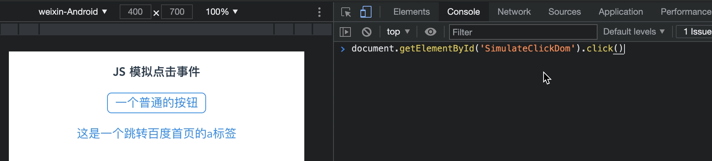

# JS 模拟点击事件

> 说到 JS 模拟点击，想必大家都会想到一些脚本程序，帮助大家接触皮肉之苦，可以通过一定的逻辑帮助我们实现对页面事件的触发，从而达到一些正常人无法达到的频次点击或者准时点击。本篇文章就为大家带来一些前端同学就可以看懂并且实现的 模拟点击方式。

> JS 模拟点击一般我们会分为两种，一种是直接通过点击事件模拟DOM节点触发来实现，另一种是通过注册事件来帮助我们进行点击操作。

> 注：本篇文章中相关JS脚本均在浏览器控制台中执行，并不是通过当前页面 `<script>` 标签中执行，这样更加接近脚本程序的执行环境。

## 直接执行点击事件(click)
### 方案解析
* 通过直接选中需要执行DOM节点，直接执行绑定在节点上的click事件来模拟人为点击。
* 这种方式针对DOM节点直接绑定事件以及 `<a>` 标签绑定 `href` 属性进行跳转都是支持的。

* 这种执行方式比较常见，也是脚本自动执行页面事件中常用的一种方式，当我们需要处理的页面事件简单，并且事件绑定简单的话我们可以使用这种方式，能够方便快捷地实现我们需要的效果，而且和真人点击没有区别。

```
document.getElementById('SimulateClickDom').click();
document.getElementById('SimulateADom').click();
```

### 执行效果


## 高阶方案: 注册事件进行模拟点击
> 此方案适合直接使用 `click()` 无效的情况下, 事件的适用场景较广泛。