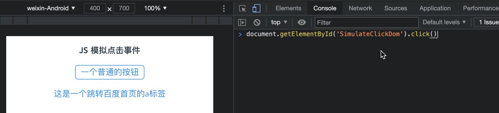

# JS 模拟点击事件

> 说到 JS 模拟点击，想必大家都会想到一些脚本程序，帮助大家接触皮肉之苦，可以通过一定的逻辑帮助我们实现对页面事件的触发，从而达到一些正常人无法达到的频次点击或者准时点击。本篇文章就为大家带来一些前端同学就可以看懂并且实现的 模拟点击方式。

> JS 模拟点击一般我们会分为两种，一种是直接通过点击事件模拟DOM节点触发来实现，另一种是通过注册事件来帮助我们进行点击操作。

> 注：本篇文章中相关JS脚本均在浏览器控制台中执行，并不是通过当前页面 `<script>` 标签中执行，这样更加接近脚本程序的执行环境。

## 直接执行点击事件(click)
### 方案解析
* 通过直接选中需要执行DOM节点，直接执行绑定在节点上的click事件来模拟人为点击。
* 这种方式针对DOM节点直接绑定事件以及 `<a>` 标签绑定 `href` 属性进行跳转都是支持的。

* 这种执行方式比较常见，也是脚本自动执行页面事件中常用的一种方式，当我们需要处理的页面事件简单，并且事件绑定简单的话我们可以使用这种方式，能够方便快捷地实现我们需要的效果，而且和真人点击没有区别。

```
document.getElementById('SimulateClickDom').click();
document.getElementById('SimulateADom').click();
```

### 执行效果


### 缺点
* `element.click()` 是浏览器原生提供的一个快捷方法，它内部其实也会触发 `click` 事件，但你无法精细控制事件细节（坐标、按键修饰符、事件阶段等）。

## 高阶方案: 注册事件进行模拟点击
> 此方案适合直接使用 `click()` 无效的情况下, 事件的适用场景较广泛。

* `dispatchEvent` 是真正通过事件系统来模拟的：
    * 你先「注册」一个事件对象（`new MouseEvent('click', {...})`）
    * 再把这个事件对象派发（`dispatch`）到目标元素上

```
// 1. 获取目标元素
const target = document.querySelector('#myBtn');

// 2. 创建事件对象（这就是「注册」事件的过程）
const clickEvent = new MouseEvent('click', {
    bubbles: true,      // 允许事件冒泡（重要！）
    cancelable: true,   // 允许 preventDefault
    view: window,
    detail: 1,          // 单击
    clientX: 150,       // 可选：模拟点击坐标
    clientY: 200,
    screenX: 300,
    screenY: 400,
    ctrlKey: false,
    altKey: false,
    shiftKey: false,
    metaKey: false,
    button: 0,          // 0 = 左键
    buttons: 1
});

// 3. 派发事件（真正触发点击）
target.dispatchEvent(clickEvent);
```

### 进阶：可以封装进事件进行处理

```
function simulateClickByEvent(element, options = {}) {
    if (!element) {
        console.error('目标元素不存在');
        return;
    }

    const event = new MouseEvent('click', {
        bubbles: true,
        cancelable: true,
        view: window,
        ...options   // 允许传入自定义参数
    });

    const result = element.dispatchEvent(event);
    console.log(`模拟点击 ${result ? '成功' : '被阻止'}`);
}

// 使用
simulateClickByEvent(document.querySelector('button'), {
    clientX: 100,
    clientY: 50,
    ctrlKey: true
});
```
