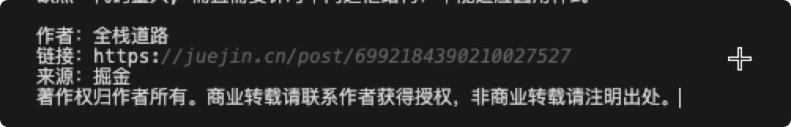

> 「复制粘贴」这是我们攻城狮日常开发代码过程中经常使用到的一种神奇技能，但是有没有想过，浏览器可以帮助我们实现复制粘贴的操作，大大增加我们的摸鱼时间。

> 在业务需求中碰到主动协助用户进行复制粘贴的需求，需要通过JS去主动复制数据从而协助用户进行其他操作

## 阅读本文您将收获
* 如何通过原生或第三方的方式实现前端自动复制粘贴
* 如何在复制的信息中自动增加原作者信息

## 复制
### 通过原生js实现
* 复制可以通过document对象实现 `document.execCommand('copy')`
* 关于此语法的兼容情况可以[点击这里](https://developer.mozilla.org/zh-CN/docs/Web/API/Document/execCommand)
* 官方api中已经给出了一个示例，本文仅展示一个vue中的示例
* 思路：
	* 将变量动态绑定
	* 是指一个隐藏的输入框
	* 获取输入框的value
	* 调用官方api进行复制
	
```
//roles为需要复制的data
//HTML部分
<button @click="copyRoles">复制</button>
<input v-if="roles && roles.length" 
	id="clipBoard" 
	v-model="roles" 
	style="position: absolute; opacity: 0;">
</input>

//js部分
copyRoles() {
	let data = ''
	if(this.roles && this.roles.length) {
		let spanSelect = document.querySelector('#clipBoard')
		spanSelect.select() // IOS 和 Safari 浏览器有兼容性问题，解决方式在下方升级版实现
		if(document.execCommand('copy')) {
			document.execCommand('copy')
			console.log(`信息已复制成功`)
		} else {
			console.log('复制失败!')
		}
	} else {
		console.log('复制失败!')
	}
}
```

### 升级版原生 JS 实现(适合移动端)
* 使用原生方法实现复制都是通过选中文本，但是使用传统的 `ele.select()` 在移动端会失效，所以需要在移动端做兼容性处理。

```
// JS部分
copyRoles(data) {
    if (document.querySelector('#orderId')) {
        let e = document.getElementById('orderId')
        document.getElementById("clipBoard").removeChild(e)
    }
    let input = document.createElement('input')
    input.id = 'orderId'
    input.value = data
    input.readOnly = "readOnly"
    document.getElementById("clipBoard").appendChild(input)
    let eleSelect = document.querySelector('#orderId')
    this.selectText(eleSelect, 0, item.length)
    if(document.execCommand('copy')) {
        document.execCommand('copy')
        this.$littleHint('复制成功')
    } else {
        this.$littleHint('复制失败')
    }
    eleSelect.blur()
},
// 选中文字
selectText(textbox, startIndex, stopIndex) {
    if (textbox.createTextRange) {
        const range = textbox.createTextRange()
        range.collapse(true)
        range.moveStart('character', startIndex)//起始光标
        range.moveEnd('character', stopIndex - startIndex)//结束光标
        range.select()
    } else {
        textbox.setSelectionRange(startIndex, stopIndex)
        textbox.focus()
    }
},
```


### 通过clipboard.js实现
* 安装方式
	* 通过 npm依赖包 安装

	`npm install clipboard --save`
	
	* 通过 CDN 引入

	`<script src="https://cdn.jsdelivr.net/npm/clipboard@2.0.6/dist/clipboard.min.js"></script>`

* 使用
	* 复制当前DOM节点的内容，只需为 `data-clipboard-target` 属性设置内容即可。

	```
	<button class="btn" data-clipboard-text="全栈道路出品，欢迎三连~">
	    
	</button>
	```
	
	* 设置复制的内容，只需为 `data-clipboard-target` 属性绑定相应的节点即可。
	
	```
	<input id="clipTarget" value="全栈道路出品，欢迎三连~">

	<button class="btn" data-clipboard-target="#clipTarget">
	    
	</button>
	```
	
	* `data-clipboard-action` 设置为 **复制** 事件还是 **剪切** 事件

	```
	<input id="clipTarget" value="全栈道路出品，欢迎三连~">

	<button class="btn" data-clipboard-action="cut" data-clipboard-target="#clipTarget">
	    
	</button>
	```

## 粘贴
* 粘贴现在没有发现什么比较好的方案，不经过用户主动操作去进行粘贴操作，直接用js去操作粘贴板兼容性极差，建议考虑一种合理的方案去实现这个功能。简单来说就是：改需求！

### 原生js实现(兼容性极差，仅支持IE和FF浏览器)

* JavaScript 的clipboardData对象提供三个方法对粘贴板进行访问
	* clearData(sDataformat):删除剪贴板中指定格式的数据 
	* setData(sDataformat,sData):给剪贴板赋予指定格式的数据，返回true则操作成功 
	* getData(sDataformat):从剪贴板获取指定格式的数据
	
```
let text = "123"; 
if (!window.clipboardData.setData()) {
	return;
}
window.clipboardData.setData('Text', text) // 赋予 text 格式的数据 
alert("复制失败!"); 
text = window.clipboardData.getData('Text'); // 获取 text 格式的数据 
alert(text);
window.clipboardData.clearData('Text'); // 清除 text 格式的数据 
text = window.clipboardData.getData('Text'); 
alert(text); 
```
### 一个婉转的方案
* 用户主动触发paste事件(三种方式)
	* 按下 CTRL + V
	* 从浏览器的编辑菜单中选择 "Paste（粘贴）"
	* 右击鼠标按钮在上下文菜单中选择 "Paste（粘贴）"
* 通过这三种方式，我们的解决方案主要有两个方面
	* 主动提示引导用户将剪贴板中的内容复制到input框，或者textarea中，从而获取值。
	* `window.addEvent("paste",function(e){ });` 通过监听事件，监听用户的粘贴操作，从而拿到想要的数据

## 如何修改用户粘贴板中的内容
> 我们在很多的网站中复制信息的时候能够发现，不少网站在复制的信息中自动为我们添加上了原作者的信息，那么下面这种操作是怎么做到的呢，当然也是和上面说到的粘贴板的部分有关。



```
<!--在需要控制的DOM节点上添加事件-->
copyDom.bind({
    copy: function (event) {
        var clipboardData = event.originalEvent && event.originalEvent.clipboardData || window.clipboardData;
        if (!clipboardData) {
            return;
        }
        var copyText = window.getSelection().toString();
        if (copyText) {
            event.preventDefault();
            clipboardData.setData('text/plain', copyText + '修改粘贴板内容');
        }
        return false; // 否则不生效
    }
});
```