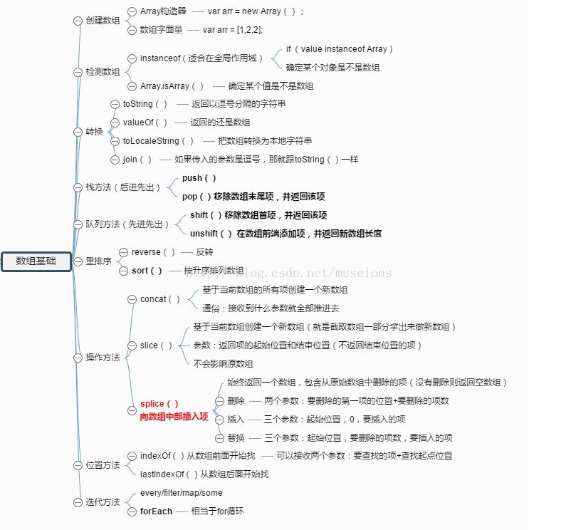

## 阅读本文您将收获
* 数组操作的基本方法

> 啥也别说先附上一张方便大家记忆的图片


> var arr = [1, 2, 3, 4, 5];

### 删除并返回数组中第一个元素

```
var theFirst = arr.shift();
alert(theFirst);//返回1 number
alert(arr);//2,3,4,5 object
```
### 删除并返回数组中最后一个元素

```
var theLast = arr.pop();
alert(theLast);//返回5 number
alert(arr);//2,3,4 object
```
### 在数组开始增加一个或多个元素，并返回数组长度

```
var theNewArrStart = arr.unshift(-1, 0);
alert(theNewArrStart);//返回5 number
alert(arr);//-1,0,2,3,4 object
```
### 在数组结尾增加一个或多个元素，并返回数组长度

```
var theNewArrEnd = arr.push(5, 6);
alert(theNewArrEnd);//返回7 number
alert(arr);//-1,0,2,3,4,5,6 object
```
### 从第i（数组索引）个位置删除n个元素

```
arr.splice(1, 2);
alert(arr);//-1,3,4,5,6 object
```
### 从第i（数组索引）个位置删除n个元素，并插入s个新元素

```
arr.splice(1, 2, 10, 11, 12);
alert(arr);//-1,10,11,12,5,6 object
```
### 合并2个或多个数组（concat中的参数可以为单个的值，也可以为数组，并且可以有多个值或数组）
 
```
var arr1 = [7, 8];
var arrCon = arr.concat(arr1);
alert(arrCon);//-1,10,11,12,5,6,7,8 object
```
### 将数组中的元素使用特定的字符分隔，并返回字符串（如果不设置特定分割字符，则默认为逗号）

```
var theSep = arrCon.join('-');
alert(theSep);//-1-10-11-12-5-6-7-8 string
```
### 颠倒数组中元素的顺序

```
var theRev = arrCon.reverse();
alert(theRev);//8,7,6,5,12,11,10,-1
```

