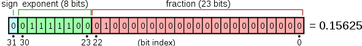

# JS 浮点数存储与计算

### 写在前面
> JavaScript中有些特殊的计算结果，如 `0.1 + 0.2 = 0.30000000000000004`(这个问题不止在JavaScript中存在，在C++、java语言中都存在这个问题，只不过这些强类型语言封装好了方法来解决这个问题。)想必大家都知道这是由于存储时数据长度截取造成的问题，但是计算机是如何存储计算这些数值的呢，本文结合多个计算机基础知识解释这点。

## 阅读本文您将收获
* 十进制与二进制间的转换
* 计算机存储计算 JavaScript 数值的原理

> 想弄清楚计算机 `0.1 + 0.2` 的计算原理，需要提前了解以下知识

## 十进制与二进制转换
##### 正整数的转换
* 除二取余，倒序排列，高位补零
* 为什么需要补位：计算机存储时按照CPU根据数据总线的宽度，决定寄存器可以保存多少位的数据

> 计算机字长是指进行运算的二进制位数，有8，16，32，64位之分，主要取决于数据总线的宽度。比如说奔腾是32位，这是指处理器的寄存器能保存32位的数据。


##### 负整数的转换
* 将负整数的绝对值转换成二进制，各位取反后 +1

##### 浮点数的转换
* 整数位正常转换，小数部分乘2取整，顺序排列


## 浮点数在计算机中的存储

1. 浮点数转换成二进制，并采用科学计数法表示。
2. 浮点型的存储实现是按照 `IEEE754标准` 的，可分为两种：

* 单精度Float--32位(4字节)
* 双精度Double--64位(8字节)

### IEEE标准
> 20世纪80年代前每个计算机制造商都自定义自己的表示浮点数的规则，及浮点数执行运算的细节。而且不太关注运算的精确性，而是更多地关注速度和简便性。

> 1985年左右推出IEEE 754标准的浮点数表示和运算规则，才让浮点数的表示和运算均有可移植性。

二进制浮点数算术标准IEEE中的存储格式为：

```
V =  (-1)^S × M × 2^E
```
* (-1)^s表示符号位，当s=0，V为正数；当s=1，V为负数。
* M表示有效数字，尾数位，大于等于1，小于2。
* 2^E表示指数位。

* 举例说明
	* 十进制下
	
	```5.0 = 5 * 10^(0)```

	* 二进制下

	```
	5.0 = 101.0 = 1.01 * 2^(-2)
		--> (-1)^0 * 1.01 * 2^(-2)
		--> S = 0, M = 1.01, E = 2
	```

### 存储格式
* 对于单精度浮点数即32位的浮点数，最高的1位是符号位 S ，接着的8位是指数 E ，剩下的23位为有效数字 M。

	

* 对于双精度的浮点数即64位的浮点数，最高的1位是符号位S，接着的11位是指数E，剩下的52位为有效数字M。

	

### 几个存储时需要注意的点
* 尾数位M(有效数字位)
	* IEEE 754 标准规定，在 **计算机内部保存 M 时，默认这个数的第一位总是1，因此可以被舍去，只保存后面的部分** 。比如保存 1.01 的时候，只保存 01，等到读取的时候，再把第一位的 1 加上去。这样做的目的，是节省 1 位有效数字。以 32 位浮点数为例，留给 M 只有 23 位，将第一位的 1 舍去以后，等于可以保存 24位有效数字。

* 指数位E
	* 首先，E为一个无符号整数。这意味着，如果 E 为 8 位，它的取值范围为 `0~2^8-1 = 0~255`；如果 E 为 11 位，它的取值范围为 `0~2^11-1 = 0~2047`。
	* 但是，我们知道，科学计数法中的 E 是可以出现负数的，所以 `IEEE 754` 规定，E的真实值必须再减去一个中间数，对于8位的E，这个中间数是127(-127~128)；对于11位的E，这个中间数是1023。
	* 举个栗子，2^10 的 E 是10，当保存成 32 位浮点数时，必须保存成 10 + 127 = 137，即 `10001001`。如果要保存成 64 位浮点数的时候，就会保存成 10 + 1023 = 1033，即 `10000001001`。

* 指数E还可以再分成三种情况：

	

	1. E 不全为 0 或不全为 1。这时，浮点数就采用上面的规则表示，即指数 E 的计算值减去 127（或1023），得到真实值，再将有效数字 M 前加上第一位的 1。
	2. E 全为 0。这时，浮点数的指数E等于 1-127（或者1-1023），有效数字M不再加上第一位的 1，而是还原为 0.xxxxxx 的小数。这样做是为了表示 ±0，以及接近于 0 的很小的数字。
	3. E 全为 1。这时，如果有效数字 M 全为0，表示±无穷大（正负取决于符号位s）；如果有效数字M不全为0，表示不是一个数（NaN）。

* JavaScript中只有一种数字相关类型 -- `Number` ,并使用双精度浮点数存储，以 64 位固定长度来表示，相当于标准的 `double` 双精度浮点数

### 存储详情
> 以 `0.1 + 0.2` 为例

1. 转换为二进制：
	
	```
	// 0.1
	0.00011 0011 0011...(0011循环)
	// 0.2
	0.0011 0011 0011...(0011循环)
	```

2. 转换为 `IEEE754` 存储: 
	
	```
	// 0.1
	(-1)^0 * 1.1 0011...(0011循环) * 2^(-4)
	=> S = 0, M= 1.1 0011...(0011循环), E = -4
	=> 实际存储指数位：-4 + 1023 = 1019 => 11 1111 1011

	//0.2
	(-1)^0 * 1.1 0011...(0011循环) * 2^(-3)
	=> S = 0, M= 1.1 0011...(0011循环), E = -3
	=> 实际存储指数位：-3 + 1023 = 1020 => 11 1111 1100
	```
3. 实际存储:

	```
	// 0.1 的存储
	0    011 1111 1011    1001100110011001100110011001100110011001100110011010
	--------------------------------------------------------------------
	S    M(11位)          E(52位)
	
	// 0.2 的存储
	0    011 1111 1100    1001100110011001100110011001100110011001100110011010
	--------------------------------------------------------------------
	S    M(11位)     	  E(52位)
	```

## 浮点数在计算机中的运算
### 运算步骤
> 计算分为六个步骤

1. **检查操作数**
	* 对0、Infinity 和 NaN 操作数作检查
	

2. **对阶**
	* 是指将两个进行计算的浮点数的阶码对齐的操作。
	* 具体操作是：求出两个浮点数阶码的差，按照 小阶对齐大阶 的方式，将两浮点数的阶码对齐，同时将小阶码对应的浮点数的尾数相应右移，以保证浮点数的值不变。
	* *注意：对阶的原则是小阶对大阶。因为若大阶对小阶，则尾数的数值部分的高位需移出，而小阶对大阶移出的是尾数的数值部分的低位，这样损失的精度更小。
	* *注意：由于尾数右移时是将最低位移出，会损失一定的精度，为减少误差，可先保留若干移出的位，供以后舍入处理用。

3. **尾数计算**
	* 主要为进行对阶后的尾数相加减的相关操作，并采用双符号法判断是否溢出。

4. **结果规格化**
	* 第一种：向右规格化：若上一步出现溢出，则尾数右移1位，阶码+1。
	* 第二种：向左规格化：若上一步没有出现溢出，且数值域最高位与符号位数值相同，则尾数左移1位且阶码-1，直到数值域最高位为1为止。

5. **舍入处理**
	* 由于浮点数无法精确表示所有数值，因此在存储前必须对数值作舍入操作。
	* 具体有五种方式，`IEEE 754` 默认的舍入模式：就近舍入(与四舍五入有一点点不同) Round to nearest, ties to even: 当存在两个数一样接近时，取偶数值(Round(0.5) = 0; Round(1.5) = 2; Round(2.4) = 2; Round(2.5) = 2; Round(3.5) = 4)
	
6. **溢出判断**

### 运算详情
1. 原本 0.1 和 0.2 的二进制表示

	```
	0.1 = 1.1001100110011001100110011001100110011001100110011010 * 2^-4
	0.2 = 1.1001100110011001100110011001100110011001100110011010 * 2^-3
	```
2. 可以看到，0.1 的阶码为 -4，0.2 的阶码为 -3，依照小阶对大阶的原则，我们需要将 0.1 的阶码变为 -3，因此其尾数部分需要右移一位。对阶之后 0.1 的存储为：

	```
	0.1 = 0.11001100110011001100110011001100110011001100110011010 * 2^-3
	0.2 = 1.1001100110011001100110011001100110011001100110011010 * 2^-3
	```
3. 对阶之后 0.1 的尾数溢出一位，正好是0，我们舍弃掉，所以最终的计算前的存储为

	```
	// 0.1
	0  01111111100  1100110011001100110011001100110011001100110011001101 
	// 0.2
	0  01111111100  1001100110011001100110011001100110011001100110011010
	```
4. 两个二进制进行加法计算
	
	```
	   0  01111111100   1100110011001100110011001100110011001100110011001101
	+  0  01111111100   1001100110011001100110011001100110011001100110011010
-------------------------------------------------------------------
	=  0  01111111100  10110011001100110011001100110011001100110011001100111
	```
5. 结果中尾数部分已经发生了进位，超过了52位，因此阶码部分加1（乘以2），即阶码由原来的 -3 变为 -2，所以阶码部分为 `01111111101`。而尾数部分右移一位（除以2），进行舍入（最后一位是1因此最低位进位），得到最终的存储：

	```
	// 这一步就是造成 JS 中 0.1 + 0.2 !== 0.3 的原因
	0  01111111101  1011001100110011001100110011001100110011001100110011
	```
6. 将最终结果转换为十进制数为

	```
	2^-2 + (1+(1*2^-1 + 0 * 2^-2+1*2^-3+1*2^-4+... ) = 	0.3000000000000000444089209850062616169452667236328125
	```
7. 最终由于精度问题，只取到 0.30000000000000004(这一步是我们看到最终计算结果)

## 解决方式
1. 浮点数转化成整数，再进行计算
2. 使用 `toFixed() `进行四舍五入
3.  自定义处理函数
4. 引用类库 
	* [Math.js](https://mathjs.org/)
	* [decimal.js](http://mikemcl.github.io/decimal.js/)
