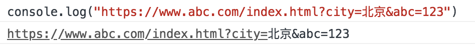

# JS 针对 URL 编码和解码
## 阅读本文您将收获
* URL和URI的概念
* 各种编码解码格式的区别

## 首先明确几个概念
* URI 
	* 统一资源标识符，是用来标识互联网上的资源（例如，网页或文件）和怎样访问这些资源的传输协议（例如，HTTP 或 FTP）的字符串。
	* 一般由三部分组成
		* ①访问资源的命名机制
		* ②存放资源的主机名
		* ③资源自身的名称，由路径表示，着重强调于资源。
* URL
	* 统一资源定位符，可以提供找到该资源的路径。URL也是一种URI
	* 一般由三部分组成
		* ①访问资源的命名机制
		* ②存放资源的主机名
		* ③资源自身的名称，由路径表示，着重强调于资源。
* URI更像是指向一个人，而URL是指向这个人的地址

## 正题：针对URI的编码和解码
* 除了encodeURI、encodeURIComponent、decodeURI、decodeURIComponent四个用来编码和解码 URI 的函数之外 ECMAScript 语言自身不提供任何使用 URL 的支持。

### URI
* 

### encodeURI
* 

### decodeURI
* 

### encodeURIComponent
* 

### decodeURIComponent
* 