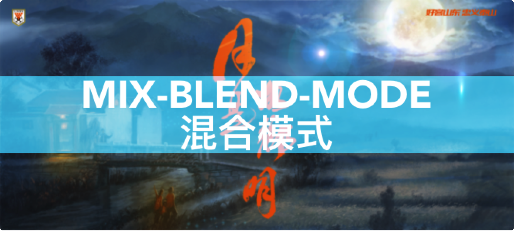
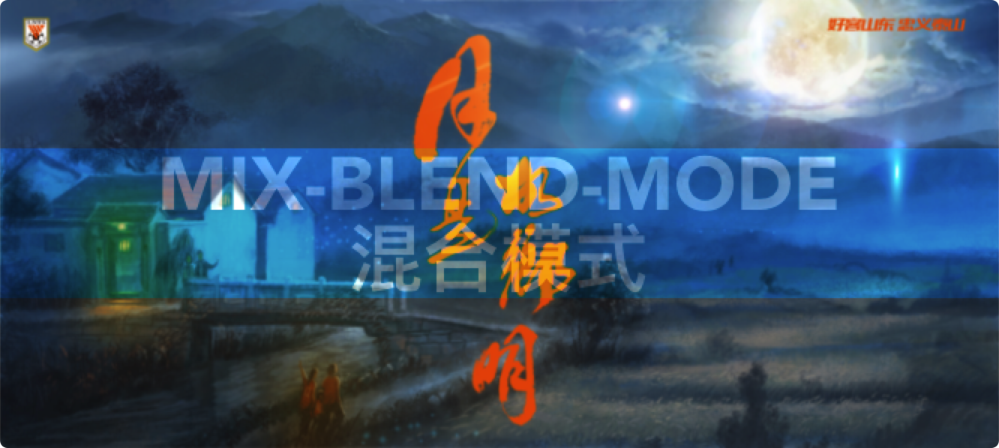
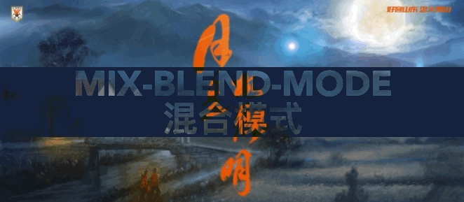

# CSS冷门属性 `mix-blend-mode` 制作文字镂空效果

## 阅读本文您将收获
* `mix-blend-mode` 属性介绍
* `mix-blend-mode` 可以实现哪些效果

## mix-blend-mode 属性
* 官方直译为 `混合模式`
* 混合模式在 图片处理软件 Photoshop 中比较常见，可以将多个图层用于同一张图片，从而将图片处理成其他效果，其实前端也能完成这样的效果，在使用合适的 样式属性 及 属性值 的情况下，是能够将图片处理成我们想要的效果。
* 属性描述了 设置元素 与 直接父元素 的背景 如何混合，通过不同的属性值，我们可以将 设置元素 和直接父元素的背景 处理成叠加、滤色等等属性。
* 如果你觉得文字描述难以理解，没有问题，请继续看下面的代码实践，通过实际效果来了解 `mix-blend-mode` 的各种属性值。

## `mix-blend-mode` 属性值

> 图片是在PS层面的相关mode实际效果，转换成了相对好理解的内容，帮助我们了解各种混合模式的实际效果是在哪方面进行了相应的处理。

> 上图来源于网络，如有侵权，请联系删除~

> 由于属性值太多，本篇文章不再全部介绍，仅介绍几个平时可以用到的实践操作及属性值。其中部分属性值的解释摘自鑫旭大神的博客。

### `normal/initial/inherit/unset` 
* 这几个属性值对设置元素的样式无特殊影响，分别是 正常、默认、继承、还原，所以这四种样式效果不再解释及展示效果。

### `multiply` 正片叠底
* 相当于在原背景图上增加了一个图层，而且能够将多个图层进行显示，达到透色的效果.
* 以下动图是来自[菜鸟教程](https://c.runoob.com/codedemo/3387/)的一个示例，如果不加混合模式属性，当按钮收起时各个图层会相互覆盖，达不到透色的效果。

### `screen` 滤色
* 使用滤色后，颜色会减淡，非常适合实现霓虹灯光效果，适合黑色背景素材和其他元素混合

### `overlay` 叠加
* 在颜色值暗的时候，采用了类似“正片叠底”的算法，而颜色亮的时候，采用了类似“滤色”的算法。此混合模式比较适合实现文字水印效果。

### `darken` 变暗 & `lighten` 变亮
* 这两个属性值相似，都是为了突出子元素，只不过 `darken` 是为了突出底层的颜色，而 `lighten` 是为了突出上层图层的颜色，使用这两个属性可以实现单色的镂空，背景图不同的情况下显示效果不同

### `color-dodge` 颜色减淡 & `color-burn` 颜色加深
* `color-dodge` 颜色减淡混合模式可以用来保护底图的高光，适合处理高光下的人物照片。
* `color-burn` 颜色加深混合模式可以用来保护底图的阴影，适合处理幽深秘境一类的照片，通过和特定的色彩进行混合，可以营造更加幽深的意境。

### `hard-light` 强光
### `soft-light` 柔光
### `difference` 差值
### `exclusion` 排除
### `hue` 色相
### `saturation` 饱和度
### `color` 颜色
### `luminosity` 亮度