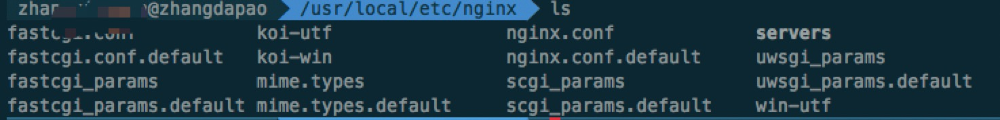

> 上一篇写了点[Nginx 的基础架构](./nginx_base.md)，Nginx 开发过程中可能架构相关的知识需要的不多，但是了解些 Nginx 基础架构方面的知识对于我们更深层次地了解 Nginx 配置有很大的帮助。

> 本篇为大家带来 Nginx 基本配置篇，让大家了解基本的 Nginx 配置。

## 阅读本文您将收获
* Nginx 的安装
* Nginx 的配置解析

##  Nginx 安装
* MAC 上装有 `homebrew`，使用其下载  Nginx  `brew install nginx`
* Nginx 下载成功后，有两个目录比较重要
	* `/usr/local/etc/nginx` Nginx 的默认安装目录

	

	* `/usr/local/var/www` Nginx 的服务器文件存放位置

##  Nginx 相关操作
> 介绍一些基本的常用的使用 Nginx 的终端语法。

* 进入`/usr/local/etc/nginx`
* 执行`sudo nginx -c nginx.conf`， Nginx 启用默认配置启动
* `sudo nginx -s reload` 优雅重启 Nginx 
* `sudo nginx -s quit` 退出 Nginx 

##  Nginx 配置

```
#定义Nginx运行的用户和用户组，来指定Nginx Worker进程运行用户以及用户组，默认由nobody账号运行
user ***;

#nginx进程数，建议设置为等于CPU总核心数。
worker_processes 4;

#全局错误日志定义类型，[ debug | info | notice | warn | error | crit ]，其中debug输出日志最为最详细，而crit输出日志最少
error_log logs/error.log info;

#进程文件，用来指定进程id的存储文件位置
pid logs/nginx.pid;

#一个nginx进程打开的最多文件描述符数目，理论值应该是最多打开文件数（系统的值ulimit -n）与nginx进程数相除，但是nginx分配请求并不均匀，所以建议与ulimit -n的值保持一致，可以使用命令“ulimit -n 65535”来设置其他值。
worker_rlimit_nofile 4864;

#工作模式与连接数上限
events {
    #参考事件模型，use [ kqueue | rtsig | epoll | /dev/poll | select | poll ]; epoll模型是Linux 2.6以上版本内核中的高性能网络I/O模型，如果跑在FreeBSD上面，就用kqueue模型。
    use epoll; #mac平台用kqueue，对于Linux系统，epoll工作模式是首选
    #worker_connections用于定义Nginx每个进程的最大连接数，即接收前端的最大请求数，默认是1024。最大客户端连接数由worker_processes和worker_connections决定，即Max_clients=worker_processes*worker_connections，在作为反向代理时，Max_clients变为：Max_clients = worker_processes * worker_connections/4。 进程的最大连接数受Linux系统进程的最大打开文件数限制，在执行操作系统命令“ulimit -n 65536”后worker_connections的设置才能生效
    worker_connections 1024;
}

#设定http服务器
http {
    #来用设定文件的mime类型,类型在配置文件目录下的mime.type文件定义，来告诉nginx来识别文件类型。
    include mime.types; 
    default_type application/octet-stream; #默认文件类型
    #charset utf-8; #默认编码
    #用于设置日志的格式，和记录哪些参数，这里设置为main，刚好用于access_log来纪录这种类型
    #log_format  main  '$remote_addr - $remote_user [$time_local] "$request" '
    #'$status $body_bytes_sent "$http_referer" '
    #'"$http_user_agent" "$http_x_forwarded_for"';
    sendfile on; #开启高效文件传输模式，sendfile指令指定nginx是否调用sendfile函数来输出文件，对于普通应用设为 on，如果用来进行下载等应用磁盘IO重负载应用，可设置为off，以平衡磁盘与网络I/O处理速度，降低系统的负载。注意：如果图片显示不正常把这个改成off。
    autoindex on; #开启目录列表访问，合适下载服务器，默认关闭。
    tcp_nopush on; #防止网络阻塞
    tcp_nodelay on; #防止网络阻塞
    keepalive_timeout 120; #长连接超时时间，单位是秒

#FastCGI相关参数是为了改善网站的性能：减少资源占用，提高访问速度。下面参数看字面意思都能理解。
    fastcgi_connect_timeout 300;
    fastcgi_send_timeout 300;
    fastcgi_read_timeout 300;
    fastcgi_buffer_size 64k;
    fastcgi_buffers 4 64k;
    fastcgi_busy_buffers_size 128k;
    fastcgi_temp_file_write_size 128k;

#gzip模块设置
    gzip on; #开启gzip压缩输出
    gzip_min_length 1k; #最小压缩文件大小
    gzip_buffers 4 16k; #压缩缓冲区
    gzip_http_version 1.0; #压缩版本（默认1.1，前端如果是squid2.5请使用1.0）
    gzip_comp_level 2; #压缩等级
    gzip_types text/plain application/x-javascript text/css application/xml;
    #压缩类型，默认就已经包含text/html，所以下面就不用再写了，写上去也不会有问题，但是会有一个warn。
    gzip_vary on;
    #limit_zone crawler $binary_remote_addr 10m; #开启限制IP连接数的时候需要使用

    upstream blog.ha97.com {
    #upstream的负载均衡，weight是权重，可以根据机器配置定义权重。weigth参数表示权值，权值越高被分配到的几率越大。
        server 192.168.80.121:80 weight=3;
        server 192.168.80.122:80 weight=2;
        server 192.168.80.123:80 weight=3;
    }
    #虚拟主机的配置
    server {
        #监听端口
        listen 80;
        #域名可以有多个，用空格隔开
        server_name www.***.com ***.com;
        index index.html index.htm index.php;
        #表示在这整个server虚拟主机内，全部的root web根目录。注意要和locate {}下面定义的区分开来
        root /data/www/***;
        location /mp/ {
             proxy_pass http://127.0.0.1:8080;
             proxy_set_header     Host $host;
        }
        location / {
             proxy_pass http://192.168.200.248:80;
             proxy_set_header     Host $host;
        }
        #禁止页面缓存
        location ~* \.(js|css|png|jpg|gif)$ {
				add_header Cache-Control no-store;
		  }
        add_header Access-Control-Allow-Origin "*";
    }
}
```