## 阅读本文您将收获
* `JavaScript` 中的 `Proxy` 是什么？能干什么？
* `Vue3.0` 开始为什么 `Proxy` 代替 `Object.defineProperty`

## `Proxy` 是什么
> 解释参考MDN，[链接直达](https://developer.mozilla.org/zh-CN/docs/Web/JavaScript/Reference/Global_Objects/Proxy)

### 名词解释
* Proxy 对象用于定义基本操作的自定义行为（如属性查找、赋值、枚举、函数调用等）
* Proxy 用于修改某些操作的默认行为,也可以理解为在目标对象之前架设一层拦截,外部所有的访问都必须先通过这层拦截,因此提供了一种机制,可以对外部的访问进行过滤和修改

### 语法
* `const p = new Proxy(target, handler)`
	* `target`: 要使用 Proxy 包装的目标对象（可以是任何类型的对象，包括原生数组，函数，甚至另一个代理）
	* `handler`: 对该代理对象的各种操作行为处理(为空对象的情况下，基本可以理解为是对第一个参数做的一次**浅拷贝**)
* 简而言之：`target` 就是你想要代理的对象；而 `handler` 是一个函数对象，其中定义了所有你想替 `target` 代为管理的操作对象，包含了：
	* *`handler.has(target, prop)`: `in` 操作符的捕捉器，拦截HasProperty操作
	* *`handler.get(target, prop)`: 属性读取操作的捕捉器
	* *`handler.set(target, prop， value)`: 属性设置操作的捕捉器
	* *`handler.apply(target, object, args)`: 函数调用操作的捕捉器，拦截函数的调用、call和apply操作
	* `handler.getPrototypeOf()`: `Object.getPrototypeOf` 方法的捕捉器
	* `handler.setPrototypeOf()`: `Object.setPrototypeOf` 方法的捕捉器
	* `handler.isExtensible()`: `Object.isExtensible` 方法的捕捉器
	* `handler.preventExtensions()`: `Object.preventExtensions` 方法的捕捉器
	* `handler.getOwnPropertyDescriptor()`: `Object.getOwnPropertyDescriptor` 方法的捕捉器
	* `handler.defineProperty()`: `Object.defineProperty` 方法的捕捉器
	* `handler.deleteProperty()`: `delete` 操作符的捕捉器
	* `handler.ownKeys()`: `Object.getOwnPropertyNames` 方法和 `Object.getOwnPropertySymbols` 方法的捕捉器
	* `handler.construct()`: new 操作符的捕捉器
	* **注意**：如果一个属性`不可配置` || `不可写`，则该属性不可被代理，通过 `Proxy` 访问该属性会报错。(实现?)

## `Proxy` 能干什么?
### 当你想进行以下操作时proxy模式通常会很有用：
* 拦截或控制对某个对象的访问
* 通过隐藏事务或辅助逻辑来减小方法/类的复杂性
* 防止在未经验证/准备的情况下执行重度依赖资源的操作

### 一：javascript中真正的私有变量/拦截has...in...操作/给出提示信息或是阻止特定操作
* 针对私有变量，可以使用一个proxy来截获针对某个属性的请求并作出限制或是直接返回 `undefined `
* 还可以使用 has trap 来掩盖这个属性的存在
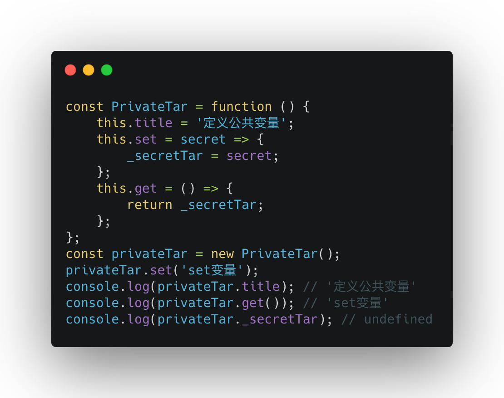

* has 方法拦截的是 `hasProperty` 操作，不是 `hasOwnProperty`,所以 `has...in` 方法不判断一个属性是自身属性还是继承的属性
* `hasOwnProperty` 不包含原型链上的，只判断实例属性上的
* `for...in` 访问原型链上所有的
* `has...in` 可以拦截到，`for...in` 拦截不到？

* 阻止其他人删除属性，想让调用方法的人知道该方法已经被废弃，或是想阻止其他人修改属性

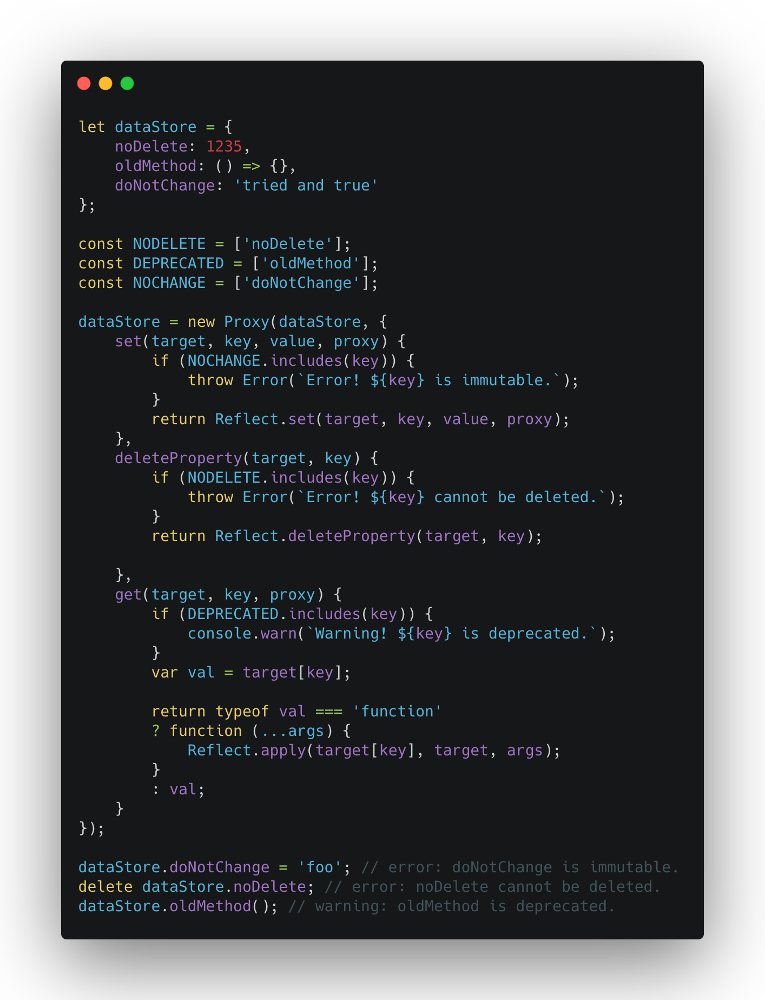

* **注意**: 要是 `Proxy` 起作用，必须针对 `Proxy` 的实例进行操作，而不是针对目标对象进行操作

### 二：数据校验(看代码)

### 三：利用proxy进行记录对象访问
* 针对那些重度依赖资源，执行缓慢或是频繁使用的方法或接口，统计它们的使用或是性能
* 可以记录各种各样的信息而不用修改应用程序的代码或是阻塞代码执行。并且只需要在这些代码的基础上稍事修改就可以记录特性函数的执行性能

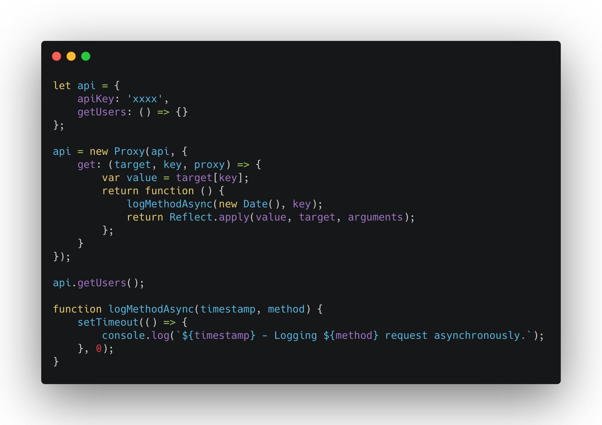

* 这里面 `Proxy` 的 `trap` 为什么使用 `get` 而不是 `apply` ? [答案](https://exploringjs.com/es6/ch_proxies.html#_intercepting-method-calls)

### 四：普通函数与构造函数的兼容
* 构造函数：调用没有使用new关键字来调用的话，Class对象会直接抛出异常

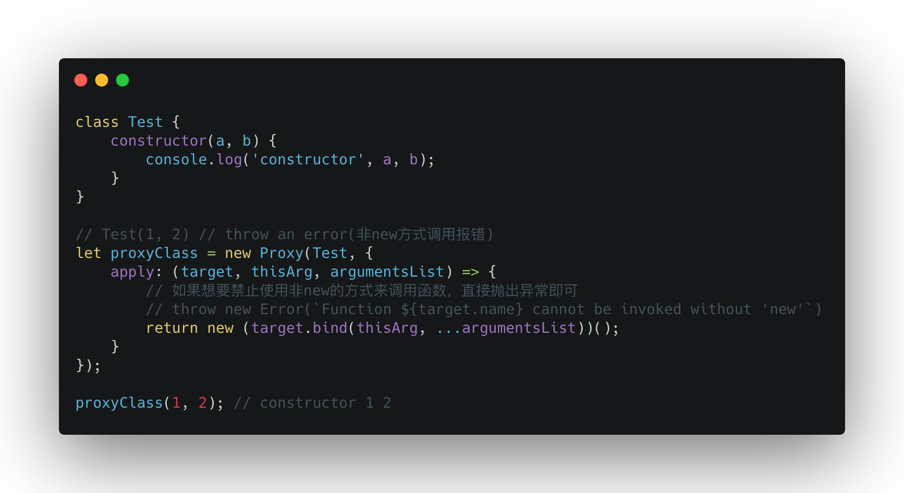

### 五：深层取值判断(看代码)
* 需要解决的几个问题
	1. 获取数据进行拦截
	2. `xxx.xxx.xxx...`无论 `undefined` 出现在哪里都不能报错
	3. `Proxy` 的 `get()` 传入的参数必须是对象

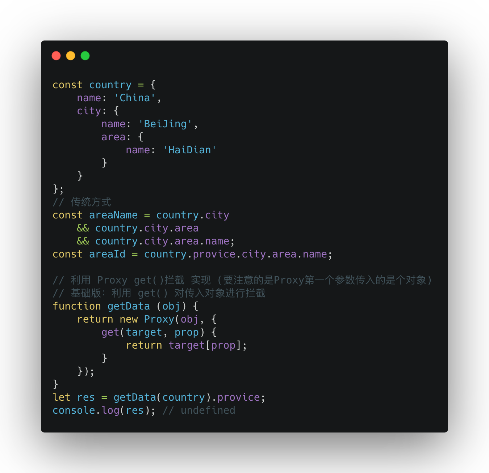

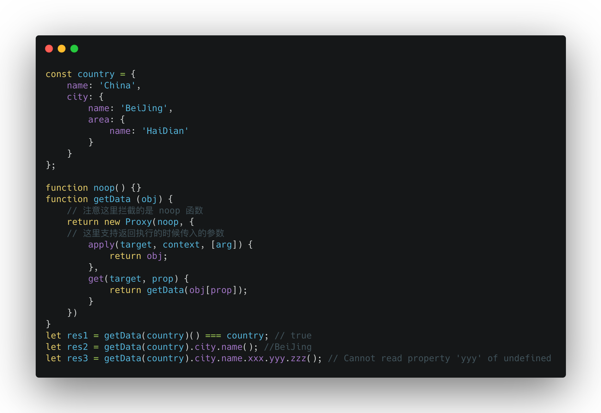

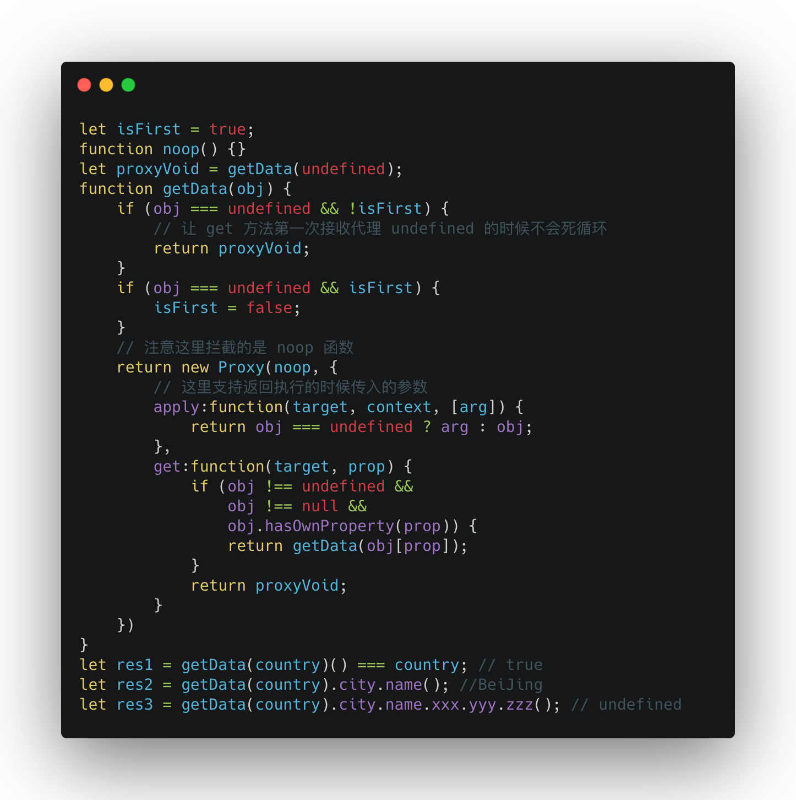

### 六：日志上报
* [腾讯利用Proxy进行日志上报功能](https://www.infoq.cn/article/6eKiic82aQu3uqaYvvfV)

## Vue 3.0 的 Proxy & Object.defineProperty
### Proxy
* **劫持方式**：代理整个对象，只需做一层代理就可以监听同级结构下的所有属性变化，包括新增属性和删除属性
* **本质**：`Proxy` 本质上属于元编程非破坏性数据劫持，在原对象的基础上进行了功能的衍生而又不影响原对象，符合松耦合高内聚的设计理念

### Object.defineProperty 
* **劫持方式**：只能劫持对象的属性，不能直接代理对象
* **流程**：get中进行依赖收集，set数据时通知订阅者更新
* **存在的问题**：虽然 `Object.defineProperty` 通过为属性设置 `getter/setter` 能够完成数据的响应式，但是它并不算是实现数据的响应式的完美方案，某些情况下需要对其进行修补或者hack，这也是它的缺陷，主要表现在两个方面：
	* 无法检测到对象属性的新增或删除
	* 不能监听数组的变化

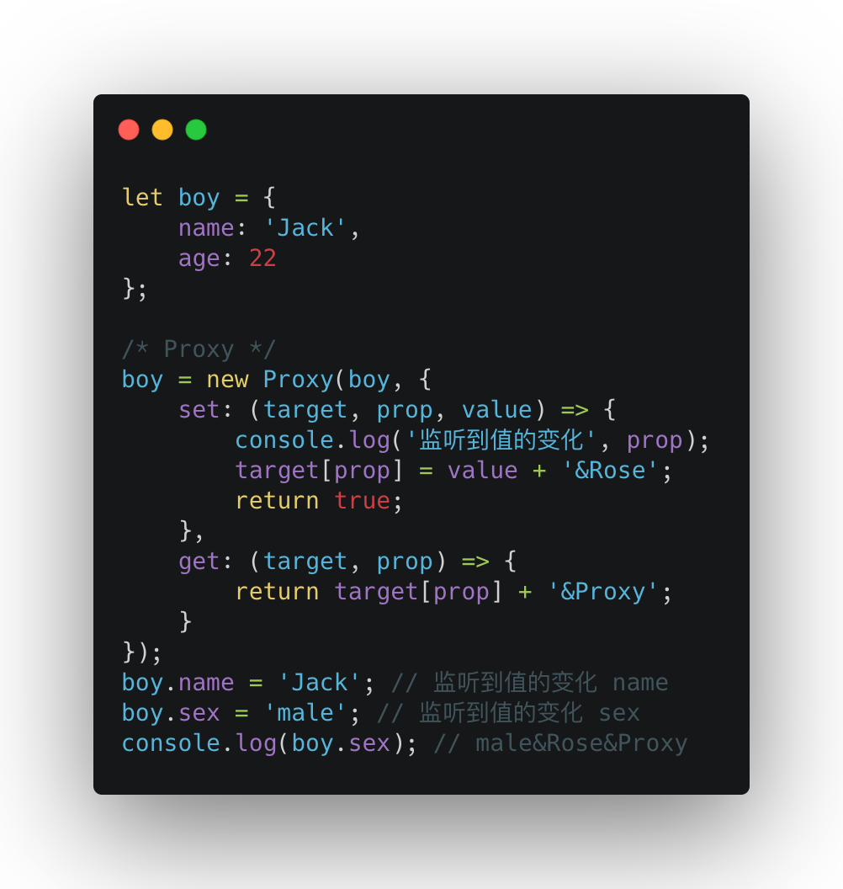

### 1. Object.defineProperty 无法监听新增加的属性
* 解决方式：提供方法重新手动Observe，需要监听的话使用 `Vue.set()` 重新设置添加属性的响应式

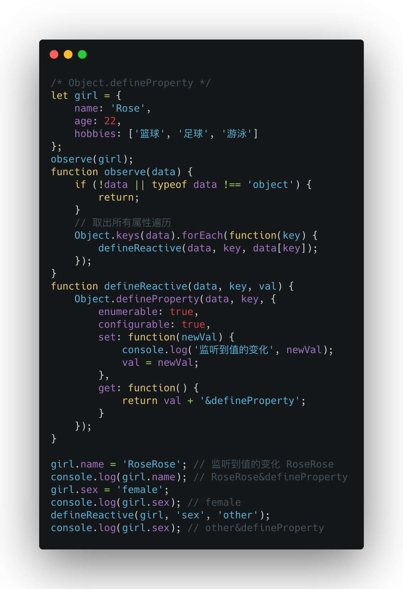

### 2. Object.defineProperty 无法一次性监听对象所有属性，如对象属性的子属性
* 解决方式: 通过递归调用来实现子属性响应式

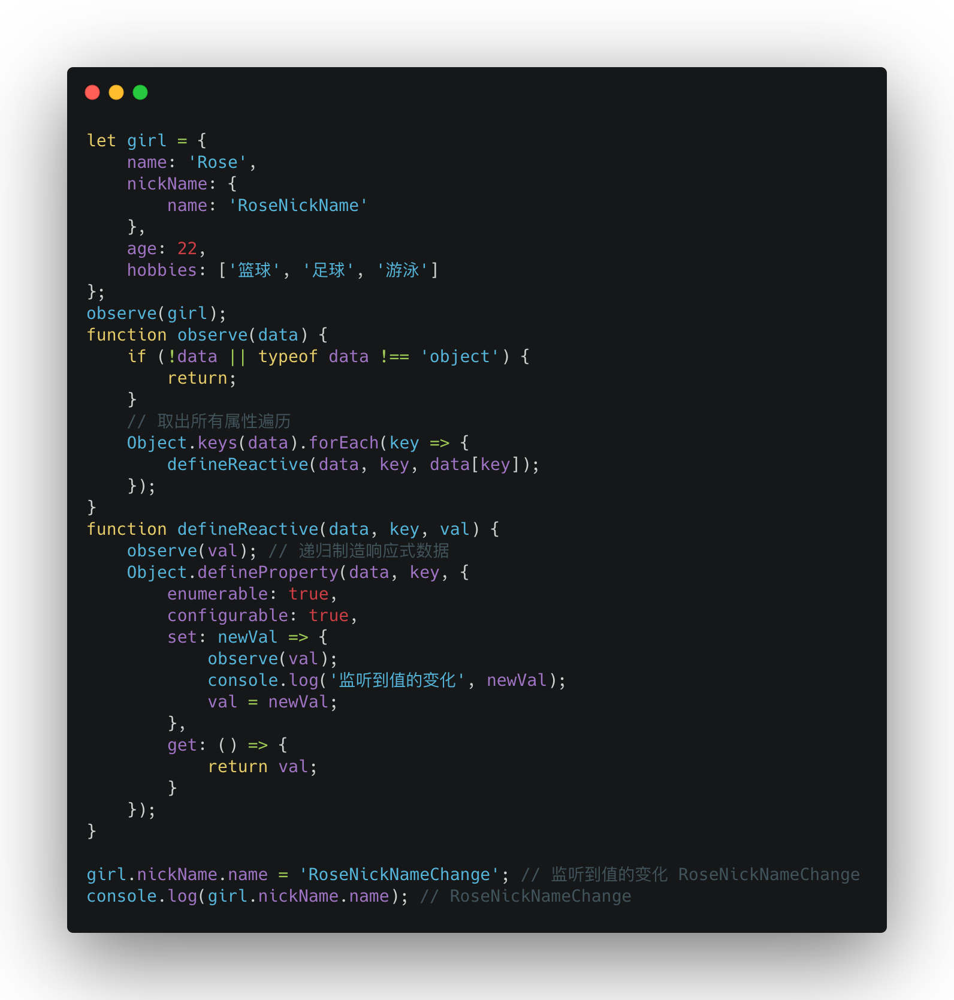

### 3. Object.defineProperty 无法响应数组操作
* 解决方式：通过遍历和重写Array数组原型方法操作方法实现，但是也只限制在 `push/pop/shift/unshift/splice/sort/reverse` 这七个方法，其他数组方法及数组的使用则无法检测到，也无法监听数组索引的变化和长度的变更

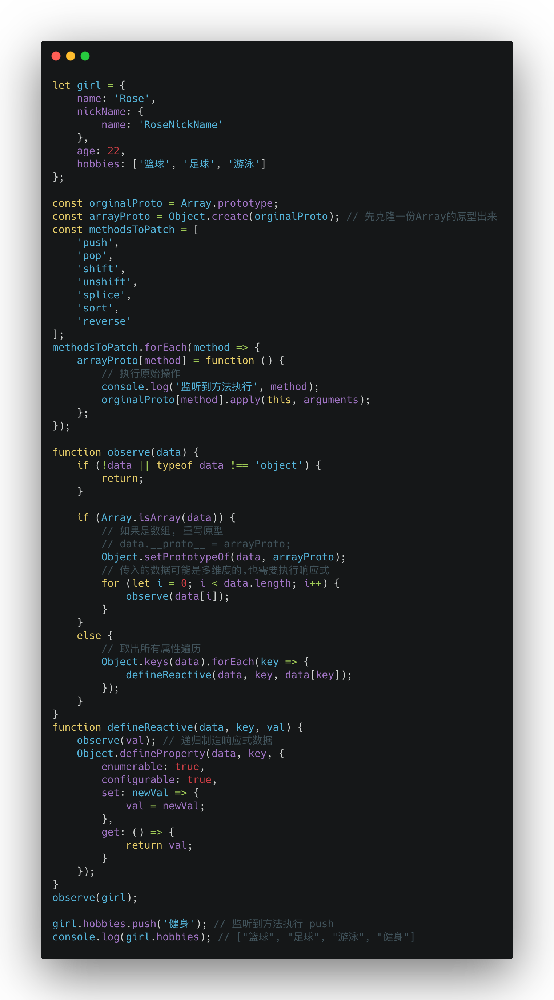

### 4. Proxy 拦截方式更多, Object.defineProperty 只有 get 和 set

### 5. Proxy 性能问题
* `Proxy` 的性能比 `Promise` 还差
* `Proxy` 作为新标准，从长远来看，JS 引擎会继续优化 `Proxy`
* [Thoughts on ES6 Proxies Performance](https://thecodebarbarian.com/thoughts-on-es6-proxies-performance)
* [ES6 Proxy 性能之我见](https://www.cnblogs.com/zmj97/p/10954968.html)

### 6. Proxy 兼容性差
* `Vue 3.0` 中放弃了对于IE的支持
* 目前并没有一个完整支持 `Proxy` 所有拦截方法的 `Polyfill` 方案，有一个 `google` 编写的 `proxy-polyfill` 也只支持了 `get/set/apply/construct` 四种拦截

## Decorator
* ES7 中实现的 `Decorator`，相当于设计模式中的装饰器模式。
* 如果简单地区分 `Proxy` 和 `Decorator` 的使用场景，可以概括为：`Proxy` 的核心作用是控制外界对被代理者内部的访问，`Decorator` 的核心作用是增强被装饰者的功能。
