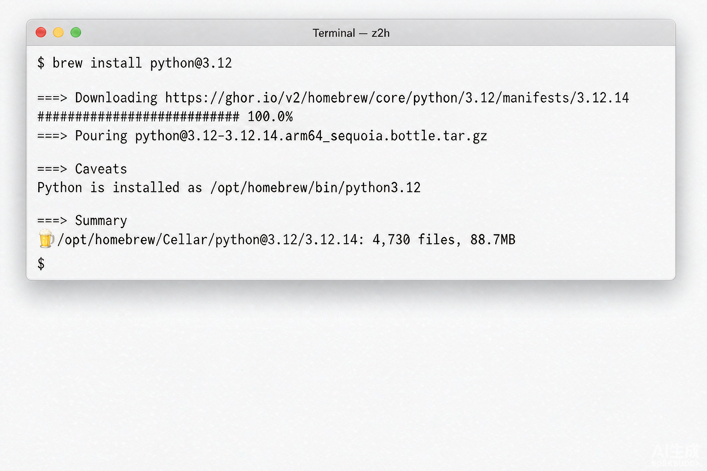
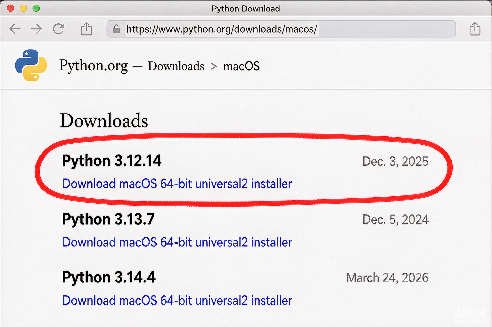
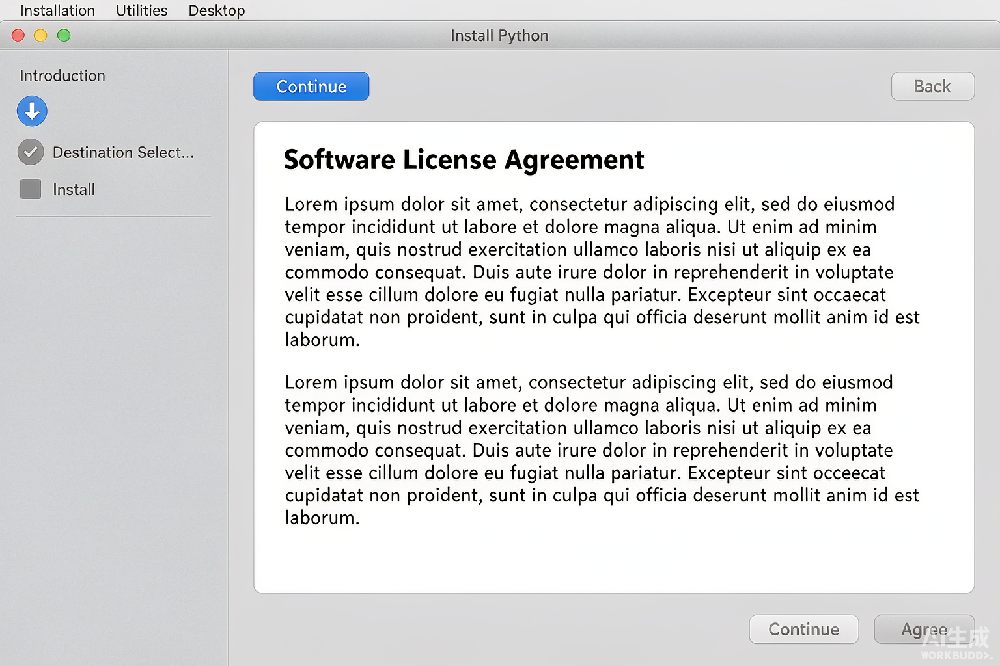
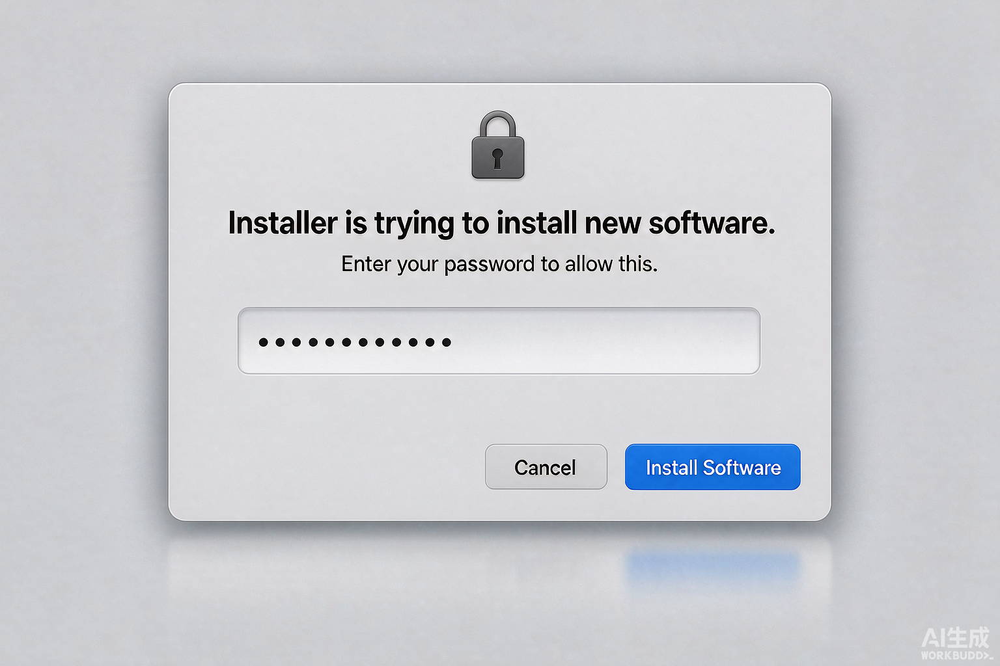
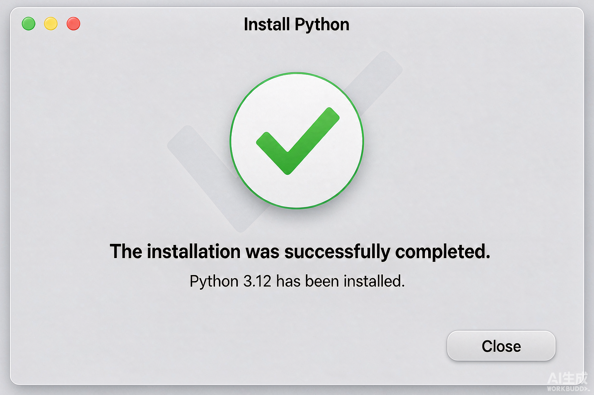

# MacOS Python 环境安装

> 本文面向 macOS 用户，从零开始讲清楚：装哪个版本、有几种装法、怎么验证装成功了、国内网络怎么加速、以及踩坑了怎么办。
>
> 全文命令均可直接复制粘贴到「终端」执行。终端怎么打开：`Command + 空格` 搜索 `Terminal`（终端）回车即可。

## 一、先搞清楚：为什么不能用 Mac 自带的 Python

Mac 出厂自带一个 Python，但它是个「残废版」：

```bash
# 查看系统自带的 Python 版本
/usr/bin/python3 -V
# 输出：Python 3.9.6
```

不推荐用它的三个原因：

1. **版本太老且已停止维护**：3.9 已于 2025 年 10 月正式 EOL（生命周期结束），此后连安全漏洞都不再修复。
2. **它是苹果给系统工具用的**：macOS 的某些系统组件依赖它，你往里乱装包，可能把系统工具搞坏。
3. **权限受限**：往里面装第三方库经常报 `Permission denied`，需要 `sudo`，而 `sudo pip install` 是公认的危险操作。

验证一下你自己有没有装过 Python：

```bash
# 看看当前终端里的 python3 是哪一个（-a 表示列出全部）
which -a python3
```

如果输出里有 `/opt/homebrew/...` 或 `~/.pyenv/...` 之类的路径，说明你已经装过了，可以直接跳到第五节验证。

## 二、装哪个版本？推荐 Python 3.12

截至 2026 年 9 月，各版本现状如下：

| 版本 | 状态 | 安全支持到 | 建议 |
| --- | --- | --- | --- |
| 3.9 | **已停止维护**（2025-10 EOL） | 已结束 | ❌ 不要用于新项目 |
| 3.10 | 仅安全维护 | 2026-10 | ⚠️ 老项目迁就用 |
| 3.11 | 仅安全维护 | 2027-10 | ⚠️ 保守场景 |
| **3.12** | **生态最成熟、工业界用量最大** | 2028-10 | ✅ **推荐：新手 / 生产环境首选** |
| 3.13 | 活跃维护中，支持周期最长 | 2029-10 | ✅ 新项目 / 追性能可选 |
| 3.14 | 最新稳定版（3.14.7） | 2030-10 | 🟡 尝鲜，部分库仍在适配 |

**为什么选 3.12？**

- **用的人最多**：Docker 官方镜像、各大云平台、CI 模板基本都把 3.12 作为默认版本，遇到问题一搜就有答案。
- **兼容性最好**：NumPy 2.x、pandas 3.x、Django、Flask 等主流库全部完美支持，不会出现「装不上」。
- **够稳定**：已进入安全维护期，意味着功能定型、不再变动，不会再冒出破坏性改动。

> **有选择困难症？**：直接选 3.12，本篇所有命令以 3.12 为例。如果你的项目明确要求更高版本，把下面的 `3.12` 换成 `3.13` 即可，命令格式完全一样。

## 三、四种安装方式对比

| 方式 | 适合谁 | 优点 | 缺点 |
| --- | --- | --- | --- |
| **Homebrew**（推荐） | 有一定终端基础 | 一条命令搞定，升级方便 | 需要先装 Homebrew |
| **官网 pkg 安装包** | 完全不想碰命令行的新手 | 纯图形界面，双击下一步 | 不好多版本共存，升级要重装 |
| **pyenv** | 要同时维护多个版本 | 版本切换自由 | 多一层配置，初次使用略绕 |
| **uv** | 追求速度与现代化 | 极快，一个工具管版本+依赖 | 比较新，团队协作需统一 |

下面四种方式**选一种**即可，别都装（会互相打架）。

## 四、方式一：Homebrew 安装（最推荐）

### 步骤 1：检查有没有 Homebrew

```bash
brew --version
```

- 有输出（类似 `Homebrew 4.x.x`）→ 直接进入步骤 2。
- 提示 `command not found: brew` → 先装 Homebrew：

```bash
/bin/bash -c "$(curl -fsSL https://raw.githubusercontent.com/Homebrew/install/HEAD/install.sh)"
```

### 步骤 2：安装 Python 3.12

```bash
brew install python@3.12
```

终端会刷出一堆下载进度，正常情况下十几秒到几分钟。示例输出（版本号和体积可能略有不同）：

```text
==> Downloading https://ghcr.io/v2/homebrew/core/python/3.12/manifests/3.12.14
==> Pouring python@3.12--3.12.14.arm64_sequoia.bottle.tar.gz
==> Caveats
Python is installed as
  /opt/homebrew/bin/python3.12

Unversioned and major-versioned symlinks `python`, `python3`, `pip`, `pip3`, etc.
are installed into
  /opt/homebrew/opt/python@3.12/libexec/bin
==> Summary
🍺  /opt/homebrew/Cellar/python@3.12/3.12.14: 4,730 files, 88.7MB
```



### 步骤 3：验证安装（关键的一步）

```bash
# 带版本号的命令一定可用
python3.12 -V
# 期望输出：Python 3.12.14

python3.12 -m pip -V
# 期望输出：pip 25.x from /opt/homebrew/lib/python3.12/site-packages/pip (python 3.12)
```

### 步骤 4：让 `python3` 这个命令指向 3.12（可选但推荐）

Homebrew 出于「不干扰系统」的考虑，**不会**把不带版本号的 `python3` 直接指向新装的 3.12，所以你执行 `python3 -V` 可能还是老版本。两种解决办法：

**办法 A：以后就用 `python3.12` 全称** —— 最省事，但每次都要多敲几个字符。

**办法 B：把 Homebrew 的软链目录加到 PATH 最前面**（推荐）：

```bash
# 写入 zsh 配置文件（macOS 默认 shell 是 zsh）
echo 'export PATH="/opt/homebrew/opt/python@3.12/libexec/bin:$PATH"' >> ~/.zshrc

# 让配置立即生效
source ~/.zshrc

# 再次验证
python3 -V
# 期望输出：Python 3.12.14
```

> 如果你用的是 bash，把 `~/.zshrc` 换成 `~/.bash_profile` 即可。

## 五、方式二：pyenv 多版本管理（要维护多个项目时）

项目 A 要 3.10、项目 B 要 3.12？用 pyenv 一键切换。

```bash
# 1. 安装 pyenv 及其编译依赖
brew install pyenv openssl readline sqlite3 xz zlib

# 2. 配置 shell（zsh）
echo 'export PYENV_ROOT="$HOME/.pyenv"' >> ~/.zshrc
echo 'export PATH="$PYENV_ROOT/bin:$PATH"' >> ~/.zshrc
echo 'eval "$(pyenv init - zsh)"' >> ~/.zshrc
source ~/.zshrc

# 3. 安装指定版本（会本地编译，耐心等待 3~10 分钟）
pyenv install 3.12.14

# 4. 设为全局默认版本
pyenv global 3.12.14

# 5. 验证
python3 -V       # Python 3.12.14
pyenv versions   # 前面带 * 的就是当前使用的版本
```

**在某个项目里单独指定版本**（推荐做法，团队协作更省心）：

```bash
cd 你的项目目录
pyenv local 3.13.7   # 会生成 .python-version 文件，进这个目录自动切换
```

> ⚠️ 如果 `pyenv install` 报编译错误，大概率原因是缺依赖：重新执行第 1 步，装齐 `openssl readline sqlite3 xz zlib` 后再试。

## 六、方式三：官网安装包（纯图形界面，最适合小白）

完全不想碰命令行的话，用这种方式。

**步骤 1**：打开官网下载页 <https://www.python.org/downloads/macos/>

**步骤 2**：找到 3.12 系列，点击 `macOS 64-bit universal2 installer` 下载 `.pkg` 文件。



**步骤 3**：双击下载好的 `.pkg` 文件，按提示一路点「继续」：

第 1 步，许可协议 → 点「继续」→ 点「同意」：



第 2 步，安装位置 → 点「安装」→ 弹出输入密码 → 输入你的开机密码 → 点「安装软件」：



第 3 步，提示「安装成功」→ 点「关闭」：



**步骤 4**：重启终端（关掉窗口再打开），验证：

```bash
python3 -V
# 期望输出：Python 3.12.x
```

**卸载方式**（万一装错了）：

```bash
# 官方安装包会在 /Library/Frameworks 下留东西，卸载脚本：
ls /Library/Frameworks/Python.framework/Versions/
sudo rm -rf /Library/Frameworks/Python.framework/Versions/3.12
# 再删掉 /Applications 里的 Python 3.12 文件夹，以及 /usr/local/bin 下的 python3.12 相关软链
```

> ⚠️ 官网安装包会把 `python3` 直接指向新版本，覆盖性较强。如果你同时用 Homebrew，建议二选一。

## 七、方式四：uv（2026 年推荐的新一代工具）

uv 是 Rust 写的 Python 工具链，装 Python、建虚拟环境、装依赖全包，速度是传统 pip 的十倍以上。

```bash
# 安装（macOS 官方脚本）
curl -LsSf https://astral.sh/uv/install.sh | sh

# 或已经装了 Homebrew
brew install uv

# 查看可安装的 Python 版本
uv python list

# 安装 Python 3.12
uv python install 3.12

# 在项目里创建虚拟环境（自动下载并使用指定版本）
cd 你的项目目录
uv venv --python 3.12

# 激活 + 装包
source .venv/bin/activate
uv pip install requests
```

> 💡 已有 uv 的用户（本机就是）：直接用 `uv python install 3.12` 即可，比上面任何方式都快。

## 八、配置国内 pip 镜像源（国内网络必做）

默认的 PyPI 源在国外，`pip install` 经常慢到超时。换成国内镜像立刻起飞：

```bash
# 清华源（推荐，同步最及时）
python3 -m pip config set global.index-url https://pypi.tuna.tsinghua.edu.cn/simple

# 顺便设置超时时间，避免大包下载中断
python3 -m pip config set global.timeout 120

# 查看是否生效
python3 -m pip config list
# 期望输出：global.index-url='https://pypi.tuna.tsinghua.edu.cn/simple'
```

其他可选镜像：

| 镜像 | 地址 |
| --- | --- |
| 清华 | `https://pypi.tuna.tsinghua.edu.cn/simple` |
| 阿里云 | `https://mirrors.aliyun.com/pypi/simple/` |
| 腾讯云 | `https://mirrors.cloud.tencent.com/pypi/simple/` |

> 💡 临时用一次镜像而不改全局配置：`pip install requests -i https://pypi.tuna.tsinghua.edu.cn/simple`

## 九、虚拟环境：每个项目一个独立空间

**这是新手最该养成的习惯。** 装了 Python 不等于可以直接 `pip install` 了——那样所有项目共用一个环境，A 项目要 `requests 2.20`、B 项目要 `requests 2.31`，必然打架。

正确做法是每个项目建一个虚拟环境：

```bash
# 1. 进入项目目录
cd ~/Projects/my-project

# 2. 创建虚拟环境（会在当前目录生成 .venv 文件夹）
python3 -m venv .venv

# 3. 激活（macOS/Linux 用 source）
source .venv/bin/activate

# 激活成功后，命令行提示符前面会多出 (.venv)，像这样：
# (.venv) user@MacBook my-project %
```

激活之后，`python` 和 `pip` 就自动指向这个独立环境了：

```bash
# 4. 在这个环境里随便装包，不会影响系统和其他项目
pip install requests

# 5. 退出虚拟环境
deactivate
```

**重要提醒**：`.venv` 目录**不要提交到 git**，在项目根目录的 `.gitignore` 里加上：

```gitignore
# Python
.venv/
venv/
__pycache__/
*.pyc
```

**在 VSCode 里选中这个环境**：按 `Command + Shift + P` → 输入 `Python: Select Interpreter` → 选择 `./.venv/bin/python`。这样编辑器里的代码提示和调试才会用对解释器。

## 十、写个 Hello World 验证全链路

新建文件 `hello.py`：

```python
"""环境验证脚本：确认 Python 版本、虚拟环境、第三方库都没问题。"""

import sys
import platform


def main() -> None:
    # 1. 解释器基本信息
    print(f"Python 版本 : {sys.version.split()[0]}")
    print(f"解释器路径  : {sys.executable}")
    print(f"系统架构    : {platform.machine()}")

    # 2. 判断是否处于虚拟环境中
    in_venv = sys.prefix != sys.base_prefix
    print(f"虚拟环境    : {'已激活 ✅' if in_venv else '未激活 ⚠️（建议先 source .venv/bin/activate）'}")

    # 3. 试探第三方库是否装好（未安装不代表环境有问题）
    try:
        import requests
    except ImportError:
        print("第三方库    : requests 未安装（执行 pip install requests 即可）")
    else:
        print(f"第三方库    : requests {requests.__version__} ✅")


if __name__ == "__main__":
    main()
```

运行：

```bash
python3 hello.py
```

期望输出（示例）：

```text
Python 版本 : 3.12.14
解释器路径  : /Users/you/Projects/my-project/.venv/bin/python
系统架构    : arm64
虚拟环境    : 已激活 ✅
第三方库    : requests 2.32.3 ✅
```

看到这个输出，说明你的 Python 环境已经彻底可用了。

## 十一、一键体检脚本

不确定环境装乱了没有？把下面这段存成 `check_env.py` 运行，它会把你机器上所有 Python 都揪出来：

```python
"""一键排查 macOS 上的 Python 环境：列出所有解释器、pip 源、虚拟环境状态。"""

import shutil
import subprocess
import sys


def run(cmd: list[str]) -> str:
    """执行命令并返回 stdout（失败时返回错误信息，不抛异常）。"""
    try:
        result = subprocess.run(cmd, capture_output=True, text=True, timeout=10, check=False)
    except (OSError, subprocess.SubprocessError) as exc:
        return f"执行失败: {exc}"
    return (result.stdout or result.stderr).strip() or "(无输出)"


def main() -> None:
    print("=" * 56)
    print("当前默认解释器")
    print("=" * 56)
    print(f"路径: {sys.executable}")
    print(f"版本: {sys.version.split()[0]}")
    print(f"虚拟环境: {'是' if sys.prefix != sys.base_prefix else '否'}")

    print()
    print("=" * 56)
    print("系统中所有 python3 候选")
    print("=" * 56)
    for name in ("python3", "python3.12", "python3.13", "python3.14"):
        path = shutil.which(name)
        if path is None:
            continue
        version = run([path, "-V"])
        print(f"{name:<12} -> {path}")
        print(f"{'':<12}    {version}")
    print()
    print("提示：which -a python3 可以看到 PATH 中全部同名命令")

    print()
    print("=" * 56)
    print("包管理器 / 版本管理工具")
    print("=" * 56)
    for tool in ("brew", "pyenv", "uv", "conda"):
        path = shutil.which(tool)
        print(f"{tool:<8}: {path or '未安装'}")

    print()
    print("=" * 56)
    print("pip 镜像源配置")
    print("=" * 56)
    output = run([sys.executable, "-m", "pip", "config", "list"])
    # run() 在无输出时会返回占位符，这里替换成更友好的提示，避免读者以为脚本挂了
    if output == "(无输出)":
        output = "(未配置 pip 镜像源，可参考本文第八节)"
    print(output)


if __name__ == "__main__":
    main()
```

## 十二、常见问题 FAQ

**Q1：提示 `zsh: command not found: python3`**
说明 PATH 里没有 Python。检查是否装成功：`ls /opt/homebrew/bin/python3*`；若存在但命令不识别，按第四节步骤 4 配置 PATH。

**Q2：`pip install` 报 `This environment is externally managed`**
Homebrew 装的 Python 受保护，不允许全局装包。**正确做法**是建虚拟环境（第九节），而不是加 `--break-system-packages` 硬闯。

**Q3：`pip install` 报 `Permission denied` 或让我 `sudo`**
**千万别用 `sudo pip`**。99% 的情况是你没激活虚拟环境，激活后重试即可。

**Q4：弹窗提示需要安装「命令行开发者工具」**
执行一次即可：`xcode-select --install`，弹窗中点「安装」等它下完。

**Q5：装了 3.12，但 `python3 -V` 还是显示 3.9.6**
`python3` 仍指向系统自带版本。执行 `which -a python3` 看顺序，然后按第四节步骤 4 把新版本目录放到 PATH 前面。

**Q6：M 系列（Apple Silicon）芯片有坑吗？**
基本没有。Homebrew 的 `bottled` 包和官网 `universal2` 安装包都已原生支持 arm64。极个别老库需要编译，报错时先 `xcode-select --install` 再试。

**Q7：怎么彻底卸载 Homebrew 装的 Python？**
`brew uninstall python@3.12`。注意如果别的软件依赖它，brew 会提示，确认后再删。

**Q8：公司内网/代理环境 pip 装不上**
先配镜像源（第八节），若必须走代理则设置：`export https_proxy=http://代理地址:端口`，再执行 pip。

## 十三、参考资料

- Python 官方下载（macOS）：<https://www.python.org/downloads/macos/>
- Python 各版本生命周期时间表：<https://devguide.python.org/versions/>
- Homebrew 官网：<https://brew.sh/zh-cn/>
- pyenv 官方仓库：<https://github.com/pyenv/pyenv>
- uv 官方文档：<https://docs.astral.sh/uv/>
- 清华 PyPI 镜像使用帮助：<https://mirrors.tuna.tsinghua.edu.cn/help/pypi/>
