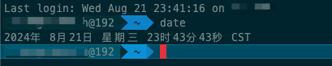
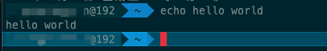
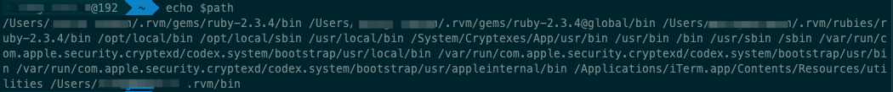
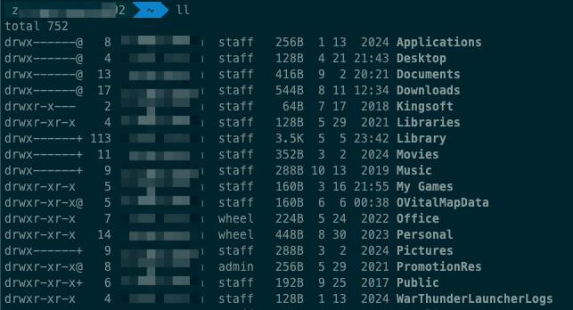

#  计算机教育中缺失的一课（一）：shell
> 计算机有着多种交互方式进行指令输入，最常用的当属 GUI 图形化界面（例如Windows、MacOS、Linux），还有终端，控制台，以及本篇文章要讲的 shell

> shell 接口是计算机中保留的一种文字指令输入方式，相比其他指令输入方式，shell能做的事情更多也更友好。

> 本文总结自[计算机教育中缺失的一课](https://missing-semester-cn.github.io)，课程中包含命令行、编辑器、版本控制等多个工具及使用指南，文章部分内容以笔者实际使用修改。

## shell 是什么
* 操作系统中有一个非常重要的硬件管理模块，就是内核（`kernel`）。
* 内核管理着整个操作系统的所有硬件，并且内核处于系统底层，不能直接让用户随意操作，但是我们需要一个程序，能够让开发人员和内核进行交互和沟通，从而让内核完成我们的任务，这个程序就是 `shell`。
* 简单来说就是将用户的执行命令翻译给内核（`kernel`），将内核（`kernel`）的反馈翻译给用户。
* `shell` 有两个关键作用
	* 传递请求指令，让操作系统执行指令
	* 保护内核（`kernel`）

## 常见 `shell`
* Shell 通常可以分为两种：命令行 `shell` 与 图形 `shell`。
* 命令行 `shell`：
	* 提供一个命令行界面 (`CLI`)
	* 例如：`bash`、`zsh`、`sh` 、`ash`等
* 图形 `shell`：
	* 提供一个图形用户界面 (`GUI`)。
	* 例如 `Windows` 下的 `explorer.exe` 就是一个典型的图形 `shell`

## 使用 `shell`

> 以下内容以 `zsh`举例 

### 指令输入

* 打开电脑上的 `shell` 窗口，会直接展示提示符，即可以通过文本接口进行指令输入。

	

* 相应指令输入回车后就会进行相应指令输入，执行结束后 `shell` 会进行下一次输入等待。

### 指令输入参数传递

* `shell` 基于空格分割指令，执行第一个单词代表的程序，剩下的作为参数进行传递。
	
	

### 指令执行过程

* `shell` 寻找指令的过程与 `python` 和 `lua` 等脚本语言类似，在编程环境中都具备变量、条件、循环、函数。
* `shell` 执行指令时会先寻找环境变量 `$path` 中的程序。

	
	
* 在 `$path` 中的程序中搜索输入的指令名并执行关键字。

### 在 `shell` 中导航
* 路径分隔符
	* Linux、MacOS: `/`
	* windows: `\`
* 绝对路径和相对路径
	* `pwd` 获取相对路径
	* `cd` 目录进入指令，`.` 同级目录查找，`..` 父级目录查找
* 查看目录文件
	* `ls`: 查看当前目录下文件
	* `ll`: 查看当前目录下文件详情，包括文件类型、文件权限、使用者权限、体积等信息

* 标记和选项
	* 以 `-` 开头，并可以改变程序的行为
	* `-h` 或 `--help` 查看帮助信息