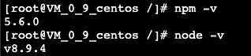
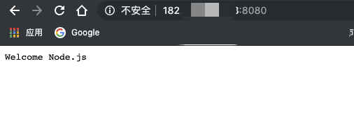

# 腾讯云CentOS下搭建 Node 网站
## 运行环境
### 本地环境
* MacBook Pro
* macOS Mojave 10.14.6

### 腾讯云主机
* CentOS 7.6 64位
* 1 核 1 GB 1 Mbps
* 高性能云硬盘

## 准备工作
* 服务器实例正常启动
* web端登录实例
* 畅通的网络

## 服务器环境设置
### 手动安装node
* 根据云主机系统选择node版本
	* [NodeJS官方下载地址](https://nodejs.org/en/download/)
* 登录云主机 并 下载node安装包(记住安装路径，免得下载完找不到安装包)
	* 方式一：直接下载

	```
	wget http://nodejs.org/dist/v8.9.4/node-v8.9.4-linux-x64.tar.gz
	```
	* 方式二：本地拷贝 拷贝到云主机地址下的文件夹

	```
	scp /local/file/path  root@187.xxx.xxx.xxx:/test
	```
* 解压安装包
	* 由于安装包是.gz格式的，我们首先需要先解压

	```
	tar -zxvf node-v8.9.4-linux-x64.tar.gz
	```	
* 解压成功会在当前文件夹生成 node 包，包名过长过复杂可重命名

	```
	mv node-v8.9.4-linux-x64 node
	```	
* 全局设置 node 环境变量 
	* 找到.bash_profile文件

	```
	vim ~/.bash_profile
	```
	* 修改文件

	```
	PATH=$PATH:$HOME/bin:/usr/local/src/node/bin
	```
	* 保存文件

	```
	source ~/.bash_profile
	```
* 检查 NodeJS 是否安装成功 `node -v`

	

* 检查 云服务 是否正常
	* 在机器中创建server.js
	
	```
	// 创建HTTP服务
	var http = require('http');
	http.createServer(function (req, res) {
		res.writeHead(200, {'Content-Type': 'text/plain'});
		res.end('Welcome Node.js');
	}).listen(8080, '0.0.0.0'); // 注意这里是监听 0.0.0.0 的端口
	console.log('Server running at http://0.0.0.0:8080/');
	```
	* 启动 server 服务 `node server.js`
* 访问机器外网IP，访问成功即为云服务器搭建成功

	

* 访问机器外网IP，访问失败请按照腾讯云服务器自检文档进行自检
	* [自检地址](https://cloud.tencent.com/document/product/213/14633)

### 安装 Git
* Git 安装

```
sudo yum install git
```

* 检查 git 是否安装成功

```
git --version
```
	
### 安装 Nginx
* 使用 yum 安装

```
sudo yum install nginx
```
* 修改 Nginx 配置

```
server {
    listen  80;
    root /home/project/dist;
    server_name localhost; 

    location / {
       try_files $uri $uri/ @router;
       index index.html;
    }

    location @router {
       rewrite ^.*$ /index.html last;
    }
}
```

## 项目本地创建与测试
> 本项目基于 Vue-cli 搭建, Vue 项目 的搭建想必熟悉前端开发的同学已经很熟悉，所有本文这部分一笔带过，不做过多赘述

### Vue项目本地创建
* 使用 NPM 安装 vue-cli

```
npm install vue -g
```

* 使用 vuw-cli 创建本地初始项目

```
vue init webpack <project-name>
```

### 项目本地启动
* 安装 node 依赖

```
npm install
```

##### 本地 node 启动访问 (开发、测试、生产环境启动)
* 启动指令具体查看 package.json

```
npm run dev
```

##### 本地 nginx 访问静态包 (测试、生产环境)
* 项目打包成静态资源(打包指令具体查看 package.json)

```
npm run build
```

### git 关联并上传
* git 创建远程分支
* 本地项目 git 初始化

```
git init
```

* 关联远程分支

```
git remote add < git 远程地址 >
```

* 将本地分支加入项目管理

```
git add .
```

* 提交本地分支到远程分支并添加注释

```
git commit -m "注释内容" 
```

* 推送到远程分支

```
git push origin <feature>
```

## 服务器手动部署项目
### 服务器添加项目
* 使用 Git 进行 clone 项目

```
git clone < 项目git地址 >
```

### 服务器启动项目
* 服务器安装 node 依赖

	```
	npm install
	```

	* 若依赖安装失败可使用本地运行时的依赖(建议打包后移动)

	```
	scp /Personal/web-projects/xxx/node_modules.tar  root@182.254.xxx.xxx:/项目地址
	```

##### 进行 node 启动
* 服务器启动

```
npm run dev
```

##### nginx 访问静态包

```
npm run build
```

### 访问网站
* 若能正常打开首页即为部署成功

### 查看监控信息
* 查看云平台控制台监控信息查看是否正常
* 使用 PM2 等 node 进程监控管理工具进行监控

### 二次开发个人网站
* 首次部署成功后可进行二次开发
* 二次开发流程和部署流程和首次开发基本相同
	
