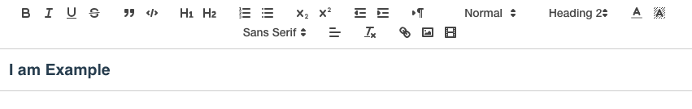

> 今天推荐一个好用的VUE富文本编辑器插件---`vue-quill-editor`

> [官方github文档](https://github.com/surmon-china/vue-quill-editor)

> [官方文档](https://quilljs.com/docs/quickstart/)

## 安装
* CDN安装

```
<link rel="stylesheet" href="path/to/quill.core.css"/>
<link rel="stylesheet" href="path/to/quill.snow.css"/>
<link rel="stylesheet" href="path/to/quill.bubble.css"/>
<script type="text/javascript" src="path/to/quill.js"></script>
<script type="text/javascript" src="path/to/vue.min.js"></script>
<script type="text/javascript" src="path/to/dist/vue-quill-editor.js"></script>
<script type="text/javascript">
  Vue.use(window.VueQuillEditor)
</script>
```

* npm 安装

```
npm install vue-quill-editor
```

## 引入
* 全局引入

```
//main.js
import Vue from 'vue'
import VueQuillEditor from 'vue-quill-editor'

// require styles
import 'quill/dist/quill.core.css'
import 'quill/dist/quill.snow.css'
import 'quill/dist/quill.bubble.css'

Vue.use(VueQuillEditor)
```
* 组件内引入

```
<template>
	<div class="editor-content">
		<quill-editor v-model="content"
                ref="myQuillEditor"
                :options="editorOption"
                @blur="onEditorBlur($event)"
                @focus="onEditorFocus($event)"
                @ready="onEditorReady($event)">
		</quill-editor>
	</div>
</template>
<script>
import { quillEditor } from 'vue-quill-editor'

export default {
	data() {
		return {
			content: '<h2>I am Example</h2>',
	        editorOption: {
	          // some quill options
	        }
		}
	},
	components: {
		quillEditor
	}
}
</script>
<style lang="scss">
	@import 'quill/dist/quill.core.css';
	@import 'quill/dist/quill.snow.css';
	@import 'quill/dist/quill.bubble.css';
</style>
```

* 引入成功



## 自定义属性及配置
### 自定义工具栏展示按钮
* vue-quill-editor的作者提供了丰富的工具栏项目，可以根据需要配置，建议在项目中将这些配置封装在同一js文件中，方便引入

```
// toolbar工具栏的工具选项（默认展示全部）
const toolOptions = [
    ['bold', 'italic', 'underline', 'strike'],//加粗，斜体，下划线，删除
    ['blockquote', 'code-block'], //引用，代码块
    [{'header': 1}, {'header': 2}],// 标题，键值对的形式；1、2表示字体大小
    [{'list': 'ordered'}, {'list': 'bullet'}],//列表
    [{'script': 'sub'}, {'script': 'super'}],// 上下标
    [{'indent': '-1'}, {'indent': '+1'}],// 缩进
    [{'direction': 'rtl'}],// 文本方向
    [{'size': ['small', false, 'large', 'huge']}],// 字体大小
    [{'header': [1, 2, 3, 4, 5, 6, false]}],//几级标题
    [{'color': []}, {'background': []}],// 字体颜色，字体背景颜色
    [{'font': []}],//字体
    [{'align': []}],//对齐方式
    ['clean'],//清除字体样式
    ['link', 'image', 'video']//上传图片、上传视频
];

```
### 自定义图片上传配置

```
/*Quill-Editor图片上传配置*/
const uploadConfig = {
    action:  '',  // 必填参数 图片上传地址 若不填则将图片保存为base64格式存在文章中
    methods: 'POST',  // 必填参数 图片上传方式
    token: '',  // 可选参数 如果需要token验证，假设你的token有存放在sessionStorage
    name: 'img',  // 必填参数 文件的参数名
    size: 1024,  // 可选参数   图片大小，单位为Kb, 1M = 1024Kb
    accept: 'image/png, image/gif, image/jpeg, image/bmp, image/x-icon'  // 可选 可上传的图片格式
};

// 自定义handlers
const handlers = {
    image: function image() {
        var self = this;
		 var fileInput = this.container.querySelector('input.ql-image[type=file]')
        if (fileInput === null) {
            fileInput = document.createElement('input')
            fileInput.setAttribute('type', 'file')
            // 设置图片参数名
            if (uploadConfig.name) {
                fileInput.setAttribute('name', uploadConfig.name);
            }
            // 可设置上传图片的格式
            fileInput.setAttribute('accept', uploadConfig.accept);
            fileInput.classList.add('ql-image');
            // 监听选择文件
            fileInput.addEventListener('change', function () {
                var formData = new FormData()
                formData.append(uploadConfig.name, fileInput.files[0])
                // formData.append('platform','yxpt')
                formData.append('platform','yhcw')

                const instance = $axios.create({
                    withCredentials: true,
                    headers: {
	                    //设置请求格式为formData
                        'Content-Type':'multipart/form-data'
                    }
                })
                instance.post(uploadConfig.action, formData).then(res => {
                    if (res && res.data && res.data.data.id) {
                        let imgUrl = 'http://xxx.com/fileserver/view?id=' + res.data.data.id

                        let length = self.quill.getSelection(true).index
                        //这里很重要，你图片上传成功后，img的src需要在这里添加，res.path就是你服务器返回的图片链接。 
                        self.quill.insertEmbed(length, 'image', imgUrl)
                        self.quill.setSelection(length + 1)       
                    }
                    fileInput.value = ''
                }).catch(error => {
                    console.log('图片上传失败',error)
                })
            })
            this.container.appendChild(fileInput)
        }
        fileInput.click()
    }
};
```
### 导出相关配置

```
//导出Quill-Editor配置
export default {
    placeholder: '请输入文章内容',
    theme: 'snow',  // 主题
    modules: {
        toolbar: {
            container: toolOptions,  // 工具栏选项
            handlers: handlers  // 事件重写
        }
    }
};
```
### 页面引用

```
import quillConfig from '../plugins/quillEditorConfig.js';

data() {
	return {
		content: '',
		editorOption: quillConfig,
	}
},
```

## 更多插件
* [更多vue-quill-editor插件](https://github.com/search?o=desc&p=4&q=quill+module&s=stars&type=Repositories&utf8=%E2%9C%93)
