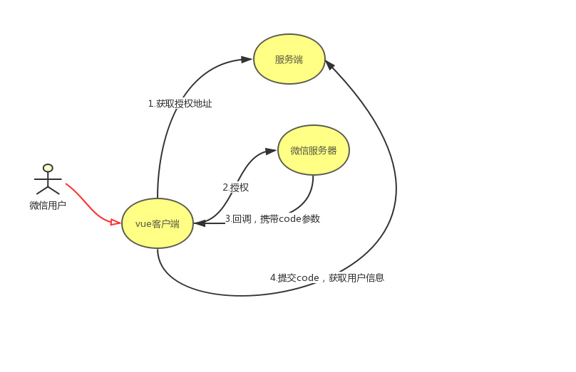

> 近期新上线项目，用到了微信授权获取用户信息和分享，掉坑无数次，遂写此篇，为后人指路

## 微信授权能获取到什么
* 微信授权获得的基本信息

```
{
    "openid":"xxx-xxx",
    "unionid":"xxxx",
    "nickname":"nickName",
    "sex":1, //1: 男性 2: 女性
    "language":"zh_CN",
    "city":"济南",
    "province":"山东",
    "country":"中国",
    "headimgurl":"http:xxxxxxxx",
    "privilege":[]
}
```
* `openid`和`unionid`的区别
	* 在不同的公众账号下`openid`是不一样的，而他们的`unionid`却是一样的

## 项目情况
### 技术选型
* 项目语言：HTML、CSS、JavaScript
* 项目框架：Vue.js
* 项目搭建脚手架：vue-cli
* 工程化工具：webpack、Npm
* 源码管理：gitlab
* 运行环境：WeChatBrowser
* 第三方服务：微信JS-SDK

### 项目需求
* 微信授权获取用户信息
* 微信分享统计
* 提交表单携带微信部分信息

> 以下技术实现方式和方案都是基于公众号已分配相关授权和权限的情况下，具体授权和权限申请请查看微信官方文档，此处不做赘述

## 微信授权(基于公众号的授权方案)
* 目前网上大多分为两种方式去获取微信授权，一种是前端主导的微信授权，一种是server端主导的微信授权，两种方式实现的结果是一样的，具体采用何种方式可以根据自己项目情况去选择

### 授权方法
* 客户端中转的授权方式

* 完全由服务端主导的授权方式

### 授权流程
* 客户端中转的授权方式
	* 微信用户进入页面(动态网址需要提前向服务器端获取授权地址)
	* 客户端携带`redirect_uri`向微信服务器发起授权请求
	* 微信服务器授权成功会携带一个`code`在`url`上返回
	* 客户端随即携带`code`向服务端发送请求
	* 服务端返回用户信息
* 完全由服务端主导的授权方式

### 客户端中转的授权方式技术实现
* 获取微信授权`code`

```
let redirectUri = encodeURI(window.location.href)
window.location.href = `https://open.weixin.qq.com/connect/oauth2/authorize?appid=xxx&redirect_uri=${redirectUri}&response_type=code&scope=snsapi_userinfo&state=123#wechat_redirect`
```
* 携带`code`向服务器端获取用户授权

```
let code = getQuery(window.location.href).code
axios.get("/xxx/getWxInfo?code=" + code).then(res => {
	if (res && res.data && res.data.code == 10000) {
		this.userInfo = res.data.data
		//获取成功后将userInfo存储在cookie中方便其他页面使用
		//localstorge存储在微信端存在问题，建议使用cookie存储
		//后续会写篇文章专门讲解微信端cookie存储和localstorge存储
		setCookie('userInfo', this.userInfo);
	}else {
		alert('微信授权失败，请重新微信授权后打开文章', res.code)
	}
}).catch(error => {
	this.userInfo = ''
	alert('微信授权失败，请重新微信授权后打开', res.code)
	console.log('获取微信授权出错了', error)
})
```
* 授权成功，此时已经拿到用户的微信的授权信息和个人信息

## 微信分享
### 分享流程
* 获取微信分享授权
* 自定义分享标题，分享摘要，分享图片，并写入微信配置(wx.config)
* 调用分享接口(wx.ready)
* 分享成功

### 微信分享技术实现
* 微信分享是个频繁调用的方法，实现过程中可以抽象一下

```
//调用服务器端接口验证授权信息
function $setShare(options) {
	axios.get('/xxx/getWxSignature?url=' + encodeURIComponent(location.href.split('#')[0])).then(function(resp) {
	    if (!resp || !resp.data || resp.data.code != 10000) { return }
	    wx.config({
	        // debug: true,// 开启debug模式
	        appId: resp.data.data.appid,
	        timestamp: resp.data.data.timestamp,
	        nonceStr: resp.data.data.noncestr,
	        signature: resp.data.data.signature,
	        jsApiList: ["onMenuShareTimeline", "onMenuShareAppMessage"]
	    });

	    var shareTimeLineData = options || {
	        title: '分享标题',
	        desc: '分享摘要',
	        link: '',
	        imgUrl:'',
	    };

	    var shareAppData = options || {
	        title: '分享标题',
	        desc: '分享摘要',
	        link: '',
	        imgUrl:'',
	    };
	    wx.ready(function() {
	        wx.onMenuShareAppMessage(shareAppData);
	        wx.onMenuShareTimeline(shareTimeLineData);
	    });
	    wx.error(function(res){
	        console.log('分享签证失败', res)
	    });
	},function(err){
	    if (err) {
	        alert(err);
	    }else{
	        alert('网络错误,请稍后重试!');
	    }
	});
}
```
* 调用分享代码实现

```
let shareWxData = {
	 title: '测试微信分享标题',
    desc: '测试微信分享摘要',
    link: window.location.href,
    imgUrl: 'xxxxxxx',
    success: function(res) {
    	// 这是微信分享的回调
    	// 注意这个地方并不是用户分享成功的回调，而是用户点击了分享的回调，微信现有版本不会告知开发者用户是否分享成功
    }
}
$setWxShare(shareWxData)
```

## 部分参考文献(排名不分先后,如有侵权请联系删除)
* [微信授权与分享官方文档](https://mp.weixin.qq.com/wiki?t=resource/res_main&id=mp1421141115)
* [网站应用微信登录开发指南](https://open.weixin.qq.com/cgi-bin/showdocument?action=dir_list&t=resource/res_list&verify=1&id=open1419316505&token=&lang=zh_CN)
* [vue 前后端分离 如何实现微信后端授权](https://www.v2ex.com/t/420936)
* [微信授权、获取用户openid](http://www.cnblogs.com/jinzhenzong/p/9035809.html)
* [Vue微信公众号开发踩坑记录](https://segmentfault.com/a/1190000010753247)
* [Vue-mall](https://github.com/qutz/vue-mall)
* [微信登录，前端怎么获取用户的信息](https://segmentfault.com/q/1010000012401356/)
* [部分自己趟过的坑和错误请点击这里](https://github.com/programmer-zhang/front-end/blob/master/profiles/wechat_error.md)