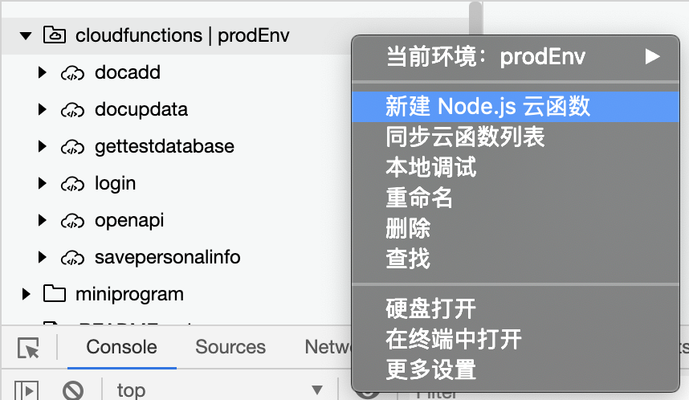
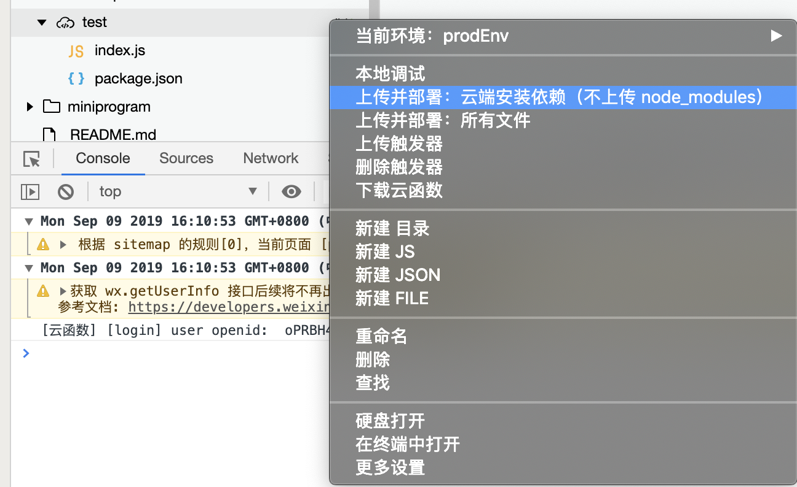

# 微信小程序云开发改造
> 更多文章在我的Github及个人公众号【全栈道路】上，欢迎观赏[【前端知识点】](https://github.com/programmer-zhang/front-end)，如有受益，不要钱，小手点个Star

> 文章仅介绍改造过程和部分细节改造，如果您没有小程序开发经验建议先查看官方文档

> 本篇文章仅针对从原生小程序迁移到云开发小程序进行改造，目前微信小程序自动支持使用脚手架工具生成云开发小程序，官方文档的使用教程很详细，这里不再赘述

> 由于小程序仅供内部使用，所以不放入口了，如想了解更多详情请评论留言

## 阅读本文您将收获
* 微信小程序云开发改造
* 微信云平台的搭建和使用

## 写在前面
### 改造背景
球队需要一个管理与报名工具，初期打算前后端分离，小程序端交互和逻辑由本人开发，后端由另一位队友开发，无奈开发初期赶上18年年底行业寒冬，大家工作变动和适应新公司，开发进度缓慢。最后猪年伊始决定直接使用腾讯云服务搭建后台，全部在小程序端实现。

### 必要条件
* 基于原生微信小程序开发语言、框架、规范进行编写
* 涉及小程序开发技术文档
	* [微信小程序框架参考文档](https://developers.weixin.qq.com/miniprogram/dev/reference/)
	* [微信小程序组件参考文档](https://developers.weixin.qq.com/miniprogram/dev/component/)
	* [微信小程序API参考文档](https://developers.weixin.qq.com/miniprogram/dev/api/)
	* [微信小程序云开发文档](https://developers.weixin.qq.com/miniprogram/dev/wxcloud/basis/getting-started.html)
* 开发工具
	* 微信开发者工具
	* Sublime Text
	* VS Code
* 代码管理
	* Github

### 必要功能(优先级自上而下递减)
* 踢球活动报名(done)
* 发布踢球活动(done)
* 个人信息(done)
* 看球活动报名(developing)
* 协会公告(developing)
* 调查问卷(done)

### 改造基础
* 微信小程序云开发提供 数据库、云函数、存储库、云调用和 HTTP API ，提供的相关功能足够支撑小程序后端服务
* 小程序的相关数据存储在 云数据库 中，涉及权限问题通过 云函数 进行处理
* 小程序云开发微服务采用 JavaScript 语言编写，前端开发能够独立完成所有开发工作
* 云控制台提供的管理工具足够支撑日常数据使用和查看

## 前期工作
### 文件结构变动
* 原生小程序到云开发小程序文件结构变动不大，主要改动在根目录中需要增加云函数相关的文件。

* 原生小程序文件结构

```
|-pages	// 页面源码文件夹
|-utils	// 公共方法
|-app.js	// 全局入口js文件
|-app.json	// 全局基础配置
|-app.wxss	// 全局css文件
|-project.config.json	// 项目配置
```
* 云开发小程序文件结构

```
|-cloudfunctions		// 云函数文件夹
|-miniprogram		// 小程序源码
	|-assets	// 静态资源文件
	|-pages	// 页面源码文件夹
	|-utils	// 公共方法
	|-app.js	// 全局入口js文件
	|-app.json	// 全局基础配置
	|-app.wxss	// 全局css文件
|-project.config.json	// 项目配置
```
### 小程序配置信息修改
* `project.config.json` 增加小程序与云函数根目录配置，指定小程序根目录及云函数根目录。

```
"miniprogramRoot": "miniprogram/",
"cloudfunctionRoot": "cloudfunctions/"
```
* 启用云函数模板模式

`"cloudfunctionTemplateRoot": "cloudfunctionTemplate"`

### 云控制台设置
* 在开发者工具工具栏左侧，点击 “云开发” 按钮即可打开云控制台。
* 根据提示开通云开发、创建云环境。

> 默认配额下可以创建两个环境，各个环境相互隔离，每个环境都包含独立的数据库实例、存储空间、云函数配置等资源。每个环境都有唯一的环境 ID 标识，初始创建的环境自动成为默认环境。

## 云开发改造与开发
### 添加云函数
* 利用模板创建云函数



* 云函数模板

```
const cloud = require('wx-server-sdk') // 引入模块

cloud.init()	// 初始化云函数

// event 参数包含小程序端调用传入的参数 data
exports.main = (event, context) => {
  // console.log 的内容可以在云开发云函数调用日志查看

  // 获取 WX Context (微信调用上下文)，包括 OPENID、APPID、及 UNIONID（需满足 UNIONID 获取条件）
  const wxContext = cloud.getWXContext()

  return {
    event,
    openid: wxContext.OPENID,
    appid: wxContext.APPID,
    unionid: wxContext.UNIONID,
  }
}
```

### 上传并部署
* 查看上传与否方式：`云开发 => 云函数 => 云函数列表` 查看有无该云函数
* 当前版本利用模板创建云函数后会自动上传并部署
* 未自动上传的可以手动上传



### 本地使用云函数
* 初次使用云函数，若返回response成功，则调用成功，若控制台报错，则调用失败。

```
// 初始化云函数
wx.cloud.init({
    env: 'prodId',		// 非必填项，使用云环境ID，默认为第一个创建的环境
    traceUser: true,  // 非必填项，是否将用户的访问记录添加到控制台中
})
// 云函数：获取openId ，本实例采用回调方式 ，也可使用promise方式
wx.cloud.callFunction({
    name: 'login',	// 云函数名称
    data: {},		// 传递数据
    success: res => {
      console.log('[云函数] [login] user openid: ', res.result.openid)
      this.globalData.openid = res.result.openid
    },
    fail: err => {
      console.error('[云函数] [login] 调用失败', err)
    }
}) 
```

### 实例化云数据库
* 初始化云数据库

```
// 获取多环境云数据库
// 这里我在 app.js 中定义了一个全局数据库环境变量 databaseEnv
const db = wx.cloud.database({ env: app.globalData.databaseEnv })
```
### 常用数据库操作
> 本实例均采用回调方式书写，promise方式可查看小程序官方文档

> 仅介绍项目中常用的几个操作，其他相关操作请查看小程序官方文档

* 获取数据

> 获取数据支持单条获取及全部获取

```
// 获取数据库并引用单条数据
const myTodo = db.collection(dbId).doc(docId)
// 获取数据库全部数据 List
db.collection(dbId).get({
	success: function(res) {
	    console.log(res)
	},
	fail: function(err) {
		console.log('error', err)
	}
})
```

* 增加数据

> 新增一条新数据

```
// 向云数据库中已存在的数据库增加数据集合
db.collection(dbId).add({
	data: data,
	success: function(resp) {
		console.log(resp)
	},
	fail: function(err) {
		console.log(err)
	}
})
```

* 更新数据

> 更新原有数据

```
// 更新云数据库中已存在数据集合
db.collection(dbId).doc(docId).update({
	// data 传入需要局部更新的数据
	data: data,
	success: function(res) {
		console.log('docupdata成功', res)
	},
	fail: function(err) {
		console.log('docupdata失败', err)
	}
})
```

* 删除数据

```
// 删除云数据库中已存在数据集合
db.collection(dbId).doc(docId).remove({
	success: function(res){
		console.log(res)
	},
	fail: function(err){
		console.log(err)
	}
})
```

* 分页获取数据

> 根据云函数的官方API，我们可以实现分页获取云数据库数据，减少一次请求数据量

```
db.collection('activityList').limit(this.data.pageSize).skip(this.data.pageSize * this.data.pageNum).orderBy('submitTime', 'desc').get({
	success: function(res) {
		self.setData({
		  activityList: [...self.data.activityList, ... res.data]
		})
	},
	fail: function(err) {
		console.log('error', err)
	}
})
```

### 云开发数据库权限问题
* 微信小程序云数据库共有四种权限设置
	* 所有用户可读，仅创建者可读写
	* 仅创建者可读写
	* 所有用户可读
	* 所有用户不可读写
* 云数据库的权限管理是基于用户创建数据时的 `_openId` 来区分写操作的用户，所以在不进行处理的情况，云数据库中的数据都不能由除了创建者和管理员修改的
* 实现数据库数据可修改的方式---通过云函数创建
* 解决方案(使用云函数添加数据集合)
	* 云函数部分
	
	```
	// 参数
	event = {
		dbId: dbId, // 数据库ID
		data: data // 存储的数据库数据
	}
	// 云函数： 增加数据库集合
	const cloud = require('wx-server-sdk')
	
	cloud.init()
	const db = cloud.database()
	
	exports.main = async (event, context) => {
	  try {
	    return await db.collection(event.dbId).add({
	      // data 传入需要局部更新的数据
	      data: event.data,
	      success: function(res) {
	        console.log('add成功', res.data)
	      },
	      fail: function(err) {
	        console.log('add失败', err)
	      }
	    })
	  } catch (e) {
	    console.error(e)
	  }
	}
	```
	* 调用部分
	
	```
	let data = {
      dbId: 'activityLog',
      data: {
        _id: id,		// 指定数据集合ID存储
        submit: [],
        leave: [],
        undetermined: []
      }
    }
	wx.cloud.callFunction({
      name: 'docadd',
      data: data,
      success: function (res) {
        console.log('addlog', res)
      },
      fail:function(err){
        console.error(err)
      }
    })
	```
	
* 通过云函数创建数据集合的作用
	* 生成的数据库集合不会保留 `_openid` 字段, 因此没有权限问题存在，数据可供其他人操作，可用作报名等业务状态下的处理方式。

### 管理静态资源
* 获取云存储库静态资源

> 适用于CDN资源的管理，将图片等资源放在云存储库中，流量级能满足需要的情况下，这种方式更加利于开发者管理图片、视频等资源，节省小程序包体积。

```
wx.cloud.getTempFileURL({
  fileList: ['cloud://prodenv-xxx.7072-prodenv-xxx-xxx/xxx.jpg'],
  success: res => {
    self.setData({
      bgUrl: res.fileList[0].tempFileURL
    })
  },
  fail: err => {
    wx.showToast({
      title: '请稍后再试',
      icon: 'none',
      mask: true,
    })
  }
})
```

* 上传本地资源到云存储库

> 报名或统计类小程序需要提交本地资源到云，这种方式可以满足上传的需要，不需要多余的接口和额外的第三方云存储空间，并且上传后的资源更方便开发者管理。

> 但是使用过程中需要控制上传文件的格式及大小，避免因大文件导致云存储空间不够。

```
wx.cloud.uploadFile({
  cloudPath: 'xxx.png',
  filePath: '', // 本地文件路径
  success: res => {
    // get resource ID
    console.log(res.fileID)
  },
  fail: err => {
    // handle error
  }
})
```

* 下载云存储库资源到本地

> 使用canvas进行图片拼接时，我们可以通过下载云资源获取到云上的底图或基础图，可减小小程序包体积。

```
wx.cloud.downloadFile({
  fileID: 'xxx', // 云存储库文件id
  success: res => {
    // get temp file path
    console.log(res.tempFilePath)
  },
  fail: err => {
    // handle error
  }
})
```

## 部署与发布
### 上传小程序体验版(与原生小程序相同)
* 在 微信开发者工具 中点击上传
* 写好提交信息和提交版本，提交版本最好和代码中的版本一致，方便日后管理
* 直接提交

### 体验版测试与修复
* 使用体验版进行测试
* 发现问题及时修复并上传

### 小程序提交审核
* 在微信公众平台版本管理中提交审核
* 注意：微信小程序关于用户授权部分重视并做了相关规则改动，在必须由用户主动授权的基础上又增加了用户未授权状态使用小程序的说明

### 审核通过发布小程序
* 官方审核通过后，在微信公众平台发布小程序

## 使用与反馈
* 收集用户使用反馈并不断改进