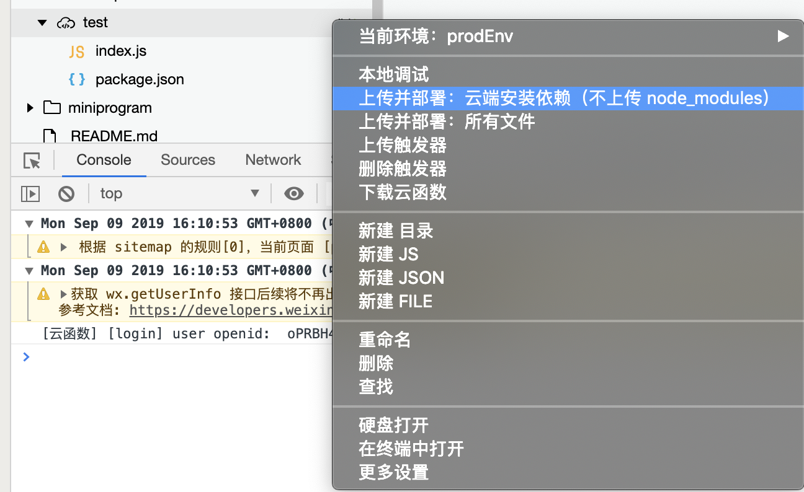

# 微信小程序云开发改造
> 文章仅介绍改造过程和部分细节改造，如果您没有小程序开发经验建议先查看官方文档

> 本小程序仅针对从原生小程序迁移到云开发小程序进行改造，目前微信小程序自动支持使用脚手架工具生成云开发小程序，官方文档的使用教程很详细，这里不再赘述

## 写在前面
### 改造背景
球队需要一个管理与报名工具，初期打算前后端分离，小程序端交互和逻辑由本人开发，后端由另一位队友开发，无奈开发初期赶上18年年底行业寒冬，大家工作变动和适应新公司，开发进度缓慢。最后猪年伊始决定直接使用腾讯云服务搭建后台，全部在小程序端实现。

### 必要条件
* 基于原生微信小程序开发语言、框架、规范进行编写
* 涉及小程序开发技术文档
	* [微信小程序框架参考文档](https://developers.weixin.qq.com/miniprogram/dev/reference/)
	* [微信小程序组件参考文档](https://developers.weixin.qq.com/miniprogram/dev/component/)
	* [微信小程序API参考文档](https://developers.weixin.qq.com/miniprogram/dev/api/)
	* [微信小程序云开发文档](https://developers.weixin.qq.com/miniprogram/dev/wxcloud/basis/getting-started.html)
* 开发工具
	* 微信开发者工具
	* Sublime Text
* 代码管理
	* Github

### 必要功能(优先级自上而下递减)
* 踢球活动报名(done)
* 发布踢球活动(done)
* 个人信息(done)
* 看球活动报名(developing)
* 协会公告(developing)
* 调查问卷(done)

### 改造基础
* 微信小程序云开发提供 数据库、云函数、存储库、云调用和 HTTP API ，提供的相关功能足够支撑小程序后端服务
* 小程序的相关数据存储在 云数据库 中，涉及权限问题通过 云函数 进行处理
* 小程序云开发微服务采用 JavaScript 语言编写，无缝衔接
* 云控制台提供的管理工具足够支撑日常数据使用和查看

## 前期工作
### 文件结构变动
* 原生小程序文件结构

```
|-pages	// 页面源码文件夹
|-utils	// 公共方法
|-app.js	// 全局入口js文件
|-app.json	// 全局基础配置
|-app.wxss	// 全局css文件
|-project.config.json	// 项目配置
```
* 云开发小程序文件结构

```
|-cloudfunctions		// 云函数文件夹
|-miniprogram		// 小程序源码
	|-assets	// 静态资源文件
	|-pages	// 页面源码文件夹
	|-utils	// 公共方法
	|-app.js	// 全局入口js文件
	|-app.json	// 全局基础配置
	|-app.wxss	// 全局css文件
|-project.config.json	// 项目配置
```
### 小程序配置信息修改
* `project.config.json` 增加小程序与云函数根目录配置

```
"miniprogramRoot": "miniprogram/",
"cloudfunctionRoot": "cloudfunctions/"
```
* 启用云函数模板模式

`"cloudfunctionTemplateRoot": "cloudfunctionTemplate"`

### 云控制台设置
> 这一部分[官方文档](https://developers.weixin.qq.com/miniprogram/dev/wxcloud/basis/quickstart.html#_1-%E6%96%B0%E5%BB%BA%E4%BA%91%E5%BC%80%E5%8F%91%E6%A8%A1%E6%9D%BF)写的很清楚，不再详细讲述

* 开通云开发
* 配置云环境
* 云控制台配置数据库、存储库等

## 云开发改造与开发
### 添加云函数
* 利用模板创建云函数


* 云函数模板

```
const cloud = require('wx-server-sdk') // 引入模块

cloud.init()	// 初始化云函数

// event 参数包含小程序端调用传入的 data
exports.main = (event, context) => {
  // console.log 的内容可以在云开发云函数调用日志查看

  // 获取 WX Context (微信调用上下文)，包括 OPENID、APPID、及 UNIONID（需满足 UNIONID 获取条件）
  const wxContext = cloud.getWXContext()

  return {
    event,
    openid: wxContext.OPENID,
    appid: wxContext.APPID,
    unionid: wxContext.UNIONID,
  }
}
```

### 上传并部署
* 查看上传与否方式：`云开发 => 云函数 => 云函数列表` 查看有无该云函数
* 当前版本利用模板创建云函数后会自动上传并部署
* 未自动上传的可以手动上传


### 本地使用云函数
* 初次使用云函数，若返回response成功，则调用成功，若控制台报错，则调用失败

```
// 初始化云函数
wx.cloud.init({
    env: 'prodId',		// 非必填项，使用云环境ID，默认为第一个创建的环境
    traceUser: true,  // 非必填项，是否将用户的访问记录添加到控制台中
})
// 云函数：获取openId ，本实例采用回调方式 ，也可使用promise方式
wx.cloud.callFunction({
    name: 'login',	// 云函数名称
    data: {},		// 传递数据
    success: res => {
      console.log('[云函数] [login] user openid: ', res.result.openid)
      this.globalData.openid = res.result.openid
    },
    fail: err => {
      console.error('[云函数] [login] 调用失败', err)
    }
}) 
```

### 实例化云数据库
* 初始化云数据库

```
// 获取多环境云数据库
// 这里我在 app.js 中定义了一个全局数据库环境变量 databaseEnv
const db = wx.cloud.database({ env: app.globalData.databaseEnv })
```
### 增删改查数据库数据
> 本实例均采用回调方式书写，promise方式可查看小程序官方文档

* 获取数据

```
// 获取数据库并引用单条数据
const myTodo = db.collection('dbId').doc('docId')
```

* 增加数据

```
// 向云数据库中已存在的数据库增加数据集合
db.collection(dbId).add({
	data: data,
	success: function(resp) {
      console.log(resp)
	},
	fail: function(err) {
		console.log(err)
	}
})
```

* 更新数据

```
// 更新云数据库中已存在数据集合
db.collection(dbId).doc(docId).update({
	// data 传入需要局部更新的数据
	data: data,
	success: function(res) {
		console.log('docupdata成功', res)
	},
	fail: function(err) {
		console.log('docupdata失败', err)
	}
})
```

* 分页获取数据

```
db.collection('activityList').limit(this.data.pageSize).skip(this.data.pageSize * this.data.pageNum).orderBy('submitTime', 'desc').get({
	success: function(res) {
		self.setData({
		  activityList: [...self.data.activityList, ... res.data]
		})
	},
	fail: function(err) {
		console.log('error', err)
	}
})
```

### 存储静态资源

## 部署与发布
### 上传小程序体验版
### 体验版测试与修复
### 小程序提交审核
### 审核通过发布小程序

## 使用与反馈