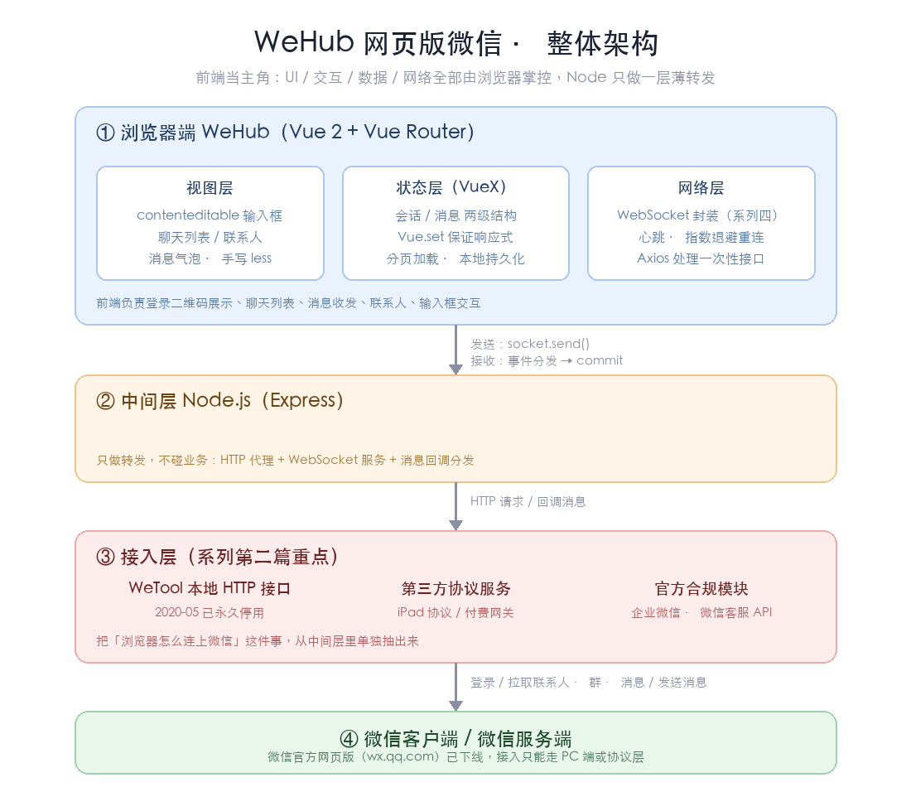

# WeHub 打造网页版微信

> 微信官方早就关停了网页版微信的入口，但"在浏览器里聊微信"这件事一直没有停下来。本系列准备从零手撸一个网页版微信 —— `WeHub`，把中间的坑、思路和代码都记录下来，希望能给同样想动手的同学一点参考。

> 本系列共四篇，从可编辑输入框到数据存储再到网络层，逐层拆解，本篇为总览。

## 阅读本文您将收获
* 网页版微信的整体技术架构
* WeHub 的功能清单与目录结构
* 本系列四篇文章的脉络与阅读顺序

## 为什么要造这个轮子
* 微信官方网页版（wx.qq.com）已下线，但"桌面端挂机 / 多开 / 消息聚合"的需求一直存在
* 市面上已有的方案要么闭源、要么需要付费，要么把逻辑写死在一个后端里
* 本项目把**前端当主角**：UI、交互、数据、网络全部由前端掌控，后端只做一层薄薄的转发
* 顺带把前端几个容易被忽略的知识点（`contenteditable`、`VueX` 数据组织、`WebSocket` 封装）串起来讲透

## 技术选型
* 前端框架：`Vue 2` + `Vue Router`（当时 Vue 3 生态还不成熟，够用即可）
* 状态管理：`VueX`
* 网络层：`WebSocket`（消息推送） + `Axios`（一次性 HTTP 接口）
* UI：手写 CSS + `less`，尽量贴近微信客户端的视觉
* 中间层：`Node.js`（`Express`） 做一层 HTTP / WebSocket 代理
* 微信接入：第三方微信 PC 端工具 `WeTool` 暴露的本地 HTTP 接口（见系列第二篇）
* 消息存储：本地 `localStorage` + 服务端内存（后续可换 `SQLite`）

## 整体架构

<center>
    
    <div><span style="color: #aaa; border-bottom: 1px solid #aaa;">WeHub 整体架构图</span></div>
</center>

* 浏览器端（`WeHub`）负责：登录二维码展示、聊天列表、消息收发、联系人、输入框交互
* 中间层（`Node`）负责：转发浏览器请求到 `WeTool` HTTP 接口；把 `WeTool` 的回调消息通过 `WebSocket` 推给浏览器
* `WeTool` 负责：登录微信 PC 端、拉取联系人 / 群 / 消息、暴露发送消息接口
* 一次消息的完整链路：
	* 发送：`输入框回车` → `VueX action` → `WebSocket.send` → `Node 中间层` → `WeTool HTTP` → `微信客户端`
	* 接收：`微信客户端` → `WeTool 回调` → `Node 中间层` → `WebSocket 推送` → `前端事件分发` → `VueX commit` → 视图更新

> 一句话总结：`WeTool` 负责"通"，`Node` 负责"转"，`Vue` 负责"显"。

## 目录结构

```
wehub/
├─ src/
│  ├─ api/                 # 网络层
│  │  ├─ scoket.js         # WebSocket 封装（系列第四篇）
│  │  ├─ http.js           # Axios 封装
│  │  └─ wetool.js         # WeTool 接口定义（系列第二篇）
│  ├─ store/               # VueX（系列第三篇）
│  │  ├─ index.js
│  │  └─ modules/
│  │     ├─ user.js        # 登录态、自己信息
│  │     ├─ contacts.js    # 联系人 / 群
│  │     └─ chat.js        # 会话列表 + 消息
│  ├─ components/
│  │  ├─ Editor.vue        # contenteditable 输入框（系列第一篇）
│  │  ├─ MessageList.vue   # 消息气泡
│  │  └─ ChatList.vue      # 会话列表
│  ├─ views/
│  │  ├─ Login.vue         # 扫码登录
│  │  └─ Home.vue          # 主界面
│  └─ main.js
└─ server/                 # Node 中间层
   ├─ index.js
   └─ ws.js
```

## 功能清单
* [x] 扫码登录 / 登录态维持
* [x] 会话列表（最近联系人 + 未读数）
* [x] 消息收发（文本、表情、图片）
* [x] 联系人 / 群列表与搜索
* [x] 消息本地缓存（刷新不丢）
* [ ] 语音 / 视频（受限于工具能力，暂不做）
* [ ] 朋友圈（不做）

## 系列导航
* [打造网页版微信(一): 属性 contenteditable 的用处](./wechat_contenteditable.md)
	* 为什么聊天输入框不用 `textarea`，以及如何搞定光标、粘贴、@提及
* [打造网页版微信(二): 利用 wetool 接入微信](./wechat_wetool.md)
	* 通过 `WeTool` 的本地 HTTP 接口打通微信，实现登录与收发消息
* [打造网页版微信(三): 利用 VueX 存储数据](./wechat_vuex.md)
	* 会话、消息、联系人如何在 `VueX` 中组织，如何扛住大量消息
* [打造网页版微信(四): 封装 WebScoket 进行网络消息传输](./wechat_webscoket.md)
	* 把原生 `WebSocket` 封装成可复用、能心跳、能重连的网络层

## 写在最后
* 本项目仅用于**前端技术学习与交流**，请勿用于任何违反微信用户协议或相关法律法规的场景
* 使用第三方工具接入微信存在**封号风险**，请自行评估，后果自负
* 系列文章之间相互引用，建议按顺序阅读；如果你只关心某一块，也可以直接跳到对应篇章
