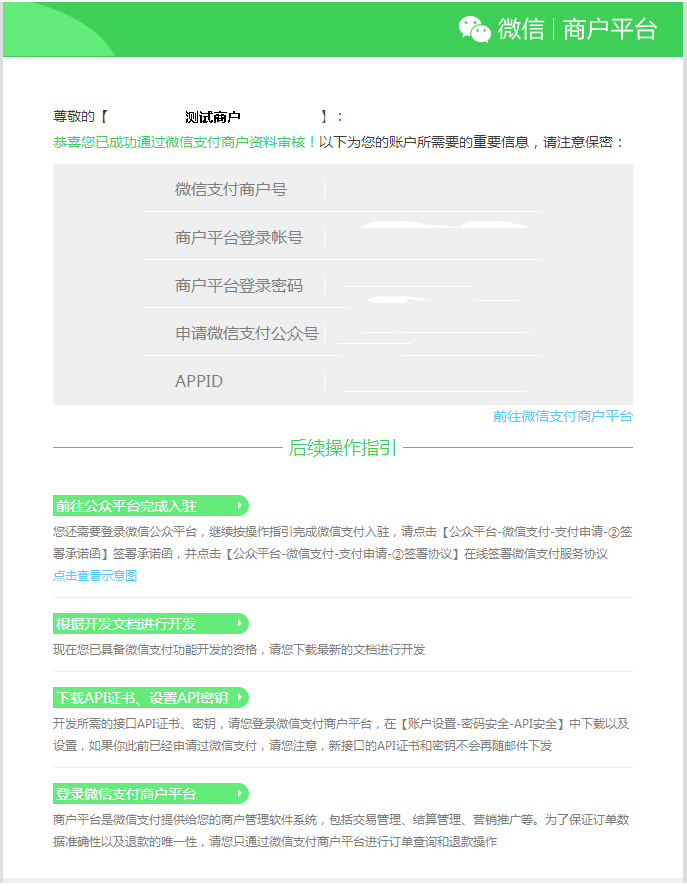
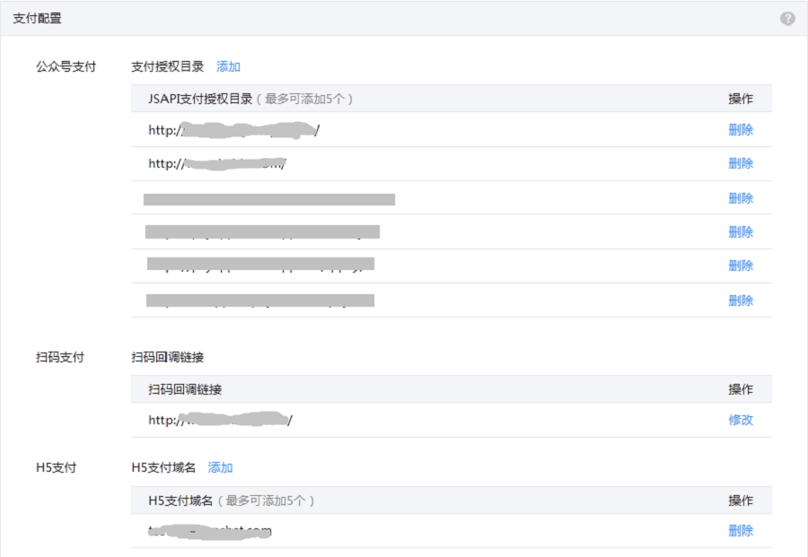
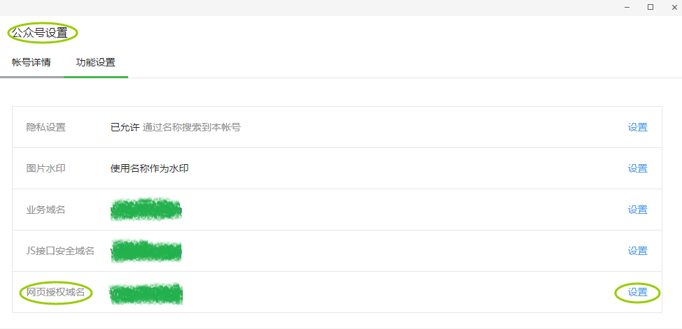
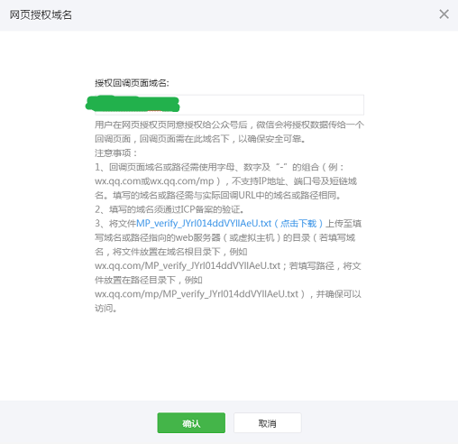

> 本期带来 微信 JSAPI 支付 (即微信浏览器内支付或微信公众号支付) 的前端开发

## 前期工作
### 微信支付权限开通
* 微信申请支付授权
* 附 [官方开通授权文档](https://pay.weixin.qq.com/wiki/doc/api/jsapi.php?chapter=3_1)

图-微信支付权限开通(图片来源：微信官方)

### 微信公众平台配置信息
* 设置支付目录 ( 配置路径: 商户平台 --> 产品中心 --> 开发配置 )

图-微信JSAPI支付-支付目录配置(图片来源：微信官方)

* 配置授权支付域名
	* 配置域名除了要在微信公众平台进行配置外，还需要将微信提供的密钥文件放在配置域名的根目录

图-微信网页授权域名设置(图片来源：微信官方)

## 开发
### 微信支付流程
* 技术流程
	* 前端微信授权 => 提交订单给后端 => 后端生成订单id => 前端接收订单参数包含订单id等 => 调用微信JDK => 传送相关参数给微信 => 调起微信支付 => 微信支付 callback => 前端结束 => 用户支付成功后端收到微信回调(前端和后端的微信支付成功回调未必同时同步)

* [业务流程时序图](https://pay.weixin.qq.com/wiki/doc/api/jsapi.php?chapter=7_4)

### 前端微信授权
* [前端微信授权](./wechat_auth.md)

### 前端发起生成订单请求
* 

### 前端调起微信支付
### 设置前端支付回调

## Q&A
### `response_type` 参数错误
### 支付失败传参错误
* 原因：微信调起支付 `WeixinJSBridge.invoke` 传参为 JSON 格式
* 解决方案：将后端 response 解析后传入