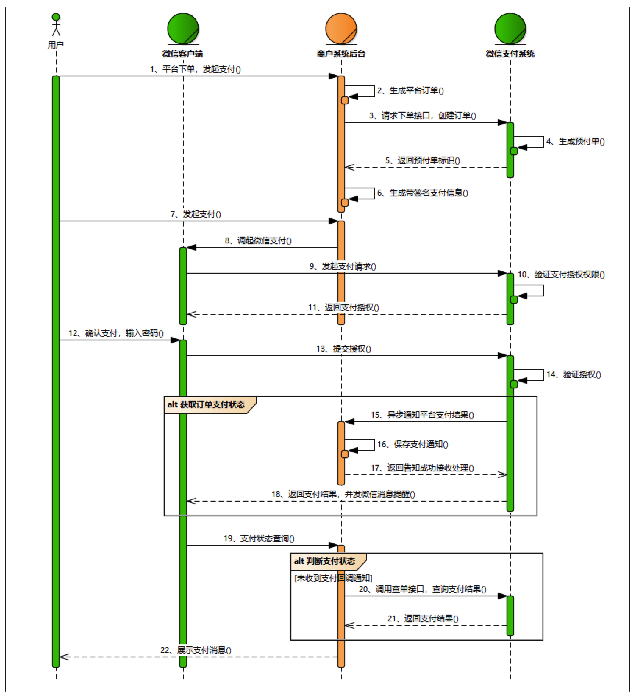

# 微信 JS API 支付的实现

> 本期带来 微信 JSAPI 支付 (即微信浏览器内支付或微信公众号支付) 的前端开发

> 文中支付相关的信息，包括但不限于支付ID，微信签名，公众号ID均已做错误处理。

## 阅读本文您将收获
* 微信支付权限开通
* 微信支付前端如何处理
* 微信支付相关问题解决

## 前期工作
### 微信支付权限开通
* 微信申请支付授权
* 注意是开通 JSAPI 支付，不是H5支付
* 附 [官方开通授权文档](https://pay.weixin.qq.com/wiki/doc/api/jsapi.php?chapter=3_1)，请正确填写相关信息。

<div style="text-align:center;color:#708090;">图-微信支付权限开通(图片来源：微信官方)</div>

### 微信公众平台配置信息
* 设置支付目录(请正确填写相关信息)
	* 配置路径: 商户平台 --> 产品中心 --> 开发配置


<div style="text-align:center;color:#708090;">图-微信JSAPI支付-支付目录配置(图片来源：微信官方)</div>

* 配置授权支付域名
	* 配置域名除了要在微信公众平台进行配置外，还需要将微信提供的密钥文件放在配置域名的根目录，也就是服务器的根目录，在浏览器中访问能直接访问到就好。


<div style="text-align:center;color:#708090;">图-微信网页授权域名设置(图片来源：微信官方)</div>

## 开发
### 微信支付流程
* 技术流程
	* 前端微信授权 => 提交订单给后端 => 后端生成订单id => 前端接收订单参数包含订单id等 => 调用微信JDK => 传送相关参数给微信 => 调起微信支付 => 微信支付 callback => 前端结束 => 用户支付成功后端收到微信回调(前端和后端的微信支付成功回调未必同时同步)

* 业务流程时序图(图片来自微信官方)



### 前端微信授权
* [前端微信授权](./wechat_auth.md)请看这篇文章

### 前端发起生成订单请求
* 前端向后端发起 `生成订单` 请求
* 创建订单成功拿到订单 微信同一订单接口订单id后调起微信支付

### 前端调起微信支付
* 微信支付传参
	* `appId` : `"wx2421b1c4370ec12a",     //公众号名称，由商户传入`
	* `timeStamp` : `"1395712654",         //时间戳，自1970年以来的秒数`
	* `nonceStr` : `"e61463f8efa94090b1f366cccfbbb555", //随机串`
	* `package` : `"prepay_id=u802345jgfjsddgsdg888",     // 传递参数，prepay_id即为微信订单id`
	* `signType` : `"MD5",         //微信签名方式`
	* `paySign` : `"70EA570631E4BB79628FBCA99534C63FF7FADD89" //微信签名`

* 调起微信支付

```
invokeWxPay(wxPayData) {
	let self = this
	WeixinJSBridge.invoke('getBrandWCPayRequest', JSON.parse(wxPayData), function(res){
	    if(res.err_msg == "get_brand_wcpay_request:ok" ){
	        // 使用以上方式判断前端返回,微信团队郑重提示：
	        // res.err_msg将在用户支付成功后返回ok，但并不保证它绝对可靠。
	    } else if (res.err_msg == "get_brand_wcpay_request:cancel") {
			// 支付取消回调
        } else {
			// 支付失败回调
        }
	})
},
```

### 设置前端支付回调
* 支付成功建议跳转至共同的订单状态页，正常情况下，微信给予后端的订单成功确认会很快，但是异常情况难免存在，建议增加订单状态确认页去确认订单。

## Q&A
### `response_type` 参数错误
* 原因： `vue hash` 模式会带有一个 `#` 号，如果回调地址中含有 `#` 而没有做转义，授权时就会报错
* 解决方案：`redirect_uri` 使用 `encodeURIComponent()` 进行转码

### 支付失败缺少参数
* 原因：若检查过确实参数都齐全，则是传参格式的问题，微信调起支付 `WeixinJSBridge.invoke` 传参为 JSON 格式
* 解决方案：将后端 `response` 进行解析后传入

### 微信登录失效，没有scope权限
* 原因：服务号未认证 或 `APPID` 填写错误 或 微信支付认证过期
* 解决方案：重新认证服务号 、检查 `APPID` 是否填写错误、更换登录授权方式

### 当前页面URL未注册
* 原因：未在微信开放平台设置支付目录 或 支付域名
* 解决方案：下单接口使用的商户号在商户平台配置对应的支付目录