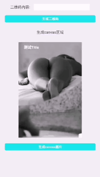

> 现如今围绕微信生态相关开发已经非常常见，本期带来如何通过 `qrcode.js` 实现微信内置浏览器动态生成二维码并能够长按识别  以及  通过 `html2canvas` 生成图片并长按保存

## 说几个知识点
* 微信长按弹出识别选项的原理
	* 微信客户端检测到用户长按`img`标签
	* 微信主动进行截屏并识别图片，二维码识别采用的是截屏而不是通过`img`标签
	* 微信识别成功后执行相关操作
* `Base64`
	* `Base64`是网络上最常见的用于传输8Bit字节码的编码方式之一，`Base64`就是一种基于64个可打印字符来表示二进制数据的方法
* `Blob`
	* `HTML5`中的`Blob`对象与`MySQL`中的`BLOB`对象有区别，`HTML5`中的`Blob`对象除了存放二进制数据外还可以设置这个数据的MINE类型，这相当于对文件的存储，其它很多二进制对象也是从这个对象继承的
* `canvas.toDataURL([type, encoderOptions])`
	* `type` : 指定图片类型，默认值 `image/png`
	* `encoderOptions` : 为 `image/jpeg` 或 `image/webp` 类型的图片设置图片质量，取值0-1，超出则以默认值0.92替代
	* 作用: 通过`canvas`进行转化图片

## 准备工作
* 结合微信规范明确需求
	* 微信img标签通过src属性可实现长按弹出选项(保存至手机，图片为二维码的情况下会出现识别二维码)
	* 二维码图片若为本地图片或服务器图片(即不需要进行动态生成)只需要正常编写代码即可实现
	* 微信针对内置浏览器内的页面图片有着自己的一套适应逻辑与规范，`canvas`的图片和`base64`编码格式的图片在安卓与ios手机上会出现不同的问题
* 确定实现方案
	* 本例采用第三方js库实现生成二维码
	* 针对生成的`base64`编码的图片微信无法长按识别需要在前端进行格式和`image`对象重新转换
	* 生成的图片弹窗展示，避免出现其他元素影响微信识别率

## 开发环境
* 开发平台
	* MacOS
* 开发环境
	* Vue + node
* 客户端环境
	* Google Chrome
	* Wechat Webview

## 技术实现
> 本例的技术实现方案均在Vue项目环境下实现的

### 引入第三方js库
* 提供两种引入方式，两种方式是不同的js库，方便大家选择和使用
	* 本地引入 `qrcode.js`
	
	```
	// qrcode.js官方GitHub文档: https://github.com/davidshimjs/qrcodejs
	<script src="static/js/qrcode.js"></script>
	```
	* npm 引入 `qrcodejs2`
	
	```
	npm install qrcodejs2
	import qrCode from 'qrcodejs2'
	```

### 组件中调用
* HTML

	```
	<div class="qrcode-panel" id="qrcode"></div>
	```
* JS
	* 简单调用
	
	```
	new QRCode(document.getElementById('qrcode'), 'your content');
	// new QRCode(element, option)
	// element 显示二维码的元素或该元素的 ID
	// option  参数配置
	```
	* 标准调用
	
	```
	var qrcode = new QRCode(document.getElementById("qrcode"), {
		text: "https://www.xxx.com?did=123456&id=123&userid=456",
		width: 160, 		//图像宽度
		height: 160,		// 图像高度
		render: 'canvas',		// 生成格式(table 和 canvas)
		colorDark : "#000000",		//前景色
		colorLight : "#ffffff",		//背景色
		correctLevel : QRCode.CorrectLevel.H    // 容错级别
	});
	// 容错级别，可设置为：
	QRCode.CorrectLevel.L（最大 7% 的错误能够被纠正）
	QRCode.CorrectLevel.M（最大 15% 的错误能够被纠正）
	QRCode.CorrectLevel.Q（最大 25% 的错误能够被纠正）
	QRCode.CorrectLevel.H（最大 30% 的错误能够被纠正）
	```
	* 其他公共方法
	
	```
	QRCode.makeCode(text) // 	设置二维码内容
	QRCode.clear()  // 	清除二维码
	```

### 重置 Image 对象
* 重置的原因是原JS生成的 image 和 canvas 对象无法在微信端长按识别

	```
	var canvas = document.getElementsByTagName('canvas')[0];
	var img = this.convertCanvasToImage(canvas);
	document.getElementById("qrcode").append(img);
	
	convertCanvasToImage(canvas) {
		//新建Image对象
		var image = new Image();
		// canvas.toDataURL 返回的是一串Base64编码的URL
		image.src = canvas.toDataURL("image/png");
		image.id = 'qrcodeImg';
		return image;
    }
	```

### 后续细节处理
* 至此，一个能够满足长按识别的动态二维码已经生成，不继续处理的话会有两张二维码，长按对比就能看出，`qrcode.js` 生成的二维码长按无法识别，而经过重置之后的对象是可以实现此功能的。
* 我的处理方式是两个二维码都保留，将二维码图片进行重新定位，将重置的二维码图片置于不能识别二维码上层，不去频繁操作DOM节点的显示隐藏。
* 生成的二维码通过 `append` 的方式插入到dom节点中，在关闭操作时需要将之前生成的 `canvas` 和 `image` 去除

## 微信内置浏览器生成canvas图片保存
* 上述教程可以实现动态生成二维码进行保存和长按识别，但是如果需要将HTML内容生成canvas保存就存在问题了。
* 针对保存需要注意的几个问题：
	* canvas禁止跨域
	* 安卓微信长按不能保存base64图片
	* 微信限制Blob类型图片的保存
	* 使用 `canvas.toDataURL` 绘制时的类型使用 `image/jpeg` 进行保存

### 技术选型
* 使用第三方JS库 `html2canvas` 进行处理
* 识别和生成原理：
	* 脚本直接在用户浏览器上截取网页或部分网页的"屏幕截图"
	* "屏幕截图"基于DOM，因此它可能不是真实表示的100％准确，因为它没有制作实际的屏幕截图，而是根据页面上可用的信息构建屏幕截图
* 存在的问题：
	* 正是因为 `html2canvas` 不是基于真正的屏幕截图去识别处理，所以脱离了文档流，或者文档流异常的元素会无法被截取下来
	* `html2canvas` 只会截取到目标元素宽高范围内的内容
	* 对部分css样式支持不好，[兼容性差的属性列表](http://html2canvas.hertzen.com/features/)
* 一些可能需要的参数
	* `useCORS` : 是否尝试使用CORS从服务器加载图像
	* `async` : 是否异步解析和呈现元素
	* `scale` : 用于渲染的比例。默认为浏览器设备像素比率`window.devicePixelRatio`
	* `allowTaint` : 是否允许画布被污染，被污染的canvas是没法使用toDataURL()转base64流的，部分细节请 [参考这里](https://developer.mozilla.org/zh-CN/docs/Web/HTML/CORS_enabled_image)
	* [更多 `html2canvas` 参数请点击这里](https://html2canvas.hertzen.com/configuration)

### 引入第三方JS库
* 使用 `html2canvas`

```
import html2canvas from 'html2canvas'
```

### 组件中调用
* HTML

```
<div class="html2canvas-conetent" ref="canvasContent">
	
	<span>测试Title</span>
</div>
<button @click="showCanvas()">生成canvas图片</button>
```
* JS
	* 使用 `html2canvas` 推荐的promise方法

```
showCanvas() {
	let self = this;
	html2canvas(self.$refs.canvasContent).then(function(canvas) {
        self.imgUrl = canvas.toDataURL();
        self.showCanvasImg = true;
	});
}
// 异步解析调用和呈现元素
showCanvas() {
	let self = this;
	html2canvas(self.$refs.canvasContent  {
		async: true
	}).then(canvas => {
		self.imgUrl = canvas.toDataURL();
		self.showCanvasImg = true;
	});
}

```

## 实现效果



## 源码地址
* [Github源码地址](https://github.com/programmer-zhang/com.frontend.www/blob/master/src/views/wechat.vue)