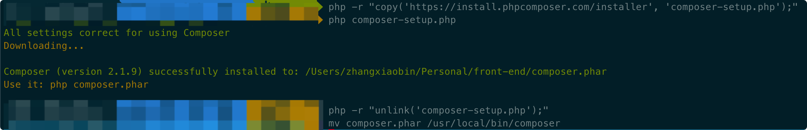

# MacOS环境 本地安装 WordPress
* 安装homebrew,
	* 验证方式 `brew --version`
* MacOS 集成了PHP环境，所以不需要安装
	* 验证方式 `php -m|less`
* 安装 Composer
	* 指令:(四条指令，分开执行) 
	
	```
	php -r "copy('https://install.phpcomposer.com/installer', 'composer-setup.php');"
	php composer-setup.php
	php -r "unlink('composer-setup.php');"
	mv composer.phar /usr/local/bin/composer
	```
	* 验证方式 
	
	* 安装完成后，我们要为 Composer 来配置国内镜像（受不可抗力因素影响，官方镜像下载速度缓慢）。
	* Composer 支持项目加速和全局加速，我们这里没有 Composer 项目，所以选择全局加速。在命令行中执行如下命令：

	```
	composer config -g repo.packagist composer https://packagist.phpcomposer.com
	```


---
## 另写一篇
* https://blog.csdn.net/u012910985/article/details/48131801
* https://www.jianshu.com/p/063ec385b823
* xampp搭建： https://www.jianshu.com/p/f4862dfbfbc4

---
### 我的错误
### Mac os下 Apache 正常启动 localhost 无法访问服务器
* 一个查看apachectl 访问localhost失败查看原因的指令 `sudo /usr/sbin/httpd -k start` 或者 `sudo apachectl -k restart`，看到原因之后去查原因
	* 报错信息： `No code signing authority for module at /usr/libexec/apache3/libphp7.so specified in LoadModule directive. Proceeding with loading process, but this will be an error condition in a future version of macOS.
httpd: Syntax error on line 187 of /private/etc/apache2/httpd.conf: Cannot load libexec/apache3/libphp7.so into server: dlopen(/usr/libexec/apache3/libphp7.so, 10): image not found`
	* 原因： 查了下应该是MAC自带的php版本与apache版本不符合，需要重新安装个php

### 一些操作
* /etc/apache2  目录下查看Apache版本 `httpd -version`
* 查找php*.so安装位置 `php -i` => 搜索 `extension_dir`
	* 我的是 `extension_dir => /usr/lib/php/extensions/no-debug-non-zts-20180731 => /usr/lib/php/extensions/no-debug-non-zts-20180731`
	* 然后去上边这个路径下找libphp7.so文件
* 查看本机Apache启动php情况 https://blog.csdn.net/wtdask/article/details/83510757

* [官方安装文档](https://cn.wordpress.org/support/category/installation/)

### 安装过程
* 本地 [手动下载wordpress](https://cn.wordpress.org/download/#download-install)
* 检查所需环境是否满足需要，MacOS下PHP等环境是系统集成其中的，不需要单独下载。
	* PHP 环境验证方式 `php -m|less`
	* MySQL 安装与校验
	* Apache 校验 `apachectl -v`
* 启动 Apache 服务 `sudo apachectl start`
	* 启动校验，浏览器网址: `http://localhost`, 显示 `it works` 即为启动成功
* 启动 PHP 环境
	* 修改 Apache 配置文件 文件位置: `/etc/apache2/httpd.conf`
	* 查找 `LoadModule php5_module libexec/apache2/libphp5.so` (php版本不同文件名字不同)，将注释去掉。
	* 重启apachectl `sudo apachectl restart`
* 

