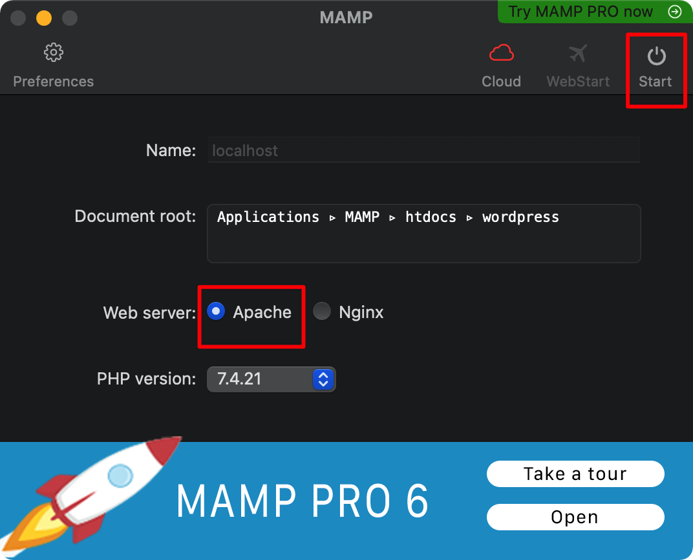
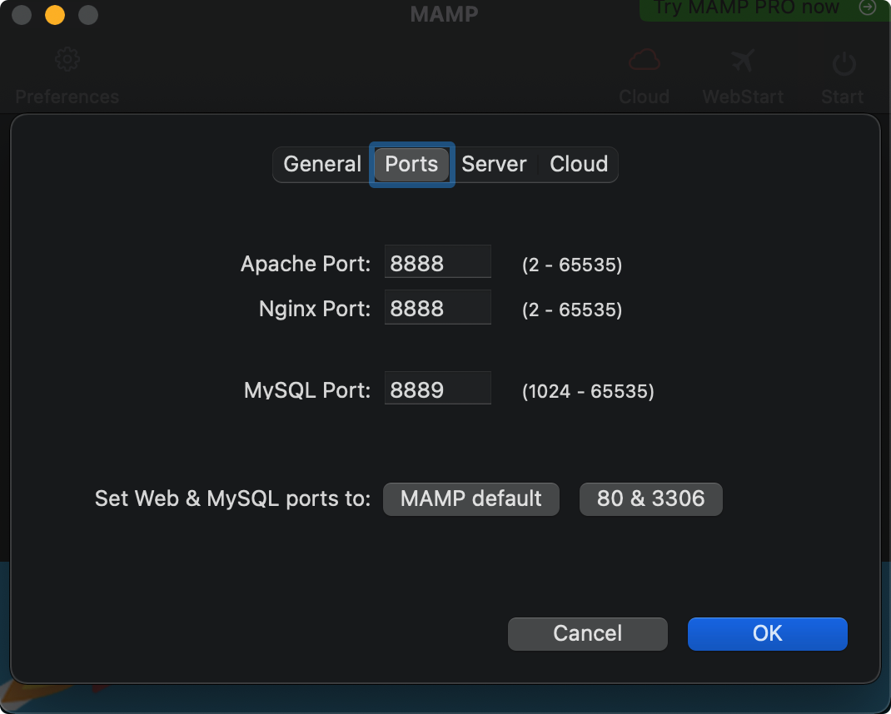
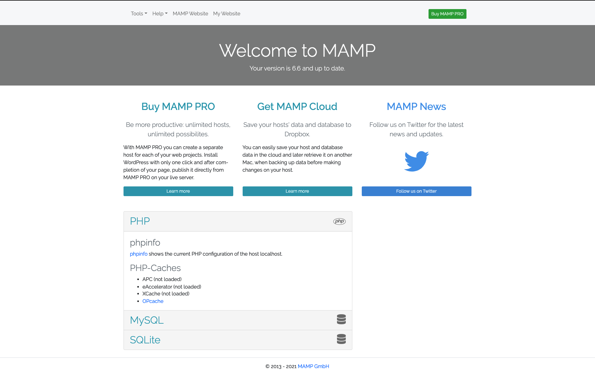
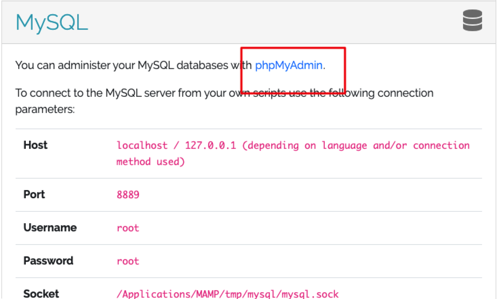
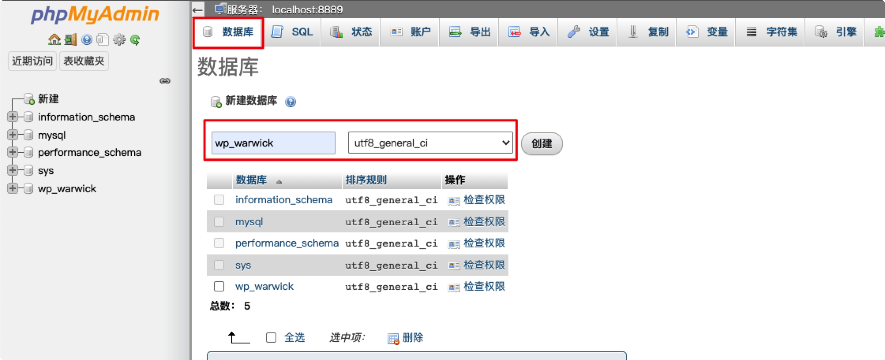
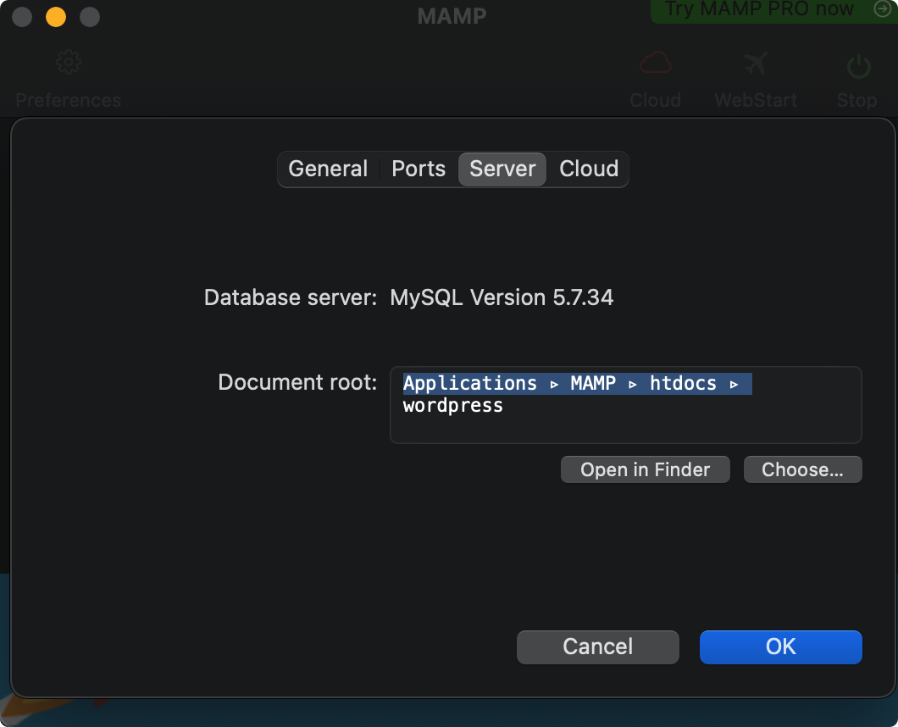
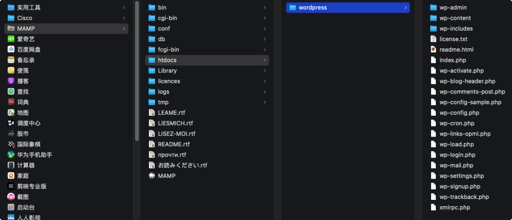
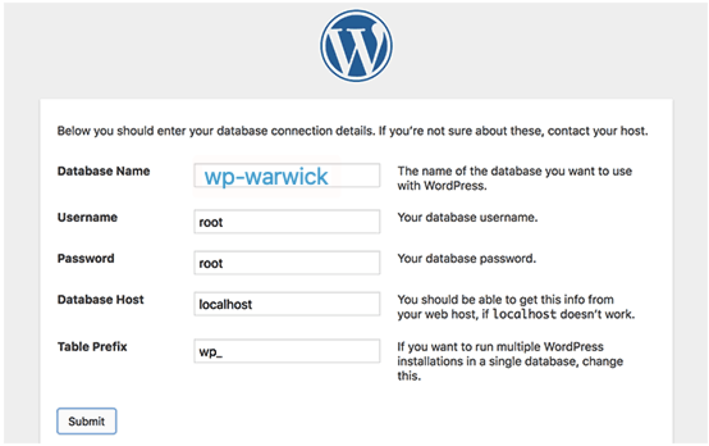

# MacOS环境 搭建 WordPress 个人博客网站
> WordPress 是使用PHP语言开发的博客平台，支持使用 PHP 和 MySQL 快速搭建自己的博客网站，在全球拥有众多用户，支持图形化设计自己的网站，当然也支持使用HTML、CSS对自己网站进行二次开发。

> 本文介绍两种搭建 WordPress 网站的方式，一种是通过分步安装 Apache、MySQL、PHP环境进行搭建，灵活性高；一种是通过 MAMP 集成式快速搭建。

> 注: 本文安装硬件环境均为 MacOS

## 方式一: 分步安装 Apache、MySQL、PHP环境进行搭建
### 手动下载 WordPress 页面文件包
* 本地 [手动下载wordpress](https://cn.wordpress.org/download/#download-install)
	* 下载成功后解压，文件夹内便是 WordPress 的页面文件包(记住包的地址, 当然也可以随意放，后期再更改地址即可)。

### 1.检查软件环境
* 检查所需环境是否满足需要，MacOS下 PHP 等环境是系统集成其中的，不需要单独下载。
	* PHP 环境验证方式 `php -m|less`
	* MySQL 安装与校验
	* Apache 校验 `apachectl -v`

### 2.启动相关软件服务
* 启动 Apache 服务 `sudo apachectl start`
	* 启动校验，浏览器网址: `http://localhost`, 显示 `it works` 即为启动成功
	* Apache webserver服务默认根目录 `Library/WebServer/Document`
* 启动 PHP 环境
	* 修改 Apache 配置文件 文件位置: `/etc/apache2/httpd.conf`
	* 查找 `LoadModule php5_module libexec/apache2/libphp5.so` (php版本不同文件名字不同)，将注释去掉。
	* 重启 apachectl `sudo apachectl restart`
* 移动 WordPress 至 Apache 默认根目录，按照目录路径即可打开 WordPress 配置页面
	* 也可以更改 Apache 默认根目录为 WordPress 位置，重启 Apache 也可

## 方式二: 使用 MAMP 集成环境 安装
### 涉及软件 & 扩展
* MAMP(MacOS Apache MySQL PHP 集成软件)
* wordPress 代码包

### 1.MAMP 下载安装
* 下载地址: [https://www.mamp.info/en/downloads/](https://www.mamp.info/en/downloads/)
* 选择合适的版本进行下载，MAMP 区分MacOS(intel 芯片版本) 和 MacOS(M1芯片版本)
	* 查看 MacOS 版本: 电脑左上角 小苹果图标 => 关于本机 => 概览中处理器信息

> 注: MAMP 分为基础版本和PRO版本，基础版本够用了，不用花钱买PRO版本

* 下载完成后正常安装就好，傻瓜式安装，一直继续就好，安装成功后启动台的图标为一个灰色的大象

### 2.WordPress 下载解压
* 下载地址: [https://wordpress.org/](https://wordpress.org/)
* 顶部栏 `GetWordPress`点击 => 下滑有个 下载按钮，下载下来并解压，解压成功后应该是一个有很多 .php 文件的文件夹。

### 3.启动 MAMP 并配置 phpMyAdmin
* 选择 web server 为 `Apache`，并启动服务。

* 查看配置并确定端口号
	* MAMP 工具栏选择设置 => 查看 Ports 选项确定各服务端口号，可以使用 `MAMP default` 的端口号，即如图所示:

 
* 启动服务，使用 Apache 的端口号打开配置页面， `MAMP default` 的端口号下地址为: `http://localhost:8888/MAMP/` 

> 注: 正常启动成功后浏览器会自动打开配置页面

* 如果安装和启动正常，你将看到下面的页面

* 选择页面下方的 `MySQL` ,正常情况下首行会显示需要下载 `phpMyAdmin` 扩展，点击  `phpMyAdmin`,会跳转到 数据库 管理。

* 创建 WordPress 配置要用的数据库，这里名称不要用中文，后面的排序规则和其他数据库保持一致就好。

* 创建完成之后我们就可以进行 `WordPress` 的相关配置和操作了。

### 4.配置根目录
* 确定 MAMP 的 server 根目录，正常应该是 `Applications/MAMP/htdocs`，如何查看如下图所示(我本机这里已经改了所以和默认的有所不同):

* 将第二步我们解压的 wordpress 文件夹移动到这个根目录下，如下图这样:

* 然后修改 MAMP 的 server 根目录，选择server根目录下的 `choose`, 选择我们移动过去的wordpress 文件夹保存即可(就像我上上张图片那样)。
* 打开浏览器 `localhost:8888`,如果能看到 `WordPress` 的配置页面就算是配置成功了。

### 5.配置 WordPress
* 在 WordPress 的配置页面地址要配置 数据库 信息，数据库名称和用户名密码(默认都是root)对应上即可。

* 提交后，没问题的话 WordPress 会自动跳转到填写网站信息的页面，填写相关信息提交后，会自动跳转到仪表盘页面，这样就算完成了，可以自己通过仪表盘添加页面元素，修改主题，增加博文等等操作了。

## 一些页面地址
* MAMP 配置页面地址: `http://localhost:8888/MAMP`
* phpMyAdmin 数据库配置地址: `http://localhost:8888/phpMyAdmin5/index.php`
* WordPress 仪表盘地址: `http://localhost:8888/wp-admin/index.php`
* WordPress 博客页面地址: `http://localhost:8888`

## 我的错误
### Mac os下 Apache 正常启动 localhost 无法访问服务器
* 一个查看apachectl 访问localhost失败查看原因的指令 `sudo /usr/sbin/httpd -k start` 或者 `sudo apachectl -k restart`，看到原因之后去查原因
	* 报错信息： `No code signing authority for module at /usr/libexec/apache3/libphp7.so specified in LoadModule directive. Proceeding with loading process, but this will be an error condition in a future version of macOS.
httpd: Syntax error on line 187 of /private/etc/apache2/httpd.conf: Cannot load libexec/apache3/libphp7.so into server: dlopen(/usr/libexec/apache3/libphp7.so, 10): image not found`
	* 原因： 查了下应该是MAC自带的php版本与apache版本不符合，需要重新安装个php

## 一些操作
* /etc/apache2  目录下查看Apache版本 `httpd -version`
* 查找php*.so安装位置 `php -i` => 搜索 `extension_dir`
	* 我的是 `extension_dir => /usr/lib/php/extensions/no-debug-non-zts-20180731 => /usr/lib/php/extensions/no-debug-non-zts-20180731`
	* 然后去上边这个路径下找libphp7.so文件
* 查看本机Apache启动php情况 https://blog.csdn.net/wtdask/article/details/83510757

* [官方安装文档](https://cn.wordpress.org/support/category/installation/)
