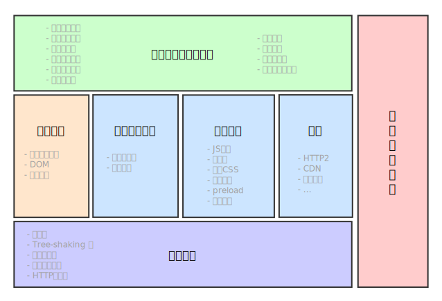

## 为什么要进行性能优化
* 用户: 提升用户体验，改善页面性能
* 开发者: 体现公司意志和开发人员技能

## 性能优化的总体方向
* 高效 ：合理安排资源
* 快速 ：减少等待时间
* 标准 ：
	* 首次有效绘制（First Meaningful Paint，简称FMP，当主要内容呈现在页面上）
	* 英雄渲染时间（Hero Rendering Times，度量用户体验的新指标，当用户最关心的内容渲染完成）
	* 可交互时间（Time to Interactive，简称TTI，指页面布局已经稳定，关键的页面字体是可见的，并且主进程可用于处理用户输入，基本上用户可以点击UI并与其交互）
	* 输入响应（Input responsiveness，界面响应用户输入所需的时间）
	* 感知速度指数（Perceptual Speed Index，简称PSI，测量页面在加载过程中视觉上的变化速度，分数越低越好）

## 优化方向
### HTML/CSS优化
* 能用html/css解决的问题就不要用js
	* 更快的开发速度，更小的维护成本
	* eg:导航高亮、鼠标悬停
	
	```
	nav li {
		opacity: 0.5;
	}
	nav li:hover {
		opacity: 1;
	}
	```
	```
	.menu {
		display: none;
	}
	.nav:hover + .menu {
		display: inline-block;
	}
	.menu:before {
		content: '';
		position: absolute;
		top: -20px;
		left: 0px;
		width: 100%;
		height: 20px;
	```

	* 自定义样式与css伪类
		* 使用全局样式sass、scss,
		
		`:focus`
		`input[type=checkbox]:checked{}`
		`@media`
	
* 优化HTML标签
	* 文字`<p>``<h1>`减少css代码
	* 表单`<form>`
	* 列表`<ol>``<ul>`
	* 图片```<picture>`
	* 链接`<a>``<button>`
	* 根据情况使用input type值
	* 使用HTML5语义化标签
	
	```
	<nav></nav>
	<header></header>
	<main>
		<section></section>
		<section></section>
	</main>
	<footer></footer>
	```
* 不滥用高消耗的样式
	* box-shadow、border-radius、float需要浏览器进行大量的计算，应减少使用
* 选择器合并
	* 把有共同的属性内容的一系列选择器组合到一起，能压缩空间和资源开销
* 0值去单位
	* 对于为0的值，尽量不要加单位，增加兼容性


### js优化
* 减少前端代码耦合
	* 利用策略模式抽离公共组件、参数、封装请求
* js书写优化
	* 字面量与局部变量的访问速度最快，数组元素和对象成员相对较慢
	* 按照强类型风格去写代码，指明变量类型和返回类型
	
	```
	//bad
	getPrice:function(price){
		if (price < 0) {
			return false;
		}else {
			return price * 10
		}
	}
	//good
	getPrice:function(price){
		if (price < 0) {
			return -1;
		}else {
			return price * 10
		}
	}
	//类型确定，解析器不会去做一些额外的的工作
	//优化回滚：编译器已经编译完成函数，类型变化导致回滚到通用状态，重新生成函数
	```
	
	* 减少作用域查找，尽量少的不要让代码暴露在全局作用域下，变量从局部作用域到全局作用域的搜索过程越长速度越慢
	
	```
	//bad
	<script>
		var map = document.querySelector('#imap');
		map.style.height = '10px';
	</script>
	//good
	<script>
		!function() {
			var map = document.querySelector('#imap');
			map.style.height = '10px';
		}
	</script>
	```
	
	* 对象嵌套的越深，读取速度就越慢
	* 避免 == 的使用
		* 确定类型的情况下直接使用 ===
* 使用ES6简化代码

### 页面加载速度优化

> JavaScript很快，DOM很慢

* 页面加载之前都经历了什么
	* DNS服务器通过域名查找对应的web服务器的ip地址
	* 三次握手机制、四次挥手机制
	* HTTP请求
	* 返回资源
* 页面渲染过程优化(例)
	 
	* JavaScript=>Style=>Layout=>Paint=>Composite=>reflow?=>repaint?

	```
	> (1)display:none 的节点不会被加入Render Tree，
		而visibility: hidden 则会，所以，如果某个节点最开始是不显示的，
		设为display:none是更优的。
	> (2)display:none 会触发 reflow，而 visibility:hidden 只会触发 repaint，
		因为没有发现位置变化。
	> (3)有些情况下，比如修改了元素的样式，浏览器并不会立刻reflow 或 repaint 一次，
		而是会把这样的操作积攒一批，然后做一次 reflow，这又叫异步 reflow 或增量异步 reflow。
		但是在有些情况下，比如resize 窗口，改变了页面默认的字体等。
		对于这些操作，浏览器会马上进行 reflow。
	```

	* dom深度尽量浅
	* 减少行内css和js的使用
	* 合适的选择器，避免后代选择器，通配符选择器
		* css选择器匹配：从右往左，最后一个选择器被称为关键选择器，最后一个选择器越特殊，需要匹配的次数越少
	* 避免强制性同步布局
	
		```
		//如果有一组 DOM 元素，我们需要读取它们的宽度，并设置其高度与宽度一致
		for(let i = 0,len = divs.length; i<len; i++){
		    let width = divs[i].clientWidth;
		    divs[i].style.height = width + 'px';
		}
		//执行这段代码就引起了强制性同步布局（forced synchonous layout），
		在每次迭代开始的时候都会进行重新计算布局，这是很昂贵的操作，千万要避免
		--------------------------------------------------------------
		//分离读与写
		let widthArray = [];
		for(let i = 0,len = divs.length; i<len; i++){
		    let width = divs[i].clientWidth;
		    widthArray.push(width);
		}
		for(let i = 0,len = divs.length; i<len; i++){
		    divs[i].style.height = widthArray[i] + 'px';
		}
		```
		
	* 异步加载js文件并合并js文件[(例)](./chrome浏览器.md)
* 加快页面的打开速度

	> 页面开启速度主要指标：白屏时间，首屏时间，页面加载完成时间，所有资源加载完成(例)
	* 减少渲染堵塞(js、css 例)
	* 延时加载图片，按需加载
	* 压缩和缓存(例)
		* gzip压缩、Cache-control、Etag
* 增强用户体验

### 应用、网络传输层优化
* [三次握手](./chrome浏览器.md)
* 假设一个典型的宽带环境
	* 没有本地缓存
	* 相对较快的DNS解析(50ms)，TCP握手，ssl协商
	* 较快的服务器响应时间(100ms)
	* 一次延迟(80ms)
* 网络传输层时间分析
	* 50ms for DNS
	* 80ms for TCP handshake (one RTT)
	* 160ms for SSL handshake (two RTT's)
	* 40ms （发送请求到服务器）
	* 100ms (服务器处理)
	* 40ms (服务器回传响应数据)
	* 一个请求耗费470ms，事实上，470ms已经很乐观了(较早的数据，现在的dns预解析和优化已经将这个时间减少很多)
* [浏览器并发请求数量问题](./chrome浏览器.md)
* 优化缓存性能

	> 最快的请求就是没有请求
	* 强缓存和协商缓存
		* 1）浏览器在加载资源时，先根据这个资源的一些http header判断它是否命中强缓存，强缓存如果命中，浏览器直接从自己的缓存中读取资源，不会发请求到服务器。比如某个css文件，如果浏览器在加载它所在的网页时，这个css文件的缓存配置命中了强缓存，浏览器就直接从缓存中加载这个css，连请求都不会发送到网页所在服务器；
	
		* 2）当强缓存没有命中的时候，浏览器一定会发送一个请求到服务器，通过服务器端依据资源的另外一些http header验证这个资源是否命中协商缓存，如果协商缓存命中，服务器会将这个请求返回，但是不会返回这个资源的数据，而是告诉客户端可以直接从缓存中加载这个资源，于是浏览器就又会从自己的缓存中去加载这个资源；
	
		* 3）强缓存与协商缓存的共同点是：如果命中，都是从客户端缓存中加载资源，而不是从服务器加载资源数据；区别是：强缓存不发请求到服务器，协商缓存会发请求到服务器。
	
		* 4）当协商缓存也没有命中的时候，浏览器直接从服务器加载资源数据。
	* Expires, ETag, Last-Modified, keepalive和Cache-Control
	* chorme有两种内部缓存的实现：本地磁盘和内存
		* 内存模式主要应用于无痕浏览，在窗口关闭时清除掉
		* 磁盘缓存实现了它自己的一组数据结构, 它们被存储在一个单独的缓存目录里。其中有索引文件(在浏览器启动时加载到内存中)，数据文件(存储着实际数据，以及HTTP头以及其它信息)
	* [查看缓存存储的数据和响应处理](chrome://net-internals/#httpCache)
* [DNS度量数据](chrome://histograms/DNS)
* [DNS预解析](chrome://DNS)
* [Chrome浏览器的url表](chrome://chrome-urls/)

### 资源优化
* 雪碧图(sprite图)
* 使用图标字体icon
* 使用内联图片
* 图片进行压缩
* 图片懒加载
* 异步无阻塞加载JS
	* 使用defer或async请将Script标签放到head标签中，以便让浏览器更早地发现资源并在后台线程中解析并开始加载JS

### Vue性能优化
> vue 的性能已经很强大了，用过都说好

* v-show，v-if 的使用
* [vue-router](https://router.vuejs.org/zh/guide/advanced/lazy-loading.html)
* 减少不必要的依赖包

### [雅虎的性能优化](https://developer.yahoo.com/performance/rules.html?guccounter=1)
