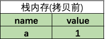
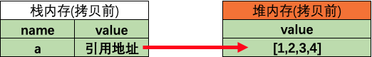
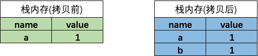
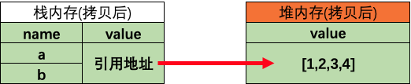
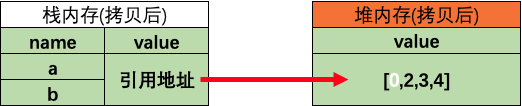
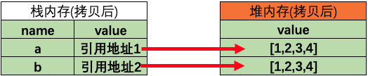

## 阅读本文您将收获
* 堆栈和数据类型的概念
* 浅拷贝实现
* 深拷贝实现

## 写在前面
> 深拷贝和浅拷贝只针对像 Object, Array 这样的复杂类型数据的。简单来说，浅拷贝只复制一层对象的属性，而深拷贝则递归复制了所有层级。

### 举个栗子

```
let a=[0,1,2,3,4],
b=a;
a[0]=1;
console.log(a,b); // a: [1,1,2,3,4],b: [1,1,2,3,4]
```
* WTF?明明b复制了a，为啥修改数组a，数组b也跟着变了

### 数据在内存中的存储
* 基本类型-存储在栈内存中



* 引用类型-地址在栈内存中，值存储在堆内存中，如 `let a = 1;`



### 浅拷贝两种数据类型的存储
* 当执行 `let b=a` 时，基本数据类型在栈内存会新开辟一个内存，所以在修改b时，两个内存中的数据不会相互影响



* 当执行 `let b=a` 时，引用数据类型在栈内存也会新开辟一个内存，但是数据的引用地址指向同一个



* 浅拷贝中当修改引用类型的值时，改变的只是引用类型堆内存中的值，但是两个数据的引用地址是指向同一个堆内存中的值，就会造成两个数据都会发生改变



### 深拷贝数据类型的存储
* 深拷贝时，新的引用数据类型除了在栈内存中开辟洗的空间外，还会在堆内存中开辟一个新的空间



* 深拷贝的数据，修改后相互之间不会受影响


## 浅拷贝实现方式
* 浅拷贝: 以赋值的形式拷贝引用对象，仍指向同一个地址，修改时原对象也会受到影响

### 赋值表达式 `=` (严格意义来说算是赋值)
### `Object.assign`
* `Object.assign()` 方法可以把任意多个的源对象自身的可枚举属性拷贝给目标对象，然后返回目标对象。但是 `Object.assign()` 进行的是浅拷贝，拷贝的是对象的属性的引用，而不是对象本身。

```
let obj = { player: {name: "Kobe", age: ∞} };
let resObj = Object.assign({}, obj);
resObj.player.name = "James";
console.log(obj.player.name); // James
```

* 注: 当拷贝对象层级只有一层时，`Object.assign()` 是深拷贝

```
let player = {
   name: 'Kobe'
};
let nextPlayer = Object.assign({}, player);
nextPlayer.name = 'James';
console.log(player); // {name: "Kobe"}
```

### 展开运算符(...)
* 与  `Object.assign()` 相同

### `Array.prototype.concat()`
* 修改数组后原数组也会更改。

```
let player = [1, 2, {
   name: 'Kobe'
}];
let nextPlayer=player.concat();    
nextPlayer[2].name = 'James';
console.log(player); // [1, 2, {name: 'James'}]
```

### `Array.prototype.slice()`
* 修改数组后原数组也会更改。

```
let player = [1, 2, {
   name: ' Kobe'
}];
let nextPlayer = player.slice();
nextPlayer[2].name = 'James'
console.log(player); // [1, 2, {name: 'James'}]
```

## 深拷贝实现方式
* 深拷贝: 完全拷贝一个新对象，修改时原对象不再受到任何影响

* 性能最快：`JSON.parse(JSON.stringify(obj))`
	* 具有循环引用的对象时，报错
	* 当值为函数或undefined时，无法拷贝

* 递归进行逐一赋值

```
deepClone(obj) {
    let result;
    if (typeof obj == 'object') {
        result = isArray(obj) ? [] : {}
        for (let i in obj) {
            result[i] = isObject(obj[i])||isArray(obj[i])?deepClone(obj[i]):obj[i]
        }
    } else {
        result = obj
    }
    return result
}
function isObject(obj) {
    return Object.prototype.toString.call(obj) == "[object Object]"
}
function isArray(obj) {
    return Object.prototype.toString.call(obj) == "[object Array]"
}
```
